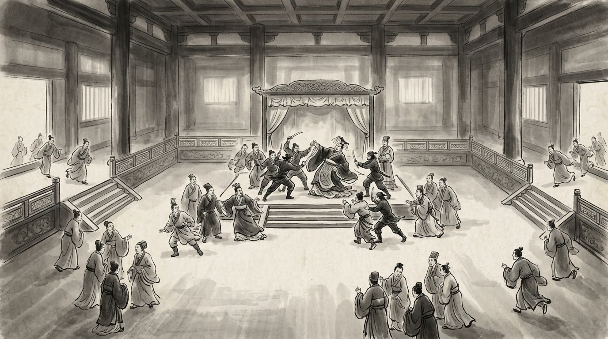

# 卷001 周紀一 — 威烈王二十四年

> 巻 1 / 294 ・ 周紀一 ・ 年号: 威烈王二十四年 ・ 西暦: 402 BCE

[← 巻インデックス](README.md)

---

威烈王二十四年〔注:己卯(きぼう)の年、紀元前四〇二年〕。

この年、威烈王が崩御し、その子の安王驕(あんおう・きょう)が即位した。

また、賊が楚の聲王(せいおう)〔注:名は当(とう)〕を殺害し、楚の国人はその子の悼王(とうおう)〔注:名は疑(ぎ)〕を立てた。

---

原文を表示

二十四年
王崩，子安王驕立。
盜殺楚聲王，國人立其子悼王。

---

出典: 維基文庫「資治通鑒 (胡三省音注)/卷001」(revid 2665347, CC BY-SA 4.0) / 原字: Kanripo KR2b0007 @80174f6 . 成果物=CC BY-NC-SA 系。

[← 前年: 威烈王二十三年](j001_y01.md) ・ [巻インデックス](README.md) ・ [次年: 安王元年 →](j001_y03.md)
