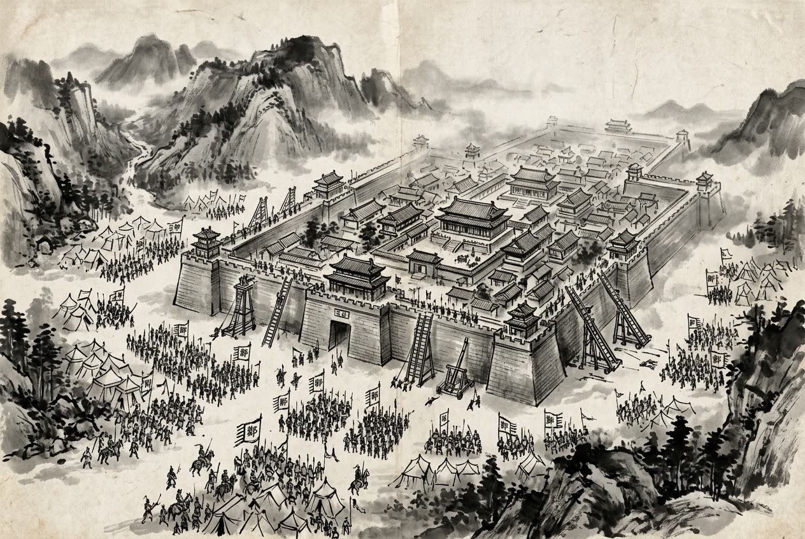

# 卷001 周紀一 — 安王二年

> 巻 1 / 294 ・ 周紀一 ・ 年号: 安王二年 ・ 西暦: 400 BCE

[← 巻インデックス](README.md)

---

安王二年〔注:辛巳(しんし)の年、紀元前四〇〇年〕。

この年、魏・韓・趙が連合して楚を攻め、桑丘(そうきゅう)に至った。

鄭が韓の陽翟(ようてき)を包囲した。

韓の景侯が薨じ、その子の烈侯取(れつこう・しゅ)が立った。

趙の烈侯が薨じ、趙の国人はその弟の武侯を立てた。

秦の簡公が薨じ、その子の惠公が立った。

---

原文を表示

二年
魏、韓、趙伐楚，至桑丘。
鄭圍韓陽翟。
韓景侯薨，子烈侯取立。
趙烈侯薨，國人立其弟武侯。
秦簡公薨，子惠公立。

---

出典: 維基文庫「資治通鑒 (胡三省音注)/卷001」(revid 2665347, CC BY-SA 4.0) / 原字: Kanripo KR2b0007 @80174f6 . 成果物=CC BY-NC-SA 系。

[← 前年: 安王元年](j001_y03.md) ・ [巻インデックス](README.md) ・ [次年: 安王三年 →](j001_y05.md)
