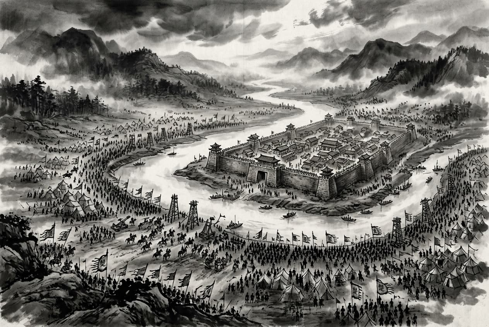

# 卷001 周紀一 — 安王四年

> 巻 1 / 294 ・ 周紀一 ・ 年号: 安王四年 ・ 西暦: 398 BCE

[← 巻インデックス](README.md)

---

安王四年〔注:癸未(きび)の年、紀元前三九八年〕。

楚が鄭を包囲した。

鄭の人々は、自国の宰相である駟子陽(し・しよう)を殺した。

---

原文を表示

四年
楚圍鄭。鄭人殺其相駟子陽。

---

出典: 維基文庫「資治通鑒 (胡三省音注)/卷001」(revid 2665347, CC BY-SA 4.0) / 原字: Kanripo KR2b0007 @80174f6 . 成果物=CC BY-NC-SA 系。

[← 前年: 安王三年](j001_y05.md) ・ [巻インデックス](README.md) ・ [次年: 安王五年 →](j001_y07.md)
