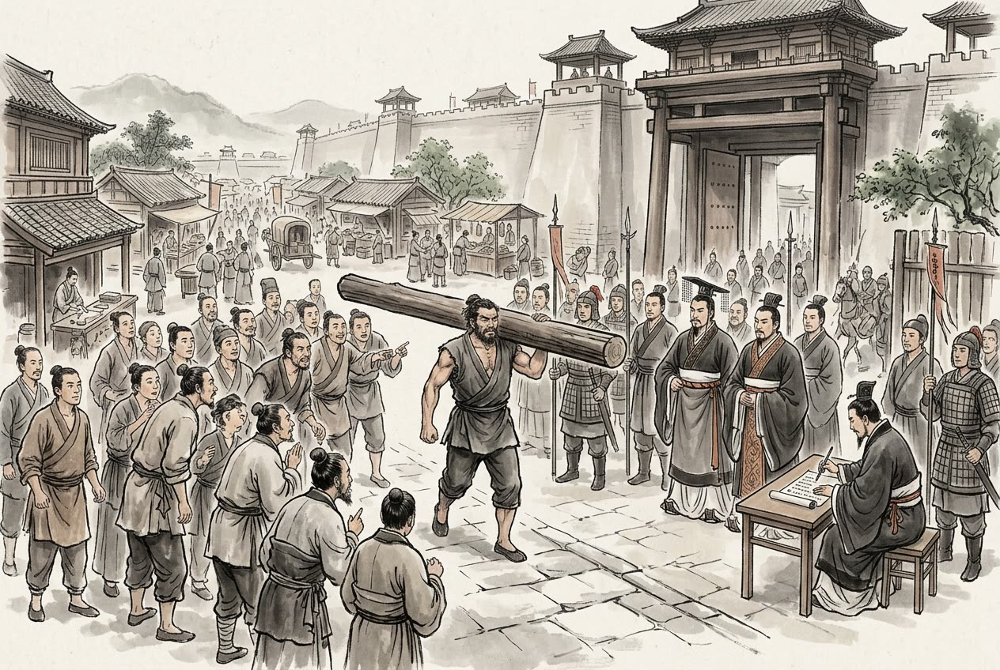

# 卷002 周紀二 — 顯王十年

> 巻 2 / 294 ・ 周紀二 ・ 年号: 顯王十年 ・ 西暦: 359 BCE

[← 巻インデックス](README.md)

---

顯王十年〔注:壬戌(じんじゅつ)の年、紀元前三五九年〕。

衞鞅(えいおう)が法を改めようとすると、秦の人々はこれを喜ばなかった。衞鞅は秦の孝公に進言した。「そもそも民というものは、事の始まりをともに思案する相手にはできませんが、成果をともに楽しむことはできます。最高の徳を論じる者は世俗に合わせず、大きな功業を成す者は大勢に相談しません。ですから聖人は、国を強くできるのであれば、古いやり方を踏襲しないのです」。甘龍(かんりょう)が言った。「そうではありません。従来の法に沿って治めれば、役人は慣れており、民も安心するものです」。衞鞅は言った。「凡人は古い習わしに安住し、学者は見聞きしたことに溺れます。この二種の者は、官職にあって法を守らせるにはよいが、法の枠の外について議論する相手ではありません。智者が法を作れば、愚者はそれに従わされ、賢者が礼を改めれば、不肖の者はそれに縛られるのです」。孝公は「よろしい」と言い、衞鞅を左庶長(さしょちょう)〔注:秦の爵位の一つで、卿大夫に相当する軍の将〕に任じた。

こうして法改正の令がついに定められた。民を什(じゅう)・伍(ご)に編成して互いに監視させ、連帯責任を負わせた〔注:五人を伍、二伍すなわち十人を什とし、一家が罪を犯せば什伍の各家が連座する〕。悪事を密告した者には敵の首を斬ったのと同じ恩賞を与え、密告しなかった者には敵に降伏したのと同じ罰を科した。軍功のある者には、それぞれ等級に応じて上位の爵位を授け、私闘をした者には、軽重に応じて大小の刑を科した。本業〔注:農耕など根本の生業〕に力を尽くし、耕作や機織りによって穀物や絹を多く生産した者は、その身の賦役を免除した。商工など末端の利を追う仕事をした者や、怠けて貧しくなった者は、摘発して妻子もろとも官の奴隷とした。公室の一族でも、軍功の認められない者は、宗室の籍に入れないこととした。身分の上下や爵位・俸禄の等級を明らかにし、それぞれの序列に応じて、所有できる田畑・屋敷・召使・衣服を定めた。功のある者は栄え輝き、功のない者は富んでいても誇り栄えることはできないとした。

令はすでに整っていたが、まだ公布していなかった。民が信用しないことを恐れて、衞鞅は三丈の木を国都の市場の南門に立て

、これを北門まで移せる者には十金を与えると民に呼びかけた。民は不審に思い、誰も移そうとしなかった。そこで重ねて「移せる者には五十金を与える」と言った。一人の者がこれを移すと、すぐさま五十金を与えた。そうしておいてから令を公布した。

令が施行されて一年が経つと、秦の民で都に出向き〔注:之く=行く〕、新しい令が不便だと訴える者が千人を数えた。そんなとき、太子が法を犯した。衞鞅は言った。「法が行われないのは、上の者がそれを犯すからだ」。だが太子は君主の世継ぎであり、刑を加えるわけにはいかない。そこで太子の傅(もり役)である公子虔(こうしけん)を処罰し、太子の師である公孫賈(こうそんか)を黥刑(げいけい)〔注:墨を入れて顔に入れ墨をする刑。これが後に秦が商君鞅を殺す伏線となる〕に処した。翌日には、秦の人々はみな令に従うようになった。

この法を十年行うと、秦の国では道に落ちている物を拾う者もなく、山には盗賊がいなくなり、民は国家のための戦には勇み、私闘には臆病になって、町や村はよく治まった。秦の民で、当初は令を不便だと言っていた者の中から、今度は令が便利だと言いに来る者が現れた。衞鞅は「これらはみな法を乱す民だ」と言って、ことごとく辺境へ移住させた。その後、民は二度と令についてあれこれ論じようとしなかった。

臣光(しんこう)が論じて言う。そもそも信義というものは、君主にとって最大の宝である。国は民によって保たれ、民は信義によって保たれる。信義がなければ民を使うことはできず、民がなければ国を守ることはできない。それゆえ古の王者は天下を欺かず、覇者は周囲の国々を欺かず、よく国を治める者はその民を欺かず、よく家を治める者はその身内を欺かなかった。そうでない者はこの逆をいき、隣国を欺き、人民を欺き、ひどい者は兄弟を欺き、親子を欺く。上が下を信じず、下が上を信じなければ、上下の心は離れ、ついには破滅に至る。それで得た利益は傷つけたものを癒すことができず、得たものは失ったものを補うことができない。なんと哀しいことではないか。むかし齊の桓公は曹沫(そうばつ)との盟約に背かず、晉の文公は原(げん)を攻め取る利を貪らず、魏の文侯は虞人(ぐじん)〔注:山林を司る役人。文侯が狩りの約束を守って会いに行った故事〕との約束を捨てず、秦の孝公は木を移した者への恩賞を反故にしなかった。この四人の君主は、その行いが純粋に潔白だったわけではなく、なかでも商君(衞鞅)はとりわけ酷薄だと評され、しかも戦乱の世にあって、天下がこぞって謀略と腕力に走る時代に身を置いていた。それでもなお、信義を忘れず民を養うことを忘れなかったのだ。まして天下太平の政治を行う者であれば、なおさら信義を重んじるべきではないか。

韓の懿侯(いこう)が薨(こう)じ、子の昭侯(しょうこう)が後を継いで立った。

---

原文を表示

十年
衞鞅欲變法，秦人不悅。衞鞅言於秦孝公曰：「夫民不可與慮始，而可與樂成。論至德者不和於俗，成大功者不謀於衆。是以聖人苟可以強國，不法其故。」甘龍曰：「不然，緣法而治者，吏習而民安之。」衞鞅曰：「常人安於故俗，學者溺於所聞，以此兩者，居官守法可也，非所與論於法之外也。智者作法，愚者制焉；賢者更禮，不肖者拘焉。」公曰：「善。」以衞鞅爲左庶長。卒定變法之令。令民爲什伍而相收司、連坐，告姦者與斬敵首同賞，不告姦者與降敵同罰。有軍功者，各以率受上爵；爲私鬬者，各以輕重被刑大小。僇力本業，耕織致粟帛多者，復其身；事末利及怠而貧者，舉以爲收孥。宗室非有軍功論，不得爲屬籍。明尊卑爵秩等級，各以差次名田宅、臣妾、衣服。有功者顯榮，無功者雖富無所芬華。
令旣具未布，恐民之不信，乃立三丈之木於國都市南門，募民有能徙置北門者予十金。民怪之，莫敢徙。復曰：「能徙者予五十金！」有一人徙之，輒予五十金。乃下令。
令行期年，秦民之國都言新令之不便者以千數。於是太子犯法。衞鞅曰：「法之不行，自上犯之。」太子，君嗣也，不可施刑，刑其傅公子虔，黥其師公孫賈。明日，秦人皆趨令。行之十年，秦國道不拾遺，山無盜賊，民勇於公戰，怯於私鬬，鄕邑大治。秦民初言令不便者，有來言令便。衞鞅曰：「此皆亂法之民也！」盡遷之於邊。其後民莫敢議令。
臣光曰：夫信者，人君之大寶也。國保於民，民保於信；非信無以使民，非民無以守國。是故古之王者不欺四海，霸者不欺四鄰，善爲國者不欺其民，善爲家者不欺其親。不善者反之，欺其鄰國，欺其百姓，甚者欺其兄弟，欺其父子。上不信下，下不信上，上下離心，以至於敗。所利不能藥其所傷，所獲不能補其所亡，豈不哀哉！昔齊桓公不背曹沫之盟，晉文公不貪伐原之利，魏文侯不棄虞人之期，秦孝公不廢徙木之賞。此四君者道非粹白，而商君尤稱刻薄，又處戰攻之世，天下趨於詐力，猶且不敢忘信以畜其民，況爲四海治平之政者哉！
韓懿侯薨，子昭侯立。

---

出典: 維基文庫「資治通鑒 (胡三省音注)/卷002」(revid 1318958, CC BY-SA 4.0) / 原字: Kanripo KR2b0007 @80174f6 . 成果物=CC BY-NC-SA 系。

[← 前年: 顯王八年](j002_y06.md) ・ [巻インデックス](README.md) ・ [次年: 顯王十一年 →](j002_y08.md)
