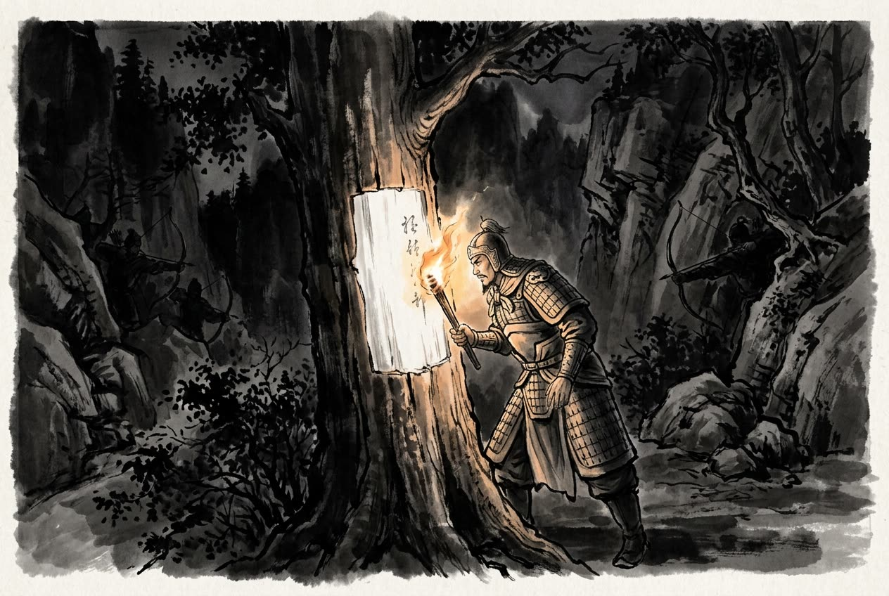

# 卷002 周紀二 — 顯王二十八年

> 巻 2 / 294 ・ 周紀二 ・ 年号: 顯王二十八年 ・ 西暦: 341 BCE

[← 巻インデックス](README.md)

---

顯王二十八年〔注:庚辰(こうしん)の年、紀元前三四一年〕。

魏の龐涓(ほうけん)が韓を攻めた。韓は齊に救援を求めた。齊の威王(いおう)は重臣たちを召して相談し、「早く救うのと、遅く救うのとでは、どちらがよいか」と尋ねた。成侯(せいこう)〔注:成侯とは齊の宰相となった鄒忌(すうき)で、成侯に封ぜられた者である〕は「いっそ救わないほうがよい」と答えた。田忌(でんき)は「救わなければ、韓は屈服して魏に併呑されてしまう。早く救うにかぎる」と言った。孫臏(そんぴん)は言った。「いま韓も魏も兵がまだ疲弊していないうちに救援すれば、われわれが韓に代わって魏の攻撃を受けることになり、かえって韓に頭が上がらなくなります。それに魏は韓を滅ぼす腹づもりですから、韓は滅亡の瀬戸際に立てば、必ず東を向いて齊に泣きつき、頼ってきます〔注:見亡とは、国が滅びかかった情勢にあることをいう〕。そこを利用して韓と深く誼(よしみ)を結んでおき、魏が疲れきったところを遅れて引き受ければ、大きな利益を手にし、しかも高い名声まで得られましょう」。王は「よかろう」と言い、ひそかに韓の使者に救援を約束したうえで帰らせた。韓は齊を頼みにして戦ったが、五たび戦って五たび勝てず、ついに東の齊に国を委ねた。

そこで齊は兵を起こし、田忌・田嬰(でんえい)・田盼(でんはん)を将軍とし、孫子(孫臏)を軍師として韓を救援させ、まっすぐ魏の都へ向かわせた。龐涓はこれを聞くと、韓から引き揚げて帰国した。魏は大軍を動員し、太子の申(しん)を将軍として齊軍を迎え撃たせた。孫子は田忌に言った。「あの三晉(さんしん)の兵〔注:三晉とは魏をはじめとする旧晋の国々の兵をいう〕はもともと荒々しく勇猛で齊を軽く見ており、齊は臆病者だと言われています。戦上手というものは、その勢いに乗じてうまく誘い込むものです。兵法にもこうあります、『百里の道を急いで利を追えば上将軍をも討ち取られ、五十里を急げば軍は半分しかたどり着けない』と〔注:これは孫武子の兵法の言葉である。蹶(けつ)は挫く、あるいは斃すの意。「半分しか至らない」とは、利を追って急ぐと部隊が前後に分断され、半分だけ着いて半分は着かないことをいう〕」。

そこで齊軍は魏の領内に入ると、初日は十万人分のかまどを作り、翌日は五万人分、その翌日は二万人分とかまどを減らしていった。龐涓は三日追ってきて大いに喜び、「やはり齊軍は臆病だ。わが領内に入って三日で、逃亡した兵が半分を超えたぞ」と言った。そこで歩兵を置き去りにし〔注:倍日とは一日で二日分の道のりを進むこと、兼行(けんこう)である〕、身軽な精鋭だけを率いて昼夜兼行で追撃した。孫子は敵の進み具合を計算し、日暮れにはちょうど馬陵(ばりょう)に至るとふんだ。馬陵の道は狭く、両側に険しい隘路が多くて伏兵を置くのにうってつけであった。そこで一本の大木の皮を削り、白くなった幹に「龐涓、この樹の下に死す」と書き付けた。そして齊軍の弓の名手一万人に強弩(きょうど)を持たせて道の両側に伏せさせ、「日暮れに火の灯(とも)るのが見えたら一斉に射よ」と命じた。龐涓は果たして夜になってその削られた木の下にやって来た。白い書き付けを見つけ、火を近づけて照らし、読み終えないうちに

一万の弩が一斉に放たれた。魏軍は大混乱に陥り、てんでばらばらになった。龐涓は自分の知略も尽き、戦に敗れたと悟ると、みずから首をはねて〔注:剄(けい)とは首を切ること〕、「とうとうあの小僧(孫臏)の名を成し遂げさせてしまった」と言い残した。齊はその勝ちに乗じて魏軍を大破し、太子の申を捕虜にした。

成侯の鄒忌(すうき)は田忌を憎んでいた。そこで人をやって十金(じっきん)を持たせ、市場で占わせ、こう言わせた。「私は田忌の家来です。主人は将軍として三たび戦って三たび勝ちました。大事(=謀反)を起こそうとしておりますが、うまくいきましょうか」。占い師が出てくると、鄒忌は人にその者を捕らえさせた。田忌は身の潔白を証し立てることができず、手勢を率いて齊の都の臨淄(りんし)〔注:臨淄は齊の国都。臨淄水のほとりに城を築いたので、この名がついた〕を攻め、成侯(鄒忌)を捜し求めたが、果たせず、楚へ亡命した。

---

原文を表示

二十八年
魏龐涓伐韓。韓請救於齊。齊威王召大臣而謀曰：「蚤救孰與晚救？」成侯曰：「不如勿救。」田忌曰：「弗救則韓且折而入於魏，不如蚤救之。」孫臏曰：「夫韓、魏之兵未弊而救之。是吾代韓受魏之兵，顧反聽命於韓也。且魏有破國之志，韓見亡，必東面而愬於齊矣。吾因深結韓之親而晚承魏之弊，則可受重利而得尊名也。」王曰：「善。」乃陰許韓使而遣之。韓因恃齊，五戰不勝，而東委國於齊。
齊因起兵，使田忌、田嬰、田盼將之。孫子爲師，以救韓，直走魏都。龐涓聞之，去韓而歸。魏人大發兵，以太子申爲將，以禦齊師。孫子謂田忌曰：「彼三晉之兵素悍勇而輕齊，齊號爲怯。善戰者因其勢而利導之。《兵法》：『百里而趣利者蹶上將，五十里而趣利者軍半至。』」乃使齊軍入魏地爲十萬竈，明日爲五萬竈，又明日爲二萬竈。龐涓行三日，大喜曰：「我固知齊軍怯，入吾地三日，士卒亡者過半矣！」乃棄其步軍，與其輕銳倍日幷行逐之。孫子度其行，暮當至馬陵，馬陵道陿而旁多阻隘，可伏兵，乃斫大樹，白而書之曰：「龐涓死此樹下！」於是令齊師善射者萬弩夾道而伏，期日暮見火舉而俱發。龐涓果夜到斫木下，見白書，以火燭之，讀未畢，萬弩俱發，魏師大亂相失。龐涓自知智窮兵敗，乃自剄，曰：「遂成豎子之名！」齊因乘勝大破魏師，虜太子申。
成侯鄒忌惡田忌，使人操十金，卜於市，曰：「我，田忌之人也。我爲將三戰三勝，欲行大事，可乎？」卜者出，因使人執之。田忌不能自明，率其徒攻臨淄，求成侯；不克，出奔楚。

---

出典: 維基文庫「資治通鑒 (胡三省音注)/卷002」(revid 1318958, CC BY-SA 4.0) / 原字: Kanripo KR2b0007 @80174f6 . 成果物=CC BY-NC-SA 系。

[← 前年: 顯王二十六年](j002_y21.md) ・ [巻インデックス](README.md) ・ [次年: 顯王二十九年 →](j002_y23.md)
