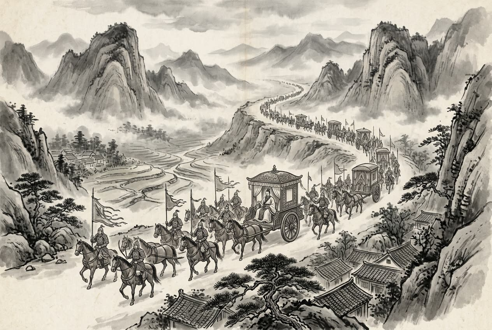

# 卷002 周紀二 — 顯王三十六年

> 巻 2 / 294 ・ 周紀二 ・ 年号: 顯王三十六年 ・ 西暦: 333 BCE

[← 巻インデックス](README.md)

---

顯王三十六年〔注:戊子(つちのえね)の年、紀元前三三三年〕。

楚王が齊(せい)を攻め、徐州(じょしゅう)を包囲した。

韓(かん)で高い門が完成した。昭侯(しょうこう)が薨(こう)じ〔注:屈宜臼(くつぎきゅう)が予言したとおりになった〕、子の宣惠王(せんけいおう)が立った。

はじめ、洛陽(らくよう)の人である蘇秦(そしん)が、秦王に天下を併呑(へいどん)する策を説いたが、秦王はその言を用いなかった。蘇秦はそこで秦を去り、燕(えん)の文公(ぶんこう)に説いて言った。「燕が外敵に侵されず、武具を取って戦わずにすんでいるのは、趙(ちょう)が南方の盾となっているからです。そもそも秦が燕を攻めるとなれば、戦いは千里のかなたで行われますが、趙が燕を攻めるなら、戦いは百里の内で行われます〔注:燕は南で趙と境を接するので「百里の内」=近い。秦は途中を趙に阻まれ、上郡(じょうぐん)の西から雲中(うんちゅう)・九原(きゅうげん)を回ってようやく燕に至るので「千里の外」=遠い〕。ところが、すぐ近くの禍(わざわい)を憂えず、はるか遠くの脅威ばかりを重んじておられる。これほど見当違いの謀(はかりごと)はありません。どうか大王には趙と合従(がっしょう)して親しく結ばれ、天下が一つにまとまるようになさいませ。さすれば燕国に憂いはなくなりましょう」。

文公はこれに従い、蘇秦に車馬を与えて送り出した。蘇秦は趙の肅侯(しゅくこう)に説いて言った。「今の世にあって、山東(さんとう)の国々で趙より強い国はなく、秦が害をなそうと狙う相手も趙ほどの国はありません。それでも秦が兵を挙げて趙を攻めようとしないのは、背後の韓・魏が後ろから隙(すき)を突くことを恐れているからです。秦が韓・魏を攻める場合には、あいだに名だたる山や大河の隔てがなく、じわじわと蚕食(さんしょく)していって、国都に迫ってようやく止まります。韓・魏は秦に持ちこたえられず、必ず秦に降って臣従するでしょう。秦にとって韓・魏という後顧(こうこ)の気がかりがなくなれば、災いは趙に降りかかります。私が天下の地図によって考えてみますに、諸侯の領土は秦の五倍、諸侯の兵を見積もれば秦の十倍にのぼります。六国が一つとなり、力を合わせて西へ向かって秦を攻めれば、秦は必ず破れます。そもそも連衡(れんこう)を説く者ども〔注:衡人(こうじん)=連衡、すなわち諸国がそれぞれ個別に秦と結ぶ策を唱える遊説家〕は、みな諸侯の土地を割いて秦に差し出そうとします。その策が成れば彼ら自身は富み栄えますが、国が秦の害を被っても、彼らはその憂いを分かち持とうとはしません。だからこそ連衡論者は日夜、秦の威勢を笠に着て諸侯を脅し、土地の割譲を求めるのです。どうか大王にはこのことをよくよくお考えいただきたい。ひそかに大王のために策を案じますに、韓・魏・齊・楚・燕・趙を一つに結束させ、合従して親しく結び、秦のやり方(連衡)に背を向けるに越したことはありません。天下の将軍・宰相たちを洹水(かんすい)〔注:川の名〕のほとりに集め、人質を交わし合って同盟を結び、こう盟約するのです。『秦が一国を攻めたなら、残る五国がそれぞれ精鋭の軍を出し、ある者は秦をくじき、ある者は攻められた国を救う。もしこの盟約に従わぬ者があれば、五国でこぞってこれを討つ』と。諸侯が合従して親しく結び、秦を退けて寄せつけなければ、秦の軍は決して函谷関(かんこくかん)から出て山東を害することはできなくなりましょう」。肅侯はおおいに喜び、蘇秦を手厚くもてなし、尊び寵愛(ちょうあい)して数々の賜り物を与え、蘇秦を通じて諸侯と盟約を結ばせた。

ちょうどそのころ、秦は犀首(さいしゅ)〔注:魏の官名。公孫衍(こうそんえん)がこの官に就いたので、その官名で呼ばれた〕を遣わして魏を攻めさせ、魏の軍四万余りを大いに破り、将軍の龍賈(りゅうか)を捕らえ、雕陰(ちょういん)を奪い取り、なおも東へ兵を進めようとしていた。蘇秦は、秦の兵が趙に攻め込んで合従の盟約が壊れることを恐れた。そこで、秦で用いることのできる者がほかにいないと考え、一計を案じて張儀(ちょうぎ)をわざと怒らせ、秦へ送り込んだ。

張儀は魏の人で、蘇秦とともに鬼谷先生(きこくせんせい)〔注:六国時代の縦横家(じゅうおうか)。鬼谷という地に住んだのでこう呼ばれた〕に師事し、縦横の術〔注:合従・連衡を説く弁論の術〕を学んだ。蘇秦は自分でも張儀にはかなわないと思っていた。張儀は諸侯のあいだを遊説して回ったが、どこにも用いられず、楚で困窮していた。蘇秦はわざと彼を呼び寄せて辱(はずかし)めた。張儀はおそれ〔注:『史記』ではここを「怒った」とする〕、諸侯の中で趙を苦しめられるのは秦だけだと考え、ついに秦に入った。蘇秦はひそかに自分の舍人(しゃじん)〔注:側近の従者〕に金品を持たせて張儀の費用を援助させた。張儀は秦王に謁見(えっけん)することができた。秦王は彼を気に入り、客卿(かくけい)〔注:他国から来た者を、卿(けい)の位に就けて客分の礼で遇する官〕に取り立てた。舍人が暇乞(いとまご)いをして言った。「蘇君(蘇秦さま)は、秦が趙を攻めて合従の盟約が壊れることを心配しておられました。そして、あなたさまでなければ秦の実権を握れる者はいないとお考えになり、それであなたをわざと怒らせ、私にひそかにあなたの費用を差し上げさせたのです。すべては蘇君のお計らいによるものでございます」。張儀は言った。「ああ、私は術中にありながら気づかなかった。明察において私は蘇君に及ばぬ。私に代わって蘇君に礼を伝えてくれ。蘇君が権勢を握っておられるこの時代に、この儀(ぎ)がどうして口出しなどできようか」。

こうして蘇秦は韓の宣惠王に説いて言った。「韓の領土は四方九百里あまり、武装兵は数十万。天下の強弓・強弩(きょうど)・鋭い剣はみな韓から産します。韓の兵が足で踏んで弩を射れば、百発を射尽くすまで止む間もありません。韓の兵の勇猛さで、堅い鎧(よろい)を身につけ、強弩を足で踏みしめ〔注:強い弩は、座って足で弩の本体を踏み、手で機(からくり)を引いてから発射した〕、鋭い剣を帯びれば、一人で百人に当たることなど言うまでもありません。大王が秦に臣従なされば、秦は必ず宜陽(ぎよう)と成皋(せいこう)〔注:いずれも韓の要地。宜陽は西で秦と境を接し、成皋は別名を虎牢(ころう)といい韓の防壁〕を求めてきましょう。今年これを差し出せば、来年にはまた別の土地の割譲を求めてきます。与えれば、やがて与えるべき土地がなくなり、与えなければこれまでの功を棒に振って後の災いを受けます。そもそも大王の領土には限りがあるのに、秦の要求には際限がありません。限りある土地で際限のない要求に応じていけば、これこそ『恨みを買い、災いを結ぶ』というものです。戦わぬうちに領土はすでに削られてしまうのです。田舎のことわざに『鶏(にわとり)の口(くちばし)となっても、牛の尻(しり)にはなるな』〔注:鶏の口は小さくとも自ら食(は)む。牛の尻は大きくとも糞(ふん)を出すだけだ、という意〕と申します。大王ほどの賢明さをもち、強国・韓の兵を擁(よう)しながら、『牛の尻』の汚名を負われるとは。私はひそかに大王のためにこれを恥じ入ります」。韓王はその言葉に従った。

蘇秦は魏王に説いて言った。「大王の領土は四方千里、土地は狭いとはいえ、田畑や家屋・小屋がびっしりと立ち並び、草を刈り家畜を放牧する空き地さえないほどです。人民は多く、車馬もおびただしく、昼夜を分かたず往来が絶えず、その轟(とどろ)きはまるで三軍の大軍がいるかのようです。私がひそかに見積もりますに、大王の国は楚にも劣りません。今ひそかに伝え聞くところでは、大王の軍勢は、武士(精鋭兵)二十万、蒼頭(そうとう)〔注:青い頭巾をつけた部隊〕二十万、奮撃(ふんげき)〔注:勇んで敵に突撃する選り抜きの兵〕二十万、廝徒(してと)〔注:薪取りなどの雑役兵〕十万、戦車六百乗(じょう)、騎兵五千騎にのぼります。それなのに群臣の説に耳を傾け、秦に臣従なさろうとしておられる。そこで我が君である趙王は、私を遣わして愚かな策を献じ、明らかな盟約(合従)を捧げさせました。あとは大王のご命令次第でございます」。魏王はこれを聞き入れた。

蘇秦は齊王に説いて言った。「齊は四方を要害に囲まれた国で、領土は四方二千里あまり、武装兵は数十万、蓄えた粟(あわ)は丘や山のようです。三軍の精兵、五家の兵〔注:三軍は三晋(さんしん)すなわち韓・魏・趙の軍、五家は五国を指すという〕は、進むときは矢じりのごとく鋭く、戦うときは雷霆(らいてい)のごとく激しく、退くときは風雨のごとく速やかです。たとえ軍役があっても、これまで泰山(たいざん)を背にして越え、清河(せいが)を渡り、渤海(ぼっかい)を渡ってまで遠征したことはありません〔注:倍(はい)=背にする、絕(ぜつ)=まっすぐ渡る、涉(しょう)=膝から上まで水に浸かって渡る。いずれも齊の北境をなす山河〕。都の臨淄(りんし)には七万戸があり、ひそかに見積もりますに一戸あたり三人を下らぬ男子がおりますから、遠方の県から徴発するまでもなく、臨淄だけですでに二十一万の兵がそろいます。臨淄はたいそう富み栄えて充実しており、その民で、闘鶏(とうけい)・犬の競走・六博(ろくはく)〔注:盤上の賭け遊び〕・蹴鞠(けまり)〔注:革に毛を詰めた鞠を蹴って遊ぶ。戦国時代に武士を鍛えるために始まったという〕に興じない者はおりません。臨淄の大通りでは、車の轂(こしき)がぶつかり合い、人の肩が触れ合い、人々の襟(えり)がつらなって帳(とばり)をなし、振り落とす汗が雨のように降るほどの賑(にぎ)わいです。そもそも韓・魏が秦をことのほか恐れるのは、秦と国境を接しているからです。兵を出して相対すれば、十日もたたぬうちに戦端が開かれ、勝敗・存亡の分かれ目が決してしまいます。韓・魏が戦って秦に勝ったとしても、兵力は半ばを失い、四方の国境を守れなくなります。戦って勝てなければ、国の危亡がそのすぐ後に追ってきます。だからこそ韓・魏は、秦と戦うことを重く見るあまり、秦の臣下となること(連衡)を軽々しく受け入れてしまうのです。ところが秦が齊を攻める場合はそうはいきません。韓・魏の地を背にし、衞(えい)の陽晉(ようしん)の道を通り、亢父(こうほ)の険しい地を抜けねばならず、その道では車は二台並んで進めず、騎兵も並んで進めません。百人が要害を守れば、千人がかりでも通り抜けられません。秦は深く攻め入りたくとも、狼(おおかみ)が後ろを振り返るように背後を気にして〔注:狼は進みながらしきりに振り返る。背後を取られるのを恐れるさま〕、韓・魏が背後を突くことを恐れます。そのため秦は、おびえ疑い、空(から)威張りでわめき、虚勢を張って驕(おご)ってみせるばかりで、あえて進撃はできません。とすれば、秦が齊を害せないことも明らかです。ところが、秦が齊をどうにもできないことを深くも考えず、西を向いて秦に仕えようとなさる。これは群臣の謀の誤りです。今、秦に臣従するという不名誉な名もなく、強国としての実を備えておられるのですから、どうか大王に少しく心をとどめてお考えいただきたいのです」。齊王はこれを承知した。

そこで蘇秦は南西へ向かい〔注:楚は齊の南西にある〕、楚の威王に説いて言った。「楚は天下の強国です。領土は四方六千里あまり、武装兵は百万、戦車は千乗、騎兵は一万騎、蓄えた粟は十年を支えるほど。これこそ覇王たる資本です。秦が害をなそうと狙う相手で楚に並ぶ国はありません。楚が強ければ秦が弱まり、秦が強ければ楚が弱まる。その勢いは両立しえません。ですから大王のために策を案じますに、合従して親しく結び、秦を孤立させるに越したことはありません。私めが、山東の国々に四季の貢ぎ物を捧げさせ、大王の明らかなご命令を奉じさせましょう。諸国は社稷(しゃしょく)を委ね、宗廟(そうびょう)を捧げ、兵士を鍛え武器を研いで、大王の用いられるがままにいたします。つまり合従が成れば諸侯が土地を割いて楚に仕え、連衡が成れば楚が土地を割いて秦に仕えることになります。この二つの策は隔たりがあまりに大きいのです。大王はどちらを取られますか」。楚王もまたこれを承知した。

こうして蘇秦は合従の盟約の長(從約長)となり、六国の宰相を兼ね、北のかた趙へ報告に向かった。その車馬や輜重(しちょう=荷物の車)の行列は

、まるで王者のそれになぞらえるほどであった。

齊の威王が薨じ、子の宣王・辟彊(へききょう)が立った。宣王は、成侯(せいこう)がかつて田忌(でんき)を陥(おとしい)れたことを知り〔注:この経緯は先の顯王二十八年に見える〕、田忌を呼び戻して、もとの地位に復させた。

燕の文公が薨じ、子の易王(えきおう)が立った。

衞の成侯が薨じ、子の平侯(へいこう)が立った。

---

原文を表示

三十六年
楚王伐齊，圍徐州。
韓高門成。昭侯薨，子宣惠王立。
初，洛陽人蘇秦說秦王以兼天下之術，秦王不用其言。蘇秦乃去，說燕文公曰：「燕之所以不犯寇被甲兵者，以趙之爲蔽其南也。且秦之攻燕也，戰於千里之外；趙之攻燕也，戰於百里之內。夫不憂百里之患而重千里之外，計無過於此者。願大王與趙從親，天下爲一，則燕國必無患矣。」
文公從之，資蘇秦車馬，以說趙肅侯曰：「當今之時，山東之建國莫強於趙，秦之所害亦莫如趙。然而秦不敢舉兵伐趙者，畏韓、魏之議其後也。秦之攻韓、魏也，無有名山大川之限，稍蠶食之，傅國都而止。韓、魏不能支秦，必入臣於秦；秦無韓、魏之規則禍中於趙矣。臣以天下地圖案之，諸侯之地五倍於秦，料度諸侯之卒十倍於秦。六國爲一，幷力西鄕而攻秦，秦必破矣。夫衡人者皆欲割諸侯之地以與秦，秦成則其身富榮，國被秦患而不與其憂，是以衡人日夜務以秦權恐愒諸侯，以求割地。故願大王熟計之也！竊爲大王計，莫如一韓、魏、齊、楚、燕、趙爲從親以畔秦，令天下之將相會於洹水之上，通質結盟，約曰：『秦攻一國，五國各出銳師，或橈秦，或救之。有不如約者，五國共伐之！』諸侯從親以擯秦，秦甲必不敢出於函谷以害山東矣。」肅侯大說，厚待蘇秦，尊寵賜賚之，以約於諸侯。
會秦使犀首伐魏，大敗其師四萬餘人，禽將龍賈，取雕陰，且欲東兵。蘇秦恐秦兵至趙而敗從約，念莫可使用於秦者，乃激怒張儀，入之於秦。
張儀者，魏人，與蘇秦俱事鬼谷先生，學縱橫之術，蘇秦自以爲不及也。儀游諸侯無所遇，困於楚，蘇秦故召而辱之。儀恐，念諸侯獨秦能苦趙，遂入秦。蘇秦陰遣其舍人齎金幣資儀，儀得見秦王。秦王說之，以爲客卿。舍人辭去，曰：「蘇君憂秦伐趙敗從約，以爲非君莫能得秦柄；故激怒君，使臣陰奉給君資，盡蘇君之計謀也。」張儀曰：「嗟乎，此吾在術中而不悟，吾不及蘇君明矣。爲吾謝蘇君，蘇君之時，儀何敢言！」
於是蘇秦說韓宣惠王曰：「韓地方九百餘里，帶甲數十萬，天下之強弓、勁弩、利劍皆從韓出。韓卒超足而射，百發不暇止。以韓卒之勇，被堅甲，蹠勁弩，帶利劍，一人當百，不足言也。大王事秦，秦必求宜陽、成皋；今茲効之，明年復求割地。與則無地以給之；不與則棄前功，受後禍。且大王之地有盡而秦求無已，以有盡之地逆無已之求，此所謂市怨結禍者也。不戰而地已削矣。鄙諺曰：『寧爲雞口，無爲牛後。』夫以大王之賢，挾強韓之兵，而有牛後之名，臣竊爲大王羞之！」韓王從其言。
蘇秦說魏王曰：「大王之地方千里，地名雖小，然而田舍廬廡之數，曾無所芻牧。人民之衆，車馬之多，日夜行不絕，輷輷殷殷，若有三軍之衆。臣竊量大王之國不下楚。今竊聞大王之卒，武士二十萬，蒼頭二十萬，奮擊二十萬，廝徒十萬；車六百乘，騎五千匹；乃聽於羣臣之說，而欲臣事秦！故敝邑趙王使臣効愚計，奉明約，在大王之詔詔之。」魏王聽之。
蘇秦說齊王曰：「齊四塞之國，地方二千餘里，帶甲數十萬，粟如丘山。三軍之良，五家之兵，進如鋒矢，戰如雷霆，解如風雨，卽有軍役，未嘗倍泰山、絕清河、涉渤海者也。臨淄之中七萬戶，臣竊度之，不下戶三男子，不待發於遠縣，而臨淄之卒固已二十一萬矣。臨淄甚富而實，其民無不鬬雞、走狗、六博、闒鞠。臨淄之塗，車轂擊，人肩摩，連袵成帷，揮汗成雨。夫韓、魏之所以重畏秦者，爲與秦接境壤也。兵出而相當，不十日而戰，勝存亡之機決矣。韓、魏戰而勝秦，則兵半折，四境不守；戰而不勝，則國已危亡隨其後；是故韓、魏之所以重與秦戰而輕爲之臣也。今秦之攻齊則不然，倍韓、魏之地，過衞陽晉之道，經乎亢父之險，車不得方軌，騎不得比行，百人守險，千人不敢過也。秦雖欲深入則狼顧，恐韓、魏之議其後也，是故恫疑、虛喝、驕矜而不敢進，則秦之不能害齊亦明矣。夫不深料秦之無柰齊何，而欲西面而事之，是羣臣之計過也。今無臣事秦之名而有強國之實，臣是故願大王少留意計之！」齊王許之。
乃西南說楚威王曰：「楚，天下之強國也，地方六千餘里，帶甲百萬，車千乘，騎萬匹，粟支十年，此霸王之資也。秦之所害莫如楚，楚強則秦弱，秦強則楚弱，其勢不兩立。故爲大王計，莫如從親以孤秦。臣請令山東之國奉四時之獻，以承大王之明詔；委社稷，奉宗廟，練士厲兵，在大王之所用之。故從親則諸侯割地以事楚，衡合則楚割地以事秦，此兩策者相去遠矣，大王何居焉？」楚王亦許之。
於是蘇秦爲從約長，幷相六國，北報趙，車騎輜重擬於王者。
齊威王薨，子宣王辟彊立；知成侯賣田忌，乃召而復之。
燕文公薨，子易王立。
衞成侯薨，子平侯立。

---

出典: 維基文庫「資治通鑒 (胡三省音注)/卷002」(revid 1318958, CC BY-SA 4.0) / 原字: Kanripo KR2b0007 @80174f6 . 成果物=CC BY-NC-SA 系。

[← 前年: 顯王三十五年](j002_y28.md) ・ [巻インデックス](README.md) ・ [次年: 顯王三十七年 →](j002_y30.md)
