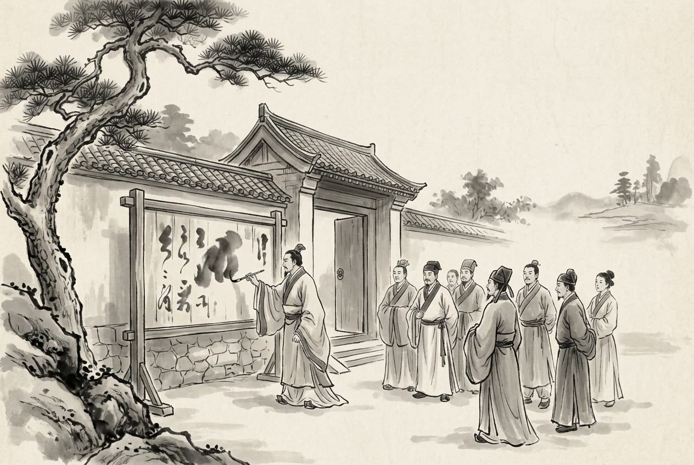

# 卷002 周紀二 — 顯王四十八年

> 巻 2 / 294 ・ 周紀二 ・ 年号: 顯王四十八年 ・ 西暦: 321 BCE

[← 巻インデックス](README.md)

---

顯王四十八年〔注:庚子(かのえね)の年、紀元前三二一年〕。

周の顯王が崩じ、子の愼靚王(しんせいおう)・定(てい)が立った。

燕の易王(えきおう)が薨(こう)じ、子の噲(かい)が立った。

齊王が田嬰(でんえい)を薛(せつ)に封じ、靖郭君(せいかくくん)と号した〔注:薛は、もとは夏(か)の奚仲(けいちゅう)の国。のちの徐州滕県(とうけん)のあたり〕。靖郭君が齊王に言った。「五官(ごかん=国政をつかさどる五大夫)の会計報告は、毎日お聞きになり、たびたび目を通されねばなりません」。齊王はこれに従ったが、まもなくその煩わしさに嫌気がさし、すべてを靖郭君に委ねてしまった。靖郭君はこれによって齊の権力を独り占めするに至った。

靖郭君が薛に城を築こうとしたとき、ある食客が靖郭君に言った。「殿は海の大魚をご存じありませんか。網でも捕らえられず、釣り針でも引き寄せられぬほどの大魚も、ひとたび暴れて水を失えば、螻蟻(ろうぎ=けらやあり)のなすがままになってしまいます。いまの齊は、殿にとってのその水でございます。殿が齊を長く保たれるなら、薛の城など何の役に立ちましょう。もし齊を失えば、たとえ薛の城を天に届くほど高く築いたとて、何の頼みになりましょうか」。そこで靖郭君は、結局、城を築かなかった。

靖郭君には四十人余りの子がいた。その身分の低い側室の子に、文(ぶん)という者がいた。文は度量が大きく、知略にも富んでいた〔注:通=人並みはずれてすぐれ、智略にあり余るほど長(た)けていた、の意〕。文は靖郭君に、財を散じて(食客の)士を養うよう勧めた。靖郭君は文に家政を任せて賓客の接待にあたらせた。賓客たちは争って文の美点を褒めそやし、みな靖郭君に、文を世継ぎにするよう願った。靖郭君が卒(しゅっ)すると、文が後を継いで薛公(せつこう)となり、孟嘗君(もうしょうくん)と号した。孟嘗君は、諸侯の遊説の士や、罪を犯して逃げてきた者たちを招き寄せ、いずれにも住まいと生業(なりわい)を与えて手厚くもてなし〔注:舍業=彼らのために家を建て、居所と生業を構えてやること〕、その親族の暮らしまで救ってやった。食客は常に数千人にのぼり、めいめいが「孟嘗君は自分に親しくしてくれている」と思った。こうして孟嘗君の名は天下に重んじられた。

臣光(しんこう)曰く——君子が士を養うのは、民のためである。『易』に「聖人は賢者を養い、それによって万民にまで恵みを及ぼす」とある〔注:『易』頤(い)卦の彖辞(たんじ)〕。そもそも賢者とは、その徳は教化を篤(あつ)くし風俗を正すに足り、その才は乱れた綱紀(こうき)を立て直すに足り、その明察は微細なことまで照らし出して遠くを慮(おもんぱか)るに足り、その強さは仁を結び義を固めるに足る。大きくは天下を利し、小さくは一国を利する。だからこそ君子は、手厚い俸禄を与えて彼らを富ませ、高い爵位を授けて彼らを尊ぶのだ。一人を養って万人にまで恵みが及ぶ——これが賢者を養う道である。ところが、いまの孟嘗君の士の養い方は、智者か愚者かを問わず、善人か悪人かも選ばず〔注:臧否(ぞうひ)=善し悪し〕、主君の俸禄をかすめ取って私的な徒党を組み、根のない名声を張り立て、上は主君を侮(あなど)り、下は民を蝕(むしば)む。これこそ姦人(かんじん)の親玉であって、どうして尊ぶに値しようか。『書』に「受(じゅ)は天下の逃亡者の頭目となり、罪人を淵(ふち)や藪(やぶ)に集まる魚や獣のように寄せ集めた」とあるのは、まさにこのことを言うのだ。

孟嘗君が楚に聘問(へいもん)したとき、楚王は彼に象牙づくりの寝台(象牀)を贈ろうとした〔注:象牀=象牙でこしらえた寝台〕。それを送り届ける役の登徒直(とうとちょく)は、運ぶのを嫌がり、孟嘗君の食客である公孫戌(こうそんじゅつ)にこう言った。「あの象牙の寝台は千金もの値打ちがあります。もし毛筋ほどでも傷つけようものなら、妻子を売り払っても弁償しきれません。あなたさまが、私がこれを運ばずにすむようにしてくださるなら、私には先祖伝来の宝剣がございます。それを差し上げたいのです」。公孫戌は承知し、孟嘗君に拝謁して言った。「小国がこぞって殿に宰相の印を捧げようとするのは、殿が貧窮の者を救い助け、滅びかけた国を存(なが)らえさせ、絶えた家系を継がせてこられたからです。だからこそ誰もが殿の義(ぎ)を喜び、その清廉さを慕うのです。それなのに、いま楚に着いて早々に象牙の寝台を受け取られては、まだ訪れていない国々は、この先どうやって殿をもてなせばよいのでしょうか」。孟嘗君は「もっともだ」と言い、ついに受け取らなかった。公孫戌が小走りに退出し、まだ奥の小門まで行き着かぬうちに〔注:閨(けい)=宮中の小門。上が円く下が方形で、圭(けい)の形に似るのでこう呼ぶ〕、孟嘗君は彼を呼び戻して言った。「お前はどうしてそんなに足取りが高く、得意げに昂(たか)ぶっているのか」。公孫戌はありのままを答えた。そこで孟嘗君は門の板札にこう書きつけた。

「文(=孟嘗君自身)の名を高め、文の過ちを止めてくれる者であれば、たとえ外で個人的に宝物を受け取った者であっても、ただちに入って諫めよ」。

臣光曰く——孟嘗君は、よく諫言を聞き容れる人物だと言ってよい。その言葉が正しくありさえすれば、たとえ進言した者が偽りいつわる心を抱いていたとしても、なお採り上げようというのだ。まして、まごころを尽くし私心なく主君に仕える者の言葉であれば、なおさらである。『詩』に「葑(ふう=かぶ)を採り菲(ひ=だいこんの類)を採るとき、根がまずいからといって(葉まで)捨てはしない」とある〔注:『詩経』邶風(はいふう)・谷風の句。葑・菲はいずれも上(葉)も下(根)も食べられる菜だが、根は美味なときも不味いときもある。根が悪いからといって、葉まで棄ててはならぬ、の意〕。孟嘗君には、この心がある。

韓の宣惠王(せんけいおう)が、公仲(こうちゅう)と公叔(こうしゅく)の二人をともに用いて政(まつりごと)を執らせようとし、繆留(びゅうりゅう)に意見を尋ねた。繆留は答えた。「なりませぬ。晉は六卿(りくけい)を用いて国が分裂しました〔注:晉の六卿とは、智氏・范(はん)氏・中行(ちゅうこう)氏・趙氏・韓氏・魏氏。晉の文公・襄公以来かわるがわる国政を執り、のちみな強大となって、ついに晉を分割した〕。齊の簡公(かんこう)は陳成子(ちんせいし)と闞止(かんし)を並べ用いて殺されました〔注:齊の簡公が闞止に政を執らせ、陳成子がこれを憚(はばか)った。やがて陳常(=陳成子)が闞止を殺し、簡公を弑(しい)した〕。魏は犀首(さいしゅ)と張儀を用いて、西河の外の地を失いました〔注:蘇代(そだい)いわく、魏の相が犀首なら韓に味方して魏を軽んじ、張儀なら秦に味方して魏を軽んじる。二人の相がそれぞれ外の同盟国を頼みとし、内では権を争ったので、魏は日に日に領土を削られた〕。いま殿が二人を並べ用いれば、力の強い方は内に徒党を組み、力の弱い方は外国の力を借りようとします。群臣のうち、内に徒党を組んで主君をないがしろにする者が出、外と結んで領土を削る者が出れば、殿の国は危うくなりましょう」。

---

原文を表示

四十八年
王崩，子愼靚王定立。
燕易王薨，子噲立。
齊王封田嬰於薛，號曰靖郭君。靖郭君言於齊王曰：「五官之計，不可不日聽而數覽也。」王從之；已而厭之，悉以委靖郭君。靖郭君由是得專齊之權。
靖郭君欲城薛，客謂靖郭君曰：「君不聞海大魚乎？網不能止，鉤不能牽，蕩而失水，則螻蟻制焉。今夫齊，亦君之水也。君長有齊，奚以薛爲！苟爲失齊，雖隆薛之城到於天，庸足恃乎！」乃不果城。
靖郭君有子四十人，其賤妾之子曰文。文通儻饒智略，說靖郭君以散財養士。靖郭君使文主家待賓客，賓客爭譽其美，皆請靖郭君以文爲嗣。靖郭君卒，文嗣爲薛公，號曰孟嘗君。孟嘗君招致諸侯遊士及有罪亡人，皆舍業厚遇之，存救其親戚，食客常數千人，各自以爲孟嘗君親己，由是孟嘗君之名重天下。
臣光曰：君子之養士，以爲民也。《易》曰：「聖人養賢，以及萬民。」夫賢者，其德足以敦化正俗，其才足以頓綱振紀，其明足以燭微慮遠，其強足以結仁固義；大則利天下，小則利一國。是以君子豐祿以富之，隆爵以尊之；養一人而及萬人者，養賢之道也。今孟嘗君之養士也，不恤智愚，不擇臧否，盜其君之祿，以立私黨，張虛譽，上以侮其君，下以蠹其民，是姦人之雄也，烏足尚哉！《書》曰：「受爲天下逋逃主、萃淵藪。」此之謂也。
孟嘗君聘於楚，楚王遺之象牀。登徒直送之，不欲行，謂孟嘗君門人公孫戌曰：「象牀之直千金，苟傷之毫髮，則賣妻子不足償也。足下能使僕無行者，有先人之寶劍，願獻之。」公孫戌許諾，入見孟嘗君曰：「小國所以皆致相印於君者，以君能振達貧窮，存亡繼絕，故莫不悅君之義，慕君之廉也。今始至楚而受象牀，則未至之國將何以待君哉！」孟嘗君曰：「善。」遂不受。公孫戌趨去，未至中閨，孟嘗君召而反之，曰：「子何足之高，志之揚也？」公孫戌以實對。孟嘗君乃書門版曰：「有能揚文之名，止文之過，私得寶於外者，疾入諫！」
臣光曰：孟嘗君可謂能用諫矣。苟其言之善也，雖懷詐諼之心，猶將用之，況盡忠無私以事其上乎！《詩》云：「采葑采菲，無以下體。」孟嘗君有焉。
韓宣惠王欲兩用公仲、公叔爲政，問於繆留。對曰：「不可，晉用六卿而國分；齊簡公用陳成子及闞止而見殺；魏用犀首、張儀而西河之外亡。今君兩用之，其多力者內樹黨，其寡力者藉外權。羣臣有內樹黨以驕主，有外爲交以削地，君之國危矣。」

---

出典: 維基文庫「資治通鑒 (胡三省音注)/卷002」(revid 1318958, CC BY-SA 4.0) / 原字: Kanripo KR2b0007 @80174f6 . 成果物=CC BY-NC-SA 系。

[← 前年: 顯王四十七年](j002_y39.md) ・ [巻インデックス](README.md)
