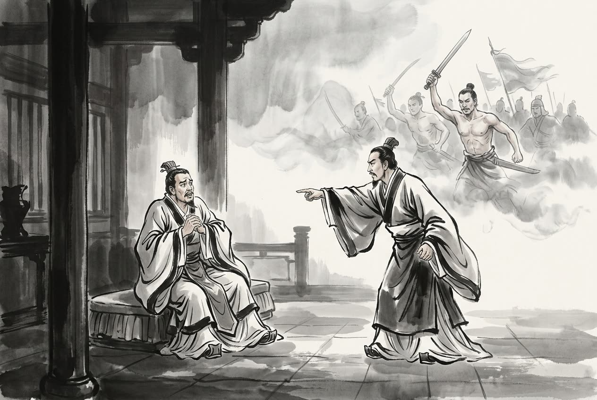

# 卷003 周紀三 — 赧王上四年

> 巻 3 / 294 ・ 周紀三 ・ 年号: 赧王上四年 ・ 西暦: 311 BCE

[← 巻インデックス](README.md)

---

四年〔注:庚戌(かのえいぬ)の年、紀元前三一一年〕。

蜀の宰相が蜀侯を殺した〔注:この宰相は陳莊(ちんしょう)であろう〕。

秦の惠王(けいおう)が使者をやって楚の懷王(かいおう)に告げ、武關(ぶかん)〔注:武關は南陽へ通じる要衝で、その外は秦の丹・析・商於(しょうお)の地である〕の外の地を黔中(けんちゅう)の地と交換したいと申し入れた。楚王は言った。「土地の交換は望まぬ。望むのは張儀(ちょうぎ)を引き渡してもらうことだ。さすれば黔中の地は献上しよう。」張儀はこれを聞くと、自分から行きたいと願い出た。秦王は言った。「楚はおまえに思いを晴らそうとしているのだぞ〔注:楚王は張儀の詐術にまんまとはまったので、その恨みを晴らそうとしていた〕。どうして行こうというのか。」張儀は言った。「秦は強く楚は弱い。大王がおられるかぎり、楚もわたしを勝手に殺すような真似はできますまい。それに、わたしは楚王の寵臣である靳尚(きんしょう)と親しい間柄です。靳尚は楚王の寵姫である鄭袖(ていしゅう)に取り入っており、鄭袖の言うことなら楚王はなんでも聞き入れます。」こうして張儀は楚へ向かった。楚王は彼を捕らえ、殺そうとした。靳尚は鄭袖に言った。「秦王は張儀をたいそう可愛がっておられます。上庸(じょうよう)の六県と美女を差し出して、彼を買い戻すおつもりでしょう〔注:上庸は春秋の庸国の地である〕。楚王が土地を重んじ秦を立てれば、秦から来た女は必ず寵を得て、あなたさまは斥けられることになりましょう。」そこで鄭袖は日夜、楚王に泣きついて言った。「臣下というものは、それぞれ自分の主君のために働くものでございましょう〔張儀が秦のために動いたのも当然のことです〕。いま張儀を殺せば、秦は必ず激怒いたします。どうかわたくしを、子もろとも江南へ移してくださいませ。秦に魚や肉のように切り刻まれるくらいなら、いっそ。」そこで楚王は張儀を赦し、手厚くもてなした。

張儀はこの機に乗じて楚王を説いて言った。「そもそも合従(がっしょう)を唱える者のやり方は、羊の群れを追い立てて猛虎に立ち向かわせるのと変わりありません。勝負にならないのは明らかです〔注:格とは「立ち向かう」「打ち合う」の意である〕。いま大王が秦に仕えなければ、秦は韓を脅し梁(りょう)を駆り立てて楚を攻めましょう。さすれば楚は危うくなります。秦は西に巴(は)・蜀(しょく)を有し、船を整え兵糧を蓄え、岷江(びんこう)に船を浮かべて下れば〔注:岷江は岷山に発する江水である〕、一日に五百里あまりも進み、十日とたたぬうちに扞關(かんかん)に迫りましょう〔注:扞關は楚の西の境にある〕。扞關が騒げば、その東の境はことごとく城に立てこもって守るほかなく、黔中・巫郡(ふぐん)はもはや大王のものではなくなります。秦が甲兵を挙げて武關から出れば、楚の北の地は断ち切られます〔注:北の地とは陳・蔡・汝・潁(えい)など楚の北の境の地である〕。秦が楚を攻めれば、危難は三月のうちに迫りましょう。ところが楚が諸侯の救援を待つには半年あまりもかかります。弱い国の救援を待ち、強い秦の禍を忘れる――これこそわたしが大王のために憂えるところです。大王がまことにわたしの言うことを聞き入れてくださるなら、わたしは秦と楚とを末永く兄弟の国とし、互いに攻め合うことのないようにいたしましょう。」楚王はすでに張儀を手中に収めていたものの、黔中の地を差し出すのは惜しく〔注:土地を重んじ、これを割いて棄てるのを惜しんだ〕、そこでこの申し出を受け入れた。

張儀はそのまま韓へ赴き、韓王を説いて言った。「韓の地は険しく、山あいに人が住んでおります〔注:楚から韓へ赴いたのである〕。穀物のとれるものといえば豆でなければ麦くらいで、国には二年分の蓄えもありません。手もとの兵は二十万を超えますまい。これに対し秦は甲兵百万あまりを擁します。山東(さんとう)の兵士が甲冑をつけ兜をかぶって戦いに臨むのに、秦の人々は甲を脱ぎ捨て肌脱ぎになって敵へ突進し、左手には敵の首をぶら下げ、右手には生け捕りをかかえております。そもそも孟賁(もうほん)・烏獲(うかく)のような勇士をもって、服従しない弱小の国を攻めるのは〔注:孟賁・烏獲は古の勇士である〕、千鈞(せんきん)もの重しを鳥の卵の上に垂らすようなもの

〔注:三十斤を一鈞という〕。助かる見込みなど決してありません。大王が秦に仕えなければ、秦は兵を下して宜陽(ぎよう)を押さえ、成皋(せいこう)を塞ぎましょう。さすればわが王の国は分断され、鴻臺(こうだい)の宮も桑林(そうりん)の苑も、もはや王のものではなくなります。大王のためを思えば、秦に仕えて楚を攻めるにこしたことはありません。そうすれば禍を転じて秦に喜ばれることになる。これより都合のよい策はございません。」韓王はこれを承知した。

張儀は帰って復命し、秦王は彼に六邑を封じ、武信君(ぶしんくん)と号した。さらに張儀を東へやって齊王を説かせて言った。「合従の者が大王を説くときには〔注:合従の者とは合従を唱える者である〕、必ずこう申しましょう。『齊は三晉(さんしん)に守られ、土地は広く民は多く、兵は強く士は勇ましい。たとえ百の秦があろうとも、齊をどうすることもできまい』と。大王はその弁舌を見事とお思いになるばかりで、その実情をお考えになっておられません。いまや秦と楚は娘を嫁がせ嫁を娶って、兄弟の国となりました。韓は宜陽を献じ、梁は河外(かがい)を差し出し〔注:張儀は秦の立場から言っており、ここの河外は河西をさす〕、趙王は秦へ入朝して河間(かかん)を割いて秦に仕えております。大王が秦に仕えなければ、秦は韓・梁を駆り立てて齊の南の地を攻め〔注:齊の南の境の地である〕、趙の兵をことごとく動員して清河(せいが)を渡り博關(はくかん)を指して進みましょう。さすれば臨菑(りんし)・卽墨(そくぼく)はもはや王のものではなくなります。国がひとたび攻められてしまえば、そのときになって秦に仕えようと思っても、もはやかないません。」齊王は張儀に従った。

張儀は齊を去り、西へ向かって趙王を説いて言った。「大王が天下を率いて秦を斥けられたために、秦の兵は十五年ものあいだ函谷關(かんこくかん)から出られませんでした〔注:このことは前の巻、顯王三十六年に見える〕。大王の威勢は山東に行きわたり、わが国は恐れおののき〔注:春秋以来、諸侯が使いをやり取りするさい、使者はみずからの国をへりくだって敝邑(へいゆう)と称した〕、甲を繕い兵を研ぎ、田を耕し兵糧を蓄え、不安に身をすくめて、あえて動こうとはしませんでした。ただ大王がそのとがめだてをなさるのではないかと案じてのことです〔注:督過とは、その事を正してとがめだてすることである〕。いま秦は大王の力をもって〔以下は張儀が秦の強さを誇示して趙を脅すための言である〕巴・蜀を取り、漢中を併せ、東西二つの周を抱え込み、白馬(はくば)の津(しん)を押さえております。秦は片田舎の遠国ではありますが、その心には怒りを抱えて久しいのです。いま秦には傷んだ甲、欠けた兵の軍が澠池(べんち)に集結しております〔注:敗れた甲、傷んだ兵というのはへりくだった言い方で、澠池に軍を置いて趙ににらみをきかせている、ということである〕。願わくはこの軍が河を渡り、漳水(しょうすい)を越え、番吾(ばんご)を押さえ、邯鄲(かんたん)の下に会して、甲子(きのえね)の日に合戦し、かの殷の紂(ちゅう)の故事を再現したい〔注:武王が紂を伐ったとき、甲子の日の明け方に牧野(ぼくや)で合戦し、ついに殷に勝って紂を殺した。張儀はこれを引いて趙を脅したのである〕。そこで謹んで使臣をつかわし、まずあなたさまのお耳に入れる次第です。いま楚は秦と兄弟の国となり、韓・梁は東のかきねの臣を称し、齊は魚や塩のとれる地を献じました〔注:このとき齊が秦に地を献じたことはなく、張儀が弁を弄して趙を脅したにすぎない〕。これは趙の右の肩を断ち切るに等しい。そもそも右の肩を断たれて人と闘い、味方を失って孤立しながら、危うくならずにすむことなどできましょうか。いま秦は三人の将軍を発し、その一軍は午道(ごどう)を塞ぎ〔注:午道は趙の東、齊の西にあたる〕、齊に告げて清河を渡らせ、邯鄲の東に軍を置く。一軍は成皋に軍を置き、韓・梁の軍を河外へ駆り立てる。一軍は澠池に軍を置く。こうして四つの国が一つとなって趙を攻めると約しております〔注:秦が齊・韓・魏と約して趙の地を四分する、ということである〕。趙が屈服すれば、必ずその地は四分されましょう。わたしひそかに大王のために考えますに、秦王と顔を合わせて約を結び、口づから誓いを交わして、末永く兄弟の国となるにこしたことはありません。」趙王はこれを承知した。

張儀はそこで北へ向かい燕へ赴き、燕王を説いて言った。「いま趙王はすでに秦へ入朝し、河間を差し出して秦に仕えております。大王が秦に仕えなければ、秦は雲中(うんちゅう)・九原(きゅうげん)へ兵を下し、趙を駆り立てて燕を攻めましょう。さすれば易水(えきすい)も長城も、もはや大王のものではなくなります。それに、いまや齊・趙の秦に対する有り様は、まるで郡県のようなもので、みだりに軍を起こして攻めかかることもできません。いま王が秦に仕えれば、末永く齊・趙の患いはなくなりましょう。」燕王は常山(じょうざん)の尾の五城を献じて和を請うた〔注:常山は北嶽の恆山(こうざん)である。漢の文帝の諱(いみな)が恆であったため常山と改めた。その尾は燕の西南の境にあたる〕。

張儀は帰って復命したが、まだ咸陽(かんよう)に着かぬうちに、秦の惠王が薨(こう)じ、子の武王(ぶおう)が立った〔注:武王の名は蕩(とう)という〕。武王は太子であったころから張儀を快く思っておらず、即位すると群臣の多くが張儀を悪しざまにけなした〔注:毀短とは、悪口を言ってその短所をあげつらうことである〕。諸侯は張儀と秦王とのあいだに隙(あつれき)が生じたと聞くと〔注:隙とは怨みや仲たがいのことである〕、みな連衡(れんこう)に背いて、ふたたび合従を結び直した。

---

原文を表示

四年
蜀相殺蜀侯。
秦惠王使人告楚懷王，請以武關之外易黔中地。楚王曰：「不願易地，願得張儀而獻黔中地。」張儀聞之，請行。王曰：「楚將甘心於子，柰何行？」張儀曰：「秦強楚弱，大王在，楚不宜敢取臣。且臣善其嬖臣靳尚，靳尚得事幸姬鄭袖，袖之言，王無不聽者。」遂往。楚王囚，將殺之。靳尚謂鄭袖曰：「秦王甚愛張儀，將以上庸六縣及美女贖之。王重地尊秦，秦女必貴而夫人斥矣。」於是鄭袖日夜泣於楚王曰：「臣各爲其主耳。今殺張儀，秦必大怒。妾請子母俱遷江南，毋爲秦所魚肉也！」王乃赦張儀而厚禮之。張儀因說楚王曰：「夫爲從者無以異於驅羣羊而攻猛虎，不格明矣。今王不事秦，秦劫韓驅梁而攻楚，則楚危矣。秦西有巴、蜀，治船積粟，浮岷江而下，一日行五百餘里，不至十日而拒扞關，扞關驚則從境以東盡城守矣，黔中、巫郡非王之有。秦舉甲出武關，則北地絕。秦兵之攻楚也，危難在三月之內。而楚待諸侯之救在半歲之外，夫待弱國之救，忘強秦之禍，此臣所爲大王患也。大王誠能聽臣，臣請令秦、楚長爲兄弟之國，無相攻伐。」楚王已得張儀而重出黔中地，乃許之。
張儀遂之韓，說韓王曰：「韓地險惡山居，五穀所生，非菽而麥，國無二歲之食；見卒不過二十萬。秦被甲百餘萬。山東之士被甲蒙胄以會戰，秦人捐甲徒裼以趨敵，左挈人頭，右挾生虜。夫戰孟賁、烏獲之士以攻不服之弱國，無異垂千鈞之重於鳥卵之上，必無幸矣。大王不事秦，秦下甲據宜陽，塞成皋，則王之國分矣，鴻臺之宮，桑林之苑，非王之有也。爲大王計，莫如事秦以攻楚，以轉禍而悅秦，計無便於此者！」韓王許之。
張儀歸報，秦王封以六邑，號武信君。復使東說齊王曰：「從人說大王者必曰：『齊蔽於三晉，地廣民衆，兵強士勇，雖有百秦，將無柰齊何。』大王賢其說而不計其實。今秦、楚嫁女娶婦，爲昆弟之國；韓獻宜陽；梁效河外；趙王入朝，割河間以事秦。大王不事秦，秦驅韓、梁攻齊之南地， 悉趙兵，渡清河，指博關，臨菑、卽墨非王之有也！國一日見攻，雖欲事秦，不可得也！」齊王許張儀。
張儀去，西說趙王曰：「大王收率天下以擯秦，秦兵不敢出函谷關十五年。大王之威行於山東，敝邑恐懼，繕甲厲兵，力田積粟，愁居懾處，不敢動搖，唯大王有意督過之也。今以大王之力，舉巴、蜀，幷漢中，包兩周，守白馬之津。秦雖僻遠，然而心忿含怒之日久矣。今秦有敝甲凋兵軍於澠池，願渡河，踰漳，據番吾，會邯鄲之下，願以甲子合戰，正殷紂之事。謹使使臣先聞左右。今楚與秦爲昆弟之國，而韓、梁稱東藩之臣，齊獻魚鹽之地，此斷趙之右肩也。夫斷右肩而與人鬬，失其黨而孤居，求欲毋危得乎！今秦發三將軍，其一軍塞午道，告齊使渡清河，軍於邯鄲之東，一軍軍成皋，驅韓、梁軍於河外，一軍軍於澠池，約四國爲一以攻趙，趙服必四分其地。臣竊爲大王計，莫如與秦王面相約而口相結，常爲兄弟之國也。」趙王許之。
張儀乃北之燕，說燕王曰：「今趙王已入朝，効河間以事秦。大王不事秦，秦下甲雲中、九原，驅趙而攻燕，則易水、長城非大王之有也！且今時齊、趙之於秦，猶郡縣也，不敢妄舉師以攻伐。今王事秦，長無齊、趙之患矣。」燕王請獻常山之尾五城以和。
張儀歸報，未至咸陽，秦惠王薨，子武王立。武王自爲太子時，不說張儀；及卽位，羣臣多毀短之。諸侯聞儀與秦王有隙，皆畔衡，復合從。

---

出典: 維基文庫「資治通鑒 (胡三省音注)/卷003」(revid 1326478, CC BY-SA 4.0) / 原字: Kanripo KR2b0007 @80174f6 . 成果物=CC BY-NC-SA 系。

[← 前年: 赧王上三年](j003_y09.md) ・ [巻インデックス](README.md) ・ [次年: 赧王上五年 →](j003_y11.md)
