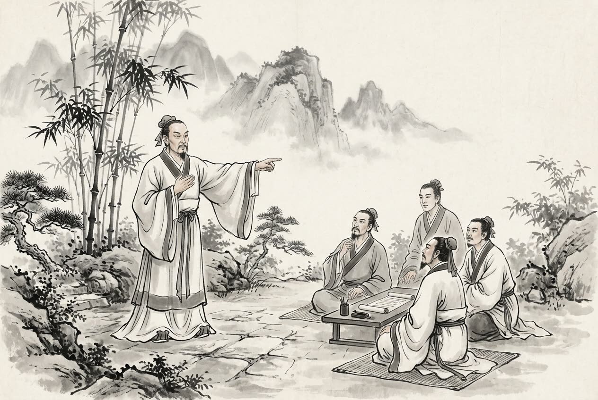

# 卷003 周紀三 — 赧王上五年

> 巻 3 / 294 ・ 周紀三 ・ 年号: 赧王上五年 ・ 西暦: 310 BCE

[← 巻インデックス](README.md)

---

五年〔注:辛亥(かのとい)の年、紀元前三一〇年〕。

張儀は秦の武王を説いて言った。「王のための策を申し上げます。東方に動乱が起これば〔注:韓・魏はいずれも秦の東にある〕、王はそのときこそ多くの土地を割き取ることができましょう。聞くところでは、齊王はわたしをひどく憎んでおり、わたしのいる国へは齊が必ず攻め込むとのこと。そこでわたしは、この不肖の身をいただいて梁(りょう)へ参りたいと存じます〔注:梁は魏の都、大梁(たいりょう)である〕。さすれば齊は必ず梁を攻め、齊と梁は兵をまじえて離れられなくなりましょう。王はその隙に韓を攻め、三川(さんせん)へ入り、天子をわきにかかえ、地図と戸籍を手にお取りになる。これこそ王業でございます。」武王はこれを許した。はたして齊王は梁を攻め、梁王は恐れた。張儀は言った。「王よ、ご心配には及びません。齊に兵を退かせてご覧に入れましょう。」そこで張儀は自分の家臣を楚へ遣わし、楚人を使者として借り受け〔注:あえて直接齊へ人を遣わさず、楚へ行って人を借り、楚人を使者に仕立てたのである〕、その者に齊王へこう言わせた。「王は秦における張儀の信用を、これほどまでに高めておしまいになるとは。」齊王は言った。「どういうことか。」楚の使者は言った。「張儀が秦を去ったのは、もとより秦王と謀ってのことです。齊と梁を攻め合わせ、そのすきに秦に三川を取らせようという腹づもりなのです。いま王ははたして梁を攻めておられる。これでは王は内に自国を疲弊させ、外には味方であるべき国を攻め、かえって張儀を秦王に信用させてやることになりましょう。」齊王はそこで兵を解いて引き返した。張儀は魏の宰相となって一年、亡くなった。

張儀は蘇秦(そしん)とともに、合従連衡の術を用いて諸侯のあいだを遊説し、高い地位と富貴を得た。天下の人々は争ってこれにならおうとした。さらに魏の人で公孫衍(こうそんえん)という者があり、犀首(さいしゅ)と号して、やはり弁舌で名を高めた。そのほか蘇代(そだい)・蘇厲(それい)・周最(しゅうさい)・樓緩(ろうかん)のたぐいが入り乱れて天下にあふれ、弁舌と詐術を競い合い、数えきれぬほどであったが、なかでも張儀・蘇秦・公孫衍がもっとも名を知られた。

孟子はこれを論じて言った。ある人が言った。「公孫衍や張儀は、なんと立派な大丈夫(だいじょうぶ)ではないか。ひとたび怒れば諸侯は恐れおののき、彼らが落ち着いていれば天下の戦乱もやむ〔注:熄とは「滅する」こと。火が消えるのを熄という。ここでは天下の戦乱がやむことをいう〕。」孟子は言った。「そんな者がどうして大丈夫といえようか。君子は天下の正しい位に立ち、天下の正しい道を行く。志を得れば民とともにその道を歩み、志を得られなければひとり己の道を行く。富貴も心を惑わすことができず、貧賤も志を変えさせることができず、威力や武力も屈服させることができない

〔注:詘は屈と同じ〕。これこそ大丈夫というものだ。」

揚子(ようし)の『法言(ほうげん)』に言う。ある人が問うた。「張儀と蘇秦は、鬼谷(きこく)の術を学び、合従連衡の弁を身につけ、中国を安んじることそれぞれ十数年。これは立派なものではないか。」揚子は言った。「人をあざむく者だ。聖人はそれを憎まれる。」ある人が言った。「孔子の言葉を読みながら張儀・蘇秦のようなことを行えば〔注:孔子の言葉を読みながら張儀・蘇秦のような行いをする、ということ〕、どうであろうか。」揚子は言った。「鳳凰の鳴き声をしながら猛禽の翼を持つようなもの、まったくひどいものだ〔注:翰は羽のこと〕。」「それなら子貢(しこう)はそうではなかったのか。」揚子は言った。「乱れていながらそれを解こうとしないことを、子貢は恥とした。説いても富貴を得られないことを、張儀・蘇秦は恥とした。」ある人が言った。「張儀・蘇秦は才人ではなかったか。先人の足跡を踏襲しなかったではないか〔注:張儀・蘇秦の才術は卓越しており、おのずと旧人の足跡をなぞらなかった、という意〕。」揚子は言った。「むかし佞人(ねいじん)については、帝(舜)もこれを拒まれた〔注:『書経』舜典に『而難任人』とある。孔安国の注に、任は佞、難は拒の意。佞人ならばこれを斥け遠ざける、という〕。才がなかったというのではない。才か、なるほど才はある。だがそれはわが同類の才ではない。」

秦王は甘茂(かんぼう)に命じて蜀の宰相であった莊(そう)を誅した〔注:四年に蜀の宰相が蜀侯を殺したので、秦の武王がこれを誅したのである。『史記』では「莊」を「壯」に作る。『秦本紀』によれば、秦は蜀を得てのち陳莊を蜀の宰相としたとあり、「莊」とするのが正しい〕。

秦王と魏王が臨晉(りんしん)で会見した〔注:臨晉は黄河の西にある〕。

趙の武靈王(ぶれいおう)は吳廣(ごこう)の娘である孟姚(もうよう)をめとり〔注:吳氏は国の名を氏としたものである〕、寵愛した。これが惠后(けいこう)である。惠后は子の何(か)を生んだ。

---

原文を表示

五年
張儀說秦武王曰：「爲王計者，東方有變，然後王可以多割得地也。臣聞齊王甚憎臣，臣之所在，齊必伐之。臣願乞其不肖之身以之梁，齊必伐梁，齊、梁交兵而不能相去，王以其間伐韓，入三川，挾天子，案圖籍，此王業也！」王許之。齊王果伐梁，梁王恐。張儀曰：「王勿患也！請令齊罷兵。」乃使其舍人之楚，借使謂齊王曰：「甚矣王之託儀於秦也！」齊王曰：「何故？」楚使者曰：「張儀之去秦也固與秦王謀矣，欲齊、梁相攻而令秦取三川也。今王果伐梁，是王內罷國而外伐與國，而信儀於秦王也。」齊王乃解兵還。張儀相魏一歲，卒。
儀與蘇秦皆以縱橫之術遊諸侯，致位富貴，天下爭慕效之。又有魏人公孫衍者，號曰犀首，亦以談說顯名。其餘蘇代、蘇厲、周最、樓緩之徒，紛紜徧於天下，務以辯詐相高，不可勝紀，而儀、秦、衍最著。
孟子論之曰：或謂：「公孫衍、張儀豈不大丈夫哉！一怒而諸侯懼，安居而天下熄。」孟子曰：「是惡足爲大丈夫哉！君子立天下之正位，行天下之正道，得志則與民由之，不得志則獨行其道，富貴不能淫，貧賤不能移，威武不能詘，是之謂大丈夫。」
揚子《法言》曰：或問：「儀、秦學乎鬼谷術而習乎縱橫言，安中國者各十餘年，是夫？」曰：「詐人也，聖人惡諸。」曰：「孔子讀而儀、秦行，何如也？」曰：「甚矣鳳鳴而鷙翰也！」「然則子貢不爲歟？」曰：「亂而不解，子貢恥諸。說而不富貴，儀、秦恥諸。」或曰：「儀、秦其才矣乎，跡不蹈已？」曰：「昔在任人，帝而難之。不以才乎？才乎才，非吾徒之才也！」
秦王使甘茂誅蜀相莊。
秦王、魏王會于臨晉。
趙武靈王納吳廣之女孟姚，有寵，是爲惠后。生子何。

---

出典: 維基文庫「資治通鑒 (胡三省音注)/卷003」(revid 1326478, CC BY-SA 4.0) / 原字: Kanripo KR2b0007 @80174f6 . 成果物=CC BY-NC-SA 系。

[← 前年: 赧王上四年](j003_y10.md) ・ [巻インデックス](README.md) ・ [次年: 赧王上六年 →](j003_y12.md)
