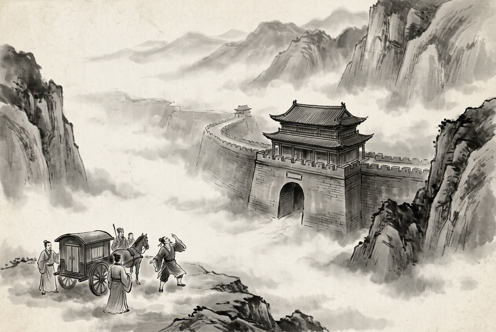

# 卷003 周紀三 — 赧王上十七年

> 巻 3 / 294 ・ 周紀三 ・ 年号: 赧王上十七年 ・ 西暦: 298 BCE

[← 巻インデックス](README.md)

---

十七年〔注:癸亥(みずのとい)の年、紀元前二九八年〕。

①ある者が秦王に言った。「孟嘗君(もうしょうくん)が秦の相となれば、必ず齊を先にして秦を後にするでしょう。秦は危ういことになります。」そこで秦王は樓緩(ろうかん)を相とし、孟嘗君を捕らえて殺そうとした。孟嘗君は人を遣わして、秦王の寵姫(ちょうき)に取りなしを求めた。姫は言った。「あなたの狐白裘(こはくきゅう)が欲しい。」〔注:狐白裘は、狐の脇の下の白い毛皮を縫い合わせて作ったもので、いわゆる『千金の裘は一匹の狐の脇毛では作れぬ』というものである〕。孟嘗君は狐白裘を持ってはいたが、すでにそれを秦王に献じてしまっており、姫の求めに応じるものがなかった。食客のなかに犬のように忍び込む盗みを得意とする者がいて、秦の蔵(くら)に入り込み〔注:物を蔵(しま)っておく所を藏という〕、狐白裘を盗み出して姫に献じた。姫はそこで孟嘗君のために王に取りなし、孟嘗君を帰してやった。王は後で悔い、追手を遣わした。孟嘗君が関所に着いたとき、関所の法では鶏が鳴いてから旅客を出すことになっていたが、まだ時刻は早かった。追手が今にも迫ろうとしていたとき

、食客のなかに鶏の鳴き真似が得意な者がいて、その声を聞いて野の雉(きじ)がみな鳴き出したので、孟嘗君はやっと脱出して帰ることができた。

②楚人が秦に告げて言った。「社稷(しゃしょく)の神霊のおかげで、国に王が立ちました。」秦王は怒り、兵を出して武關(ぶかん)から楚を撃ち、五万を斬首して十六の城を取った。

③趙王はその弟(勝(しょう))を封じて平原君(へいげんくん)とした。平原君は士を好み、食客は常に数千人もいた。公孫龍(こうそんりゅう)という者がいて、堅白同異(けんぱくどうい)の弁論を得意としており〔注:堅白とは守白のことで、黄は堅さのもと、白は鋭さのもとであるといった類の論である〕、平原君はこれを食客とした。孔穿(こうせん)が魯から趙へ赴き〔注:孔穿は孔子の子孫である〕、公孫龍と「臧(ぞう=下僕)には耳が三つある」という説を論じあった〔注:三耳とは、『荘子』にいう鶏に足が三本あるという説のたぐいである。臧は臧獲(ぞうかく)の臧、すなわち下僕のことである〕。公孫龍はじつに巧みに分析した〔注:辯は別(わ)けること、析は分けることで、分析がきわめて精緻であるという意味である〕。子高(しこう=孔穿)は応酬せず、まもなく辞して退出した。翌日、ふたたび平原君に会った。平原君は言った。「昨日の公孫君の言はまことに見事な弁論であった。先生はどうお考えか。」孔穿は答えた。「そのとおりです。あやうく臧に耳を三つ持たせるところでした〔注:然とは、是(そのとおり)という決まり文句。幾(ほとんど)は『あやうく』の意〕。とはいえ、実際にはむずかしいのです。わたしはさらに君にお尋ねしたい。いま、耳が三つあるというのはきわめてむずかしいが実際には正しくなく、耳が二つあるというのはきわめて易しいが実際には正しい、とします。すると君は、易しくて正しいほうに従われますか、それとも、むずかしくて正しくないほうに従われますか。」平原君は答えるすべがなかった。翌日、平原君は公孫龍に言った。「あなたはもう孔子高と弁論をしてはならぬ。あの人は理が辞(ことば)に勝っているが、あなたは辞が理に勝っている。辞が理に勝てば、しまいには必ず言い負かされてしまう。」

鄒衍(すうえん)が趙を通りかかったとき、平原君は彼に公孫龍と「白馬は馬にあらず」の説を論じさせた〔注:これもまた『荘子』にいう『狗は犬にあらず』の説のたぐいである〕。鄒子は言った。「それはいけない。そもそも弁論とは、異なる種類を区別して互いに害しあわぬようにし、異なる立場を整理して互いに乱れぬようにするものだ。考えを述べて意図を通じさせ、その言わんとするところを明らかにして、人にともに理解させ、わざと相手を惑わせようとはせぬ。だから、勝った者はその守る立場を失わず、勝てなかった者もその求めるところ(=何が正しいかの吟味)を得る。そうであってこそ、弁論は意味あるものとなる。ところが、煩(わずら)わしい言葉を連ねて相手を言いくるめ、言辞を飾り立てて相手を言い詰め、巧みな譬(たと)えで論点をすり替え、人を引きずり回してその本意に届かせぬようにする――こうしたことは大いなる道を損なう。もつれ絡んだ言い争いで、われ先にと相手を屈服させて自分が最後まで言い残そうと競うのは、君子を損なわずにはおかぬ。この衍(わたし)はそのようなことはせぬ。」一座の者は皆その言を善しとして称えた。公孫龍はこれによって、ついに屈した。

---

原文を表示

十七年
或謂秦王曰：「孟嘗君相秦，必先齊而後秦；秦其危哉！」秦王乃以樓緩爲相，囚孟嘗君，欲殺之。孟嘗君使人求解於秦王幸姬，姬曰：「願得君狐白裘。」孟嘗君有狐白裘，已獻之秦王，無以應姬求。客有善爲狗盜者，入秦藏中，盜狐白裘以獻姬。姬乃爲之言於王而遣之。王後悔，使追之。孟嘗君至關，關法，雞鳴而出客，時尚蚤，追者將至，客有善爲雞鳴者，野雞聞之皆鳴，孟嘗君乃得脫歸。
楚人告于秦曰：「賴社稷神靈，國有王矣！」秦王怒，發兵出武關擊楚，斬首五萬，取十六城。
趙王封其弟爲平原君。平原君好士，食客嘗數千人。有公孫龍者，善爲堅白同異之辯，平原君客之。孔穿自魯適趙，與公孫龍論臧三耳，龍甚辯析。子高弗應，俄而辭出，明日復見平原君。平原君曰：「疇昔公孫之言信辯也，先生以爲何如？」對曰：「然。幾能令臧三耳矣。雖然，實難！僕願得又問於君：今謂三耳甚難而實非也，謂兩耳甚易而實是也，不知君將從易而是者乎，其亦從難而非者乎？」平原君無以應。明日，謂公孫龍曰：「公無復與孔子高辯事也！其人理勝於辭；公辭勝於理，終必受詘。」
鄒衍過趙，平原君使與公孫龍論白馬非馬之說。鄒子曰：「不可。夫辯者，別殊類使不相害，序異端使不相亂。抒意通指，明其所謂，使人與知焉，不務相迷也。故勝者不失其所守，不勝者得其所求。若是，故辯可爲也。及至煩文以相假，飾辭以相惇，巧譬以相移，引人使不得及其意，如此害大道。夫繳紉爭言而競後息，不能無害君子，衍不爲也。」座皆稱善。公孫龍由是遂詘。

---

出典: 維基文庫「資治通鑒 (胡三省音注)/卷003」(revid 1326478, CC BY-SA 4.0) / 原字: Kanripo KR2b0007 @80174f6 . 成果物=CC BY-NC-SA 系。

[← 前年: 赧王上十六年](j003_y22.md) ・ [巻インデックス](README.md)
