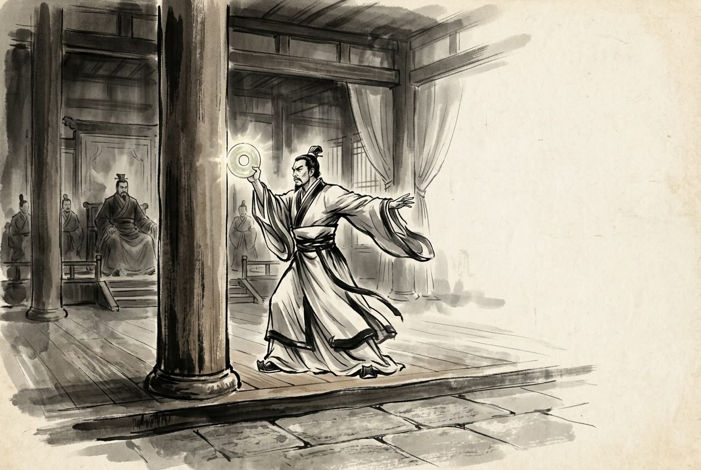

# 卷004 周紀四 — 赧王中三十二年

> 巻 4 / 294 ・ 周紀四 ・ 年号: 赧王中三十二年 ・ 西暦: 283 BCE

[← 巻インデックス](README.md)

---

赧王三十二年〔注:戊寅(ぼいん)の年、紀元前二八三年〕。

秦と趙が穰(じょう)で会見した。秦は魏の安城(あんじょう)を攻め落とし、軍は大梁(たいりょう)まで迫ってから引き返した〔注:安城は、のちの汝南郡の安成県にあたる。当時、魏の領土は南は汝南にまで及んでおり、秦は武関(ぶかん)から兵を出してこれを攻め落とした〕。

齊では、さきの淖齒(どうし)の乱のとき、湣王(びんおう)の子の法章(ほうしょう)は姓名を変え、莒(きょ)の太史敫(たいしきょう)の家の雇われ人になっていた〔注:「敫(きょう)」は穆(ぼく)の古字。「傭(よう)」は、身を雇われて人のために働くこと〕。太史敫の娘は法章の容貌を見て、ただ者ではないといぶかり、ふびんに思っては、こっそり衣服や食事を与えてやり〔注:「竊(せつ)」はひそかに、人に知られぬようにすること〕、そのうちにひそかに情を通じた。一方、王孫賈(おうそんか)は湣王に従っていたが、王の行方を見失った。その母は言った。「お前が朝出かけて夕方に帰るときは、わたしは門に寄りかかってお前を待つ。お前が夕方出かけて帰らぬときは、わたしは里の門に寄りかかってお前を待つ〔注:「閭(りょ)」は里の門。『周礼』では二十五家を一閭とする〕。お前は今、王にお仕えしていながら、王が逃げてその行方も知らぬとは——それでもお前はどの面下げて帰ってきたのか。」そこで王孫賈は市場の中に入って叫んだ。「淖齒は齊国を乱し、湣王を殺した。わたしとともにこやつを誅(ちゅう)しようという者は、右肩を脱げ〔注:右肩をあらわにせよ、ということ〕。」市場の人で従う者が四百人あり、ともに淖齒を攻めてこれを殺した。こうして齊の亡び残った臣たちは、たがいに湣王の子を捜し出し、これを王に立てようとした。法章は自分が殺されはしまいかと恐れ、しばらくしてからようやく名乗り出た。そこで一同は法章を齊王に立て、莒城に拠って燕に対抗し、国じゅうに布告して言った。「王はすでに莒で即位なされた。」

趙王は楚の和氏(かし)の璧(へき)を手に入れていた〔注:楚の人の卞和(べんか)が玉の原石を得て、これを楚王に献じたが、玉人(ぎょくじん)が「ただの石だ」と言ったため、和は二たび足を刖(き)られた。のちに文王が玉人に磨かせると名玉が現れ、そこで「和氏の璧」と名づけられた〕。秦の昭王はこれを欲しがり、十五の城と交換したいと申し入れてきた。趙王は与えたくなかったが秦の強さを恐れ、与えたなら今度は欺かれるのを恐れた。そこで藺相如(りんしょうじょ)に相談すると〔注:藺(りん)は氏。韓の献子の玄孫の康が藺に采邑を得て氏とした〕、相如は答えて言った。「秦が城をもって璧を求めているのに王が承知しなければ、非はこちらにあります。こちらが璧を与えたのに秦が城を渡さなければ、非は秦にあります。この二つの策を比べれば、いっそ承知して、非を秦に負わせるのがよろしい。わたしが璧を捧げて参りましょう。もし秦の城が手に入らなければ、わたしは璧を完(まっと)うして持ち帰ってまいります。

」趙王は相如を遣わした。相如が秦に着くと、秦王には趙に城を渡す気がなかった。そこで相如は計略で秦王をだまして璧を取り戻し〔注:「紿(たい)」は欺くこと、だますこと〕、従者にこれをふところに隠させ、ひそかな道を通って趙へ帰らせ〔注:「間行」はひそかな道を行くこと〕、自分は身一つで秦にとどまって処分を待った。秦王は相如を賢者と思って誅さず、礼遇して趙へ帰した。趙王は相如を上大夫(じょうたいふ)とした。

衞(えい)の嗣君(しくん)が薨(こう)じ、子の懷君(かいくん)が後を継いだ。嗣君はこまかく隠れた事柄まで探り出すのを好んだ。ある県令が、敷き布団をめくると下の敷物が破れていた〔注:「令」は県令。県令の職は戦国時代に起こり、秦・漢がこれにならった〕。嗣君はこれを聞きつけ、その県令に敷物を賜った。県令は大いに驚き、君は神のようだと思った。また人を関所の市にやって、役人を金で買収させ〔注:これは関所の市を掌る役人を買収したものであろう〕、しばらくしてその関所の役人を召し出し、「客が通りかかってお前に金を渡したはずだが、お前はそれを突き返したな〔注:「回遣」は、その金を返したということ〕」と問うた。関所の役人は大いに恐れ入った。また嗣君は泄姬(せつき)を寵愛し、如耳(じょじ)を重んじていたが、二人がその寵愛と重用をかさに着て自分の目をふさぐようになるのを恐れ〔注:「壅(よう)」はふさぐこと〕、そこで薄疑(はくぎ)を貴んで如耳に対抗させ〔注:薄(はく)は氏。『風俗通』に衞の賢人の薄疑が見える〕、魏妃(ぎひ)を尊んで泄姬と対(つい)にして〔注:「偶」は匹(たぐい)・対の意〕、こう言った。「こうしてたがいに牽制させるのだ〔注:「参(さん)」は三つ並べる、間に挟むの意〕。」

荀子(じゅんし)はこれについて論じている。成侯(せいこう)と嗣君は、財を搾り取り損得を計算する君主であって、まだ民の心をつかむには至っていない。子産(しさん)は、民の心をつかんだ者だが、まだ政(まつりごと)を行うには至っていない。管仲(かんちゅう)は、政を行った者だが、まだ礼を修めるには至っていない。ゆえに、礼を修める者は王者となり、政を行う者は強くなり、民の心をつかむ者は安らかとなり、財を搾り取る者は滅びる。

---

原文を表示

三十二年
秦、趙會于穰。秦拔魏安城，兵至大梁而還。
齊淖齒之亂，湣王子法章變姓名爲莒太史敫家傭。太史敫女奇法章狀貌，以爲非常人，憐而常竊衣食之，因與私通。王孫賈從湣王，失王之處，其母曰：「汝朝出而晚來，則吾倚門而望；汝暮出而不還，則吾倚閭而望。汝今事王，王走，汝不知其處，汝尚何歸焉！」王孫賈乃入市中呼曰：「淖齒亂齊國，殺湣王。欲與我誅之者袒右！」市人從者四百人，與攻淖齒，殺之。於是齊亡臣相與求湣王子，欲立之。法章懼其誅己，久之乃敢自言，遂立以爲齊王，保莒城以拒燕，布告國中曰：「王已立在莒矣！」
趙王得楚和氏璧，秦昭王欲之，請易以十五城。趙王欲勿與，畏秦強；欲與之，恐見欺。以問藺相如，對曰：「秦以城求璧而王不許，曲在我矣。我與之璧而秦不與我城，則曲在秦。均之二策，寧許以負秦。臣願奉璧而往；使秦城不入，臣請完璧而歸之！」趙王遣之。相如至秦，秦王無意償趙城。相如乃以詐紿秦王，復取璧，遣從者懷之，間行歸趙，而以身待命於秦。秦王以爲賢而弗誅，禮而歸之。趙王以相如爲上大夫。
衞嗣君薨，子懷君立。嗣君好察微隱，縣令有發褥而席弊者，嗣君聞之，乃賜之席。令大驚，以君爲神。又使人過關市，賂之以金，旣而召關市，問有客過與汝金，汝回遣之；關市大恐。又愛泄姬，重如耳，而恐其因愛重以壅己也，乃貴薄疑以敵如耳，尊魏妃以偶泄姬，曰：「以是相參也。」
荀子論之曰：成侯、嗣君，聚斂計數之君也，未及取民也。子產，取民者也，未及爲政也。管仲，爲政者也，未及修禮也。故修禮者王，爲政者強，取民者安，聚斂者亡。

---

出典: 維基文庫「資治通鑒 (胡三省音注)/卷004」(revid 1327722, CC BY-SA 4.0) / 原字: Kanripo KR2b0007 @80174f6 . 成果物=CC BY-NC-SA 系。

[← 前年: 赧王中三十一年](j004_y14.md) ・ [巻インデックス](README.md) ・ [次年: 赧王中三十三年 →](j004_y16.md)
