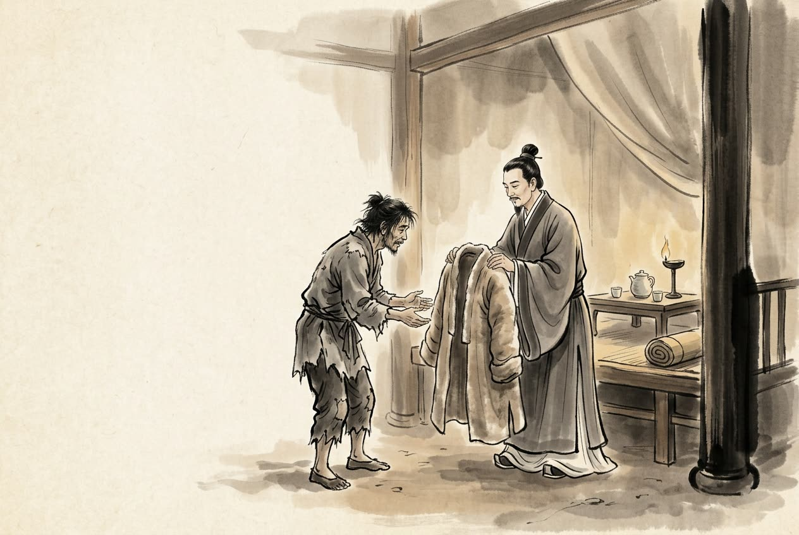

# 卷005 周紀五 — 赧王下四十九年

> 巻 5 / 294 ・ 周紀五 ・ 年号: 赧王下四十九年 ・ 西暦: 266 BCE

[← 巻インデックス](README.md)

---

四十九年〔注:乙未(いつび)の年、紀元前二六六年〕。

秦が魏の邢丘(けいきゅう)を攻め落とした。范睢(はんすい)は日ごとに(秦王に)親しまれ、政務を取り仕切るようになった。そこで折を見て秦王にこう説いた。「私が山東(さんとう)におりましたころ、齊には孟嘗君(もうしょうくん)がいると聞きましたが、王がいるとは聞きませんでした。秦には太后と穰侯(じょうこう)がいると聞きましたが、王がいるとは聞きませんでした。そもそも国を意のままに動かせる者をこそ王と言い、人に利害を加えられる者をこそ王と言い、人の生殺を握る者をこそ王と言うのです。いま太后は他をはばからず思うがままに振る舞い、穰侯は使者を出しても王に報告せず、華陽君(かようくん)と涇陽君(けいようくん)は人を打ち裁いてもはばかることなく、高陵君(こうりょうくん)は進退を王に願い出ることもありません。この四人の貴人(=四貴)がそろっていながら国が危うくならなかったためしは、いまだかつてありません。この四貴の下に立っている、これこそ世にいう『王なし』の状態でございます。

穰侯の使者は王の権威を笠に着て、諸侯に対して物事を決し、天下に符(ふ)を割って命令を下し〔注:符を割って使者を出すことをいう〕、敵を征し国を伐(う)つのに、誰一人としてあえて従わぬ者はおりません。戦に勝ち攻め取れば利益は(穰侯の領地の)陶(とう)に帰し、戦に敗れれば民に怨みを結ばせ、その禍(わざわい)は社稷(しゃしょく)に帰してしまいます。私はまたこう聞いております。木の実が多くなりすぎればその枝を裂き、枝が裂ければ幹の中心を傷つける。都(みやこ)を大きくしすぎればその国を危うくし、臣を尊びすぎればその主を卑(いや)しくする、と。淖齒(どうし)が齊の政を握ったときには、王の股(もも)を射、王の筋(すじ)を引き抜き、これを廟(びょう)の梁(はり)に吊るして、一晩のうちに死なせました〔注:淖齒が齊の湣王(びんおう)を弑(しい)したことは前の巻(三十一年)に見える〕。李兌(りたい)が趙の政を握ったときには、主父(しゅほ)を沙丘(さきゅう)に閉じ込め、百日を経て餓死させました。いま私が四貴のなさりようを見ますに、これもまた淖齒や李兌のたぐいでございます。

そもそも三代(夏・殷・周)が国を滅ぼしたわけは、君主が政を臣に丸投げして、酒におぼれ狩りに明け暮れたからです。政を委ねられた者は、賢者を妬(ねた)み有能な者を憎み、下の者を抑え上の者の目をふさいで私腹を肥やし、主君のためにはかろうとしません。それでいて主君が目を覚まさぬので、ついに国を失うのです。いま、秩(ちつ)ある役人以上から諸々の大吏(たいり)に至るまで〔注:有秩(ゆうちつ)は田間の大夫(村役)である。大吏とは、左更・右更・中更以上の吏をいう〕、下は王のそばに仕える者に至るまで、相国(しょうこく。穰侯)の息のかかった者でない者はおりません。王が朝廷でただ一人、孤立しておられるのを見て、私はひそかに王のために恐れております。万世ののち、秦の国を持つ者が、王の子孫でなくなるのではないか、と。」

秦王はそのとおりだと思い、ここに太后を退け、穰侯・高陵君・華陽君・涇陽君を関の外へ追放し、范睢を丞相(じょうしょう)とし、応侯(おうこう)に封じた〔注:応は国の名で、周の武王の子が応に封じられた。その地はいまの安州の境にある〕。

魏王が須賈(しゅか)を秦に使いとして遣わした。応侯(范睢)は、みすぼらしい服を着て、人目を避けて徒歩で須賈に会いに行った。須賈は驚いて言った。「范叔(はんしゅく)、まったく無事であったか。」〔注:范睢は字(あざな)を叔という〕そして須賈は范睢を引き留めて飲み食いさせ、綈袍(ていほう。厚地の綿入れ)を一着取って贈った。

范睢はそのまま須賈の御者となって相府(しょうふ)に至り、こう言った。「私が先に入って、宰相どのにお取り次ぎいたしましょう。」須賈は、范睢がいつまでたっても出てこないのを不審に思い、門番に尋ねた。門番は言った。「范叔という者はおりません。先ほどのお方は、わが宰相の張君(ちょうくん)でございます。」須賈は欺かれたと知り、膝(ひざ)で這(は)って中へ入り、罪を詫びた〔注:膝行(しっこう)とは、膝を地につけて進み、ひれ伏してわびを示すことである〕。

応侯は座したまま須賈を責め立て、こう言った。「お前が死なずに済んだのは、あの綈袍に、なお昔なじみを思う情がいくらか残っていたからだけのことだ。」そして大いに宴席をしつらえ、諸侯の賓客を招いた。須賈は堂の下に座らされ、その前に莝(まぐさ)と豆(まめ)を置かれて、馬のように食わされた〔注:莝とは、寸刻みにした藁(わら)に豆を混ぜて馬に与えるものである〕。范睢は須賈を帰らせ、魏王にこう伝えさせた。「すみやかに魏齊(ぎせい)の首を斬って持ってこい。さもなくば、大梁(たいりょう)を皆殺しにするぞ。」須賈は帰国してこれを魏齊に告げた。魏齊は趙へ逃げ、平原君(へいげんくん)の家に身を隠した。

趙の惠文王(けいぶんおう)が薨じ、その子の孝成王(こうせいおう)丹(たん)が立った。平原君を相(しょう)とした。

---

原文を表示

==四十九年==
秦拔魏邢丘。范睢日益親，用事，因承間說王曰：「臣居山東時，聞齊之有孟嘗君，不聞有王；聞秦有太后、穰侯，不聞有王。夫擅國之謂王，能利害之謂王，制殺生之謂王。今太后擅行不顧，穰侯出使不報，華陽、涇陽擊斷無諱，高陵進退不請，四貴備而國不危者，未之有也。爲此四貴者下，乃所謂無王也。穰侯使者操王之重，決制於諸侯，剖符於天下，征敵伐國，莫敢不聽；戰勝攻取則利歸於陶，戰敗則結怨於百姓而禍歸於社稷。臣又聞之，木實繁者披其枝，披其枝者傷其心；大其都者危其國，尊其臣者卑其主。淖齒管齊，射王股，擢王筋，懸之於廟梁，宿昔而死。李兌管趙，囚主父於沙丘，百日而餓死。今臣觀四貴之用事，此亦淖齒、李兌之類也。夫三代之所以亡國者，君專授政於臣，縱酒弋獵；其所授者妬賢疾能，御下蔽上以成其私，不爲主計，而主不覺悟，故失其國。今自有秩以上至諸大吏，下及王左右，無非相國之人者，見王獨立於朝，臣竊爲王恐，萬世之後有秦國者，非王子孫也！」王以爲然，於是廢太后，逐穰侯、高陵、華陽、涇陽君於關外，以范睢爲丞相，封爲應侯。
魏王使須賈聘於秦，應侯敝衣間步而往見之。須賈驚曰：「范叔固無恙乎！」留坐飲食，取一綈袍贈之。遂爲須賈御而至相府，曰：「我爲君先入通於相君。」須賈怪其久不出，問於門下，門下曰：「無范叔；鄕者吾相張君也。」須賈知見欺，乃膝行入謝罪。應侯坐，責讓之，且曰：「爾所以得不死者，以綈袍戀戀尚有故人之意耳！」乃大供具，請諸侯賓客；坐須賈於堂下，置莝、豆於前而馬食之，使歸告魏王曰：「速斬魏齊頭來，不然，且屠大梁！」須賈還，以告魏齊。魏齊奔趙，匿於平原君家。
趙惠文王薨，子孝成王丹立；以平原君爲相。

---

出典: 維基文庫「資治通鑒 (胡三省音注)/卷005」(revid 1751430, CC BY-SA 4.0) / 原字: Kanripo KR2b0007 @80174f6 . 成果物=CC BY-NC-SA 系。

[← 前年: 赧王下四十八年](j005_y06.md) ・ [巻インデックス](README.md) ・ [次年: 赧王下五十年 →](j005_y08.md)
