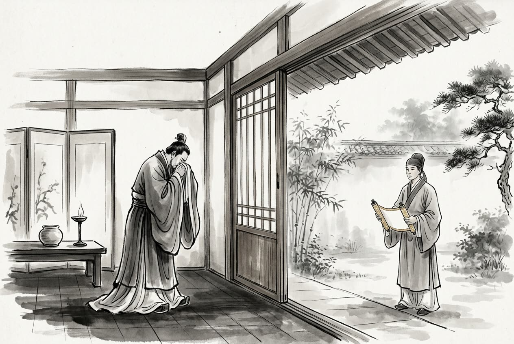

# 卷005 周紀五 — 赧王下五十三年

> 巻 5 / 294 ・ 周紀五 ・ 年号: 赧王下五十三年 ・ 西暦: 262 BCE

[← 巻インデックス](README.md)

---

五十三年〔注:己亥(きがい)の年、紀元前二六二年〕。

楚が州(しゅう)の地を秦に差し出して、和睦した。

武安君(ぶあんくん)が韓を伐ち、野王(やおう)を抜いた。これによって上黨(じょうとう)への道が断たれた〔注:韓の都は新鄭(しんてい)で、上黨から鄭へ向かうには野王を通って黄河を渡る。いま秦が野王を抜いたので、鄭への道が断たれたのである〕。上黨の守(かみ)である馮亭(ふうてい)は、その地の民と謀って言った。「鄭への道はもう断たれた。秦兵は日ごとに進んでくるが、韓は応じることができぬ。それよりは、上黨を趙に帰属させるにこしたことはない。趙が我らを受け入れれば、秦は必ず趙を攻めるだろう。趙が秦兵に攻められれば、必ず韓と親しくしようとする。韓と趙が一つになれば、秦に立ち向かうことができる。」

そこで使者を遣わして趙にこう告げた。「韓は上黨を守りきれず、これを秦に差し出すことになりました。しかし、その役人も民もみな趙に帰することを安んじ、秦の民となることを喜びません。城市(じょうし)のある邑(むら)が十七ございます。なにとぞ再拝(さいはい)して、これを大王に献上いたしたく存じます。」趙王はこれを平陽君(へいようくん)豹(ひょう)に告げた。豹は答えた。「聖人は、いわれのない利益を、ひどく禍(わざわい)として恐れるものでございます。」趙王は言った。「人々がわしの徳を慕って(従おうとして)おるのだ。なぜ『いわれがない』と言うのか。」豹は答えた。「秦は韓の地を蚕食(さんしょく)し、その途中を断ち切って、互いに行き来できぬようにしました。秦は当然、座したままで上黨が手に入ると思い込んでおります。韓が上黨を秦に渡そうとしないのは、その禍を趙になすりつけようとしているのです〔注:悪事を人に押しつけることを『嫁禍(かか)』という〕。秦が労を負い、趙がその利を受ける——強大な国でさえ弱小の国から(やすやすと)奪えぬものを、弱小の国がどうして強大な国から奪えましょうか。これを『いわれがない』と言わずして何と言いましょう。受け取らぬにこしたことはございません。」

趙王はこれを平原君(へいげんくん)に告げた。平原君は受け取るよう請うた。そこで王は平原君を遣わして地を受け取らせ、一万戸の都(まち)三つをもって、その太守(=馮亭)を華陽君(かようくん)に封じ、千戸の都三つをもって、その県令を侯に封じ、役人も民もみな爵位を三級ずつ加えた。馮亭は涙を流して使者に会おうとせず、こう言った。「私は、主君の地を売ってそれで食らうことには忍びないのだ。」

---

原文を表示

==五十三年==
楚人納州于秦以平。
武安君伐韓，拔野王。上黨路絕，上黨守馮亭與其民謀曰：「鄭道已絕，秦兵日進，韓不能應，不如以上黨歸趙。趙受我，秦必攻之；趙被秦兵，必親韓；韓、趙爲一，則可以當秦矣。」乃遣使者告於趙曰：「韓不能守上黨，入之秦，其吏民皆安於趙，不樂爲秦。有城市邑十七，願再拜獻之大王！」趙王以告平陽君豹，對曰：「聖人甚禍無故之利。」王曰：「人樂吾德，何謂無故？」對曰：「秦蠶食韓地，中絕，不令相通，固自以爲坐而受上黨也。韓氏所以不入於秦者，欲嫁其禍於趙也。秦服其勞而趙受其利，雖強大不能得之於弱小，弱小固能得之於強大乎！豈得謂之非無故哉？不如勿受。」王以告平原君，平原君請受之。王乃使平原君往受地，以萬戶都三封其太守爲華陽君，以千戶都三封其縣令爲侯，吏民皆益爵三級。馮亭垂涕不見使者，曰：「吾不忍賣主地而食之也！」

---

出典: 維基文庫「資治通鑒 (胡三省音注)/卷005」(revid 1751430, CC BY-SA 4.0) / 原字: Kanripo KR2b0007 @80174f6 . 成果物=CC BY-NC-SA 系。

[← 前年: 赧王下五十二年](j005_y10.md) ・ [巻インデックス](README.md)
