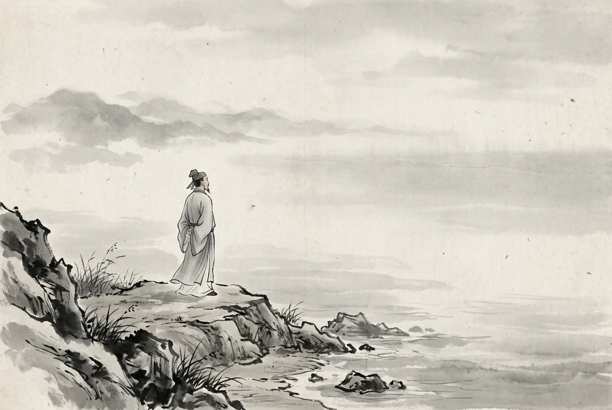

# 卷006 秦紀一 — 孝文王元年

> 巻 6 / 294 ・ 秦紀一 ・ 年号: 孝文王元年 ・ 西暦: 250 BCE

[← 巻インデックス](README.md)

---

孝文王(こうぶんおう)〔注:名は柱(ちゅう)。諡(おくりな)は、一族が安んじる「孝」と、いつくしみ深く民を愛する「文」を合わせたもの〕。

元年〔注:辛亥(しんがい)の年、紀元前二五〇年〕。

冬十月の己亥(きがい)の日、王(孝文王)は即位したが、わずか三日で薨じた。子の子楚(しそ)が立った。これが莊襄王(そうじょうおう)である。莊襄王は華陽夫人(かようふじん)を華陽太后と尊び、夏姬(かき)を夏太后(かたいこう)と尊んだ〔注:夏姬は莊襄王(子楚)の生母なので、太后と尊ばれた〕。

燕(えん)の将軍が斉の聊城(りょうじょう)を攻め、これを攻め落とした〔注:聊城は濟水の北にあり、東郡に属する〕。ところが、ある者がこの将軍を燕王に讒言したため、将軍は聊城に立てこもったまま、(罰を恐れて)帰国できずにいた。斉の田単(でんたん)がこれを攻めたが、一年あまりたっても落とせなかった。そこで魯仲連(ろちゅうれん)が手紙を書き、それを矢に巻きつけて城内へ射込み、燕の将軍に届けて利害を説いて言った。「あなたのために考えますと、燕に帰るか、斉に降るかのどちらかしかありません。いま孤城をただ一人で守り、斉の兵は日ごとに増えるのに燕からの救援は来ない。これからどうなさるおつもりですか。」燕の将軍は手紙を読んで三日のあいだ涙を流したが、迷うばかりで自分では決断できなかった。燕に帰ろうにも、すでに王との間にしこりがある。斉に降ろうにも、斉では殺し捕らえた者があまりに多く、降伏したあとで辱めを受けるのを恐れた。将軍はため息をついて嘆いた。「人に刃を向けられて殺されるくらいなら、いっそ自分の手で刃にかかろう。」そして自害した。聊城は混乱に陥り、田単はついに聊城を攻め落とした〔注:大軍を用いて勝つことを「克」という〕。田単は帰国すると、斉(の王)に魯仲連の働きを伝え、彼に爵位を授けようとした。だが魯仲連は海辺へ逃げ、こう言った。「私は、富貴を得て人に頭を下げて従うよりは、たとえ貧しく賤しくとも、世俗にとらわれず思いのままに生きる方を選ぶ。」

魏の安釐王(あんきおう)が、子順(しじゅん)に天下の高潔な士は誰かと尋ねた。子順は答えた。「そのような人物は今の世にはおりません。しいて次点を挙げるなら、あの魯仲連でしょうか。」王は言った。「魯仲連は(高潔を)無理に作り上げている者で、生まれつき自然にそうなのではない。」子順は言った。「人は誰でも(初めは)作るものです。作り続けてやめなければ、やがて君子となります。作り続けて変わらなければ、習慣が身と一体になって、それがもはや自然(生まれつき)となるのです〔注:朱熹いわく、君子とは徳を成し遂げた者の名である〕。」

---

原文を表示

孝文王
元年
冬，十月，己亥，王卽位；三日薨。子楚立，是爲莊襄王；尊華陽夫人爲華陽太后，夏姬爲夏太后。
燕將攻齊聊城，拔之。或譖之燕王，燕將保聊城，不敢歸。齊田單攻之，歲餘不下。魯仲連乃爲書，約之矢以射城中，遺燕將，爲陳利害曰︰「爲公計者，不歸燕則歸齊。今獨守孤城，齊兵日益而燕救不至，將何爲乎？」燕將見書，泣三日，猶豫不能自決。欲歸燕，已有隙；欲降齊，所殺虜於齊甚衆，恐已降而後見辱。喟然歎曰︰「與人刃我，寧我自刃！」遂自殺。聊城亂，田單克聊城。歸，言魯仲連於齊，欲爵之。仲連逃之海上，曰︰「吾與富貴而詘於人，寧貧賤而輕世肆志焉！」
魏安釐王問天下之高士於子順，子順曰︰「世無其人也；抑可以爲次，其魯仲連乎！」王曰︰「魯仲連強作之者，非體自然也。」子順曰︰「人皆作之。作之不止，乃成君子；作之不變，習與體成，則自然也。」

---

出典: 維基文庫「資治通鑒 (胡三省音注)/卷006」(revid 387087, CC BY-SA 4.0) / 原字: Kanripo KR2b0007 @80174f6 . 成果物=CC BY-NC-SA 系。

[← 前年: 昭襄王五十六年](j006_y05.md) ・ [巻インデックス](README.md) ・ [次年: 莊襄王元年 →](j006_y07.md)
