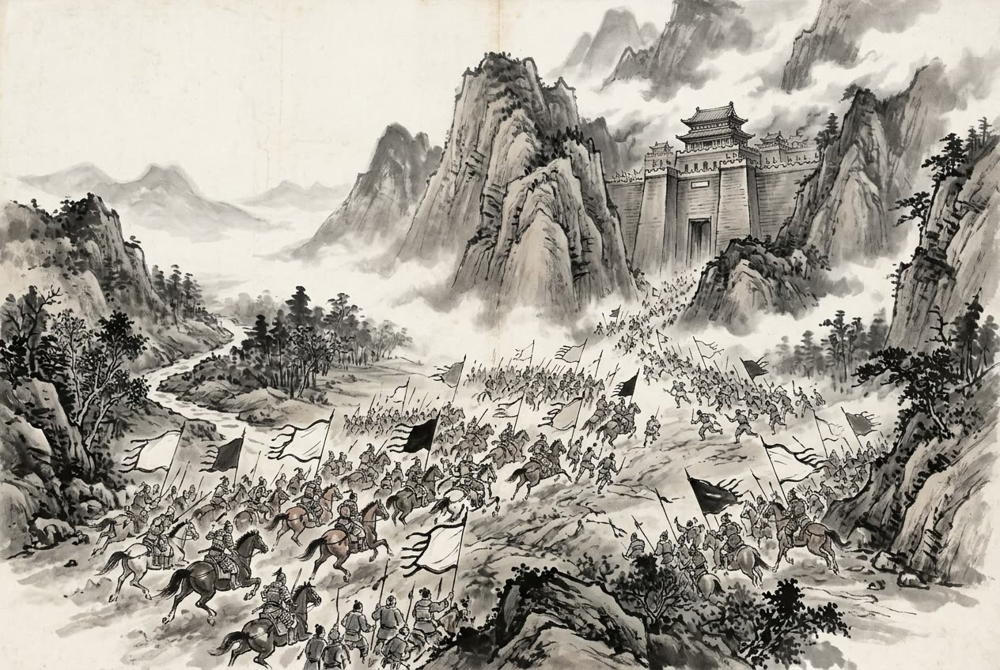

# 卷006 秦紀一 — 莊襄王三年

> 巻 6 / 294 ・ 秦紀一 ・ 年号: 莊襄王三年 ・ 西暦: 247 BCE

[← 巻インデックス](README.md)

---

三年〔注:甲寅(こういん)の年、紀元前二四七年〕。

王齕(おうこつ)が上党(じょうとう)の諸城を攻め、ことごとくこれを攻め落とし、新たに太原郡(たいげんぐん)を置いた。

蒙驁(もうごう)が軍を率いて魏を伐ち、高都(こうと)・汲(きゅう)を奪い取った。魏の軍はたびたび敗れ、魏王はこれを憂え、そこで人をやって趙にいる信陵君(しんりょうくん)に(帰国を)請うた。信陵君は罪に問われるのを恐れて、帰ろうとしなかった〔注:信陵君が趙に留まっていた経緯は前の巻に見える〕。そして門下の者たちに戒めて言った。「あえて魏の使者を取り次ぐ者は死罪に処す。」食客たちは誰も諫めようとしなかった。すると毛公(もうこう)・薛公(せつこう)が信陵君に会って言った。「公子(信陵君)が諸侯から重んじられているのは、ひとえに魏という国があるからにすぎません。いま魏が危急に瀕しているのに公子が顧みず、ある日秦人が(魏の都の)大梁(たいりょう)を攻め落とし、先王の宗廟を踏みにじったなら、公子はどの面目があって天下に立てましょうか。」言葉が終わらぬうちに、信陵君は顔色を変え、急いで車を仕立てて魏へ帰った。魏王は信陵君の手を取って涙を流し、彼を上将軍(じょうしょうぐん)に任じた。信陵君が諸侯に使者をやって救援を求めると、諸侯は信陵君がふたたび魏の将となったと聞いて、みな兵を送って魏を救った。信陵君は五か国の軍を率いて河外(かがい)で蒙驁を破り

〔注:河外とは黄河の西側をいう〕、蒙驁は逃げ去った。信陵君は函谷関(かんこくかん)まで追撃し、秦軍を関内に抑え込んでから引き返した。

安陵(あんりょう)の人である縮高(しゅくこう)の子は秦に仕えており、秦は彼を管(かん)の守備に当たらせていた〔注:管は河南郡中牟県にある、もと管という国の地〕。信陵君は管を攻めたが落とせず、人をやって安陵君にこう告げた。「あなたから縮高を遣わしてくだされば、私は彼を五大夫(ごたいふ)に任じ、執節尉(しっせつい)にいたしましょう。」安陵君は答えた。「安陵は小国であり、自国の民に必ずこうせよと強いることはできません。使者ご自身で出向いて頼まれるがよいでしょう。」そこで(安陵君は)役人に命じて使者を縮高のもとへ案内させた。使者が信陵君の命を伝えると、縮高は言った。「あなた(信陵君)が私を取り立ててくださるのは、私に管を攻めさせるためでしょう。そもそも父が攻め子が守るというのは、世間の物笑いの種です。また、私を見て(子が)降参すれば、それは主君(秦)を裏切ることになります。父が子に裏切りを教えるなど、あなたとて喜ばれますまい。謹んで再拝してお断り申し上げます。」使者がこれを信陵君に報告すると、信陵君は大いに怒り、使者を安陵君のもとへ遣わして言わせた。「安陵の地も、もとはと言えば魏のものだ。いま私が管を攻めて落とせなければ、秦兵が我が身に及び、社稷(国家)は必ず危うくなる。どうか縮高を生け捕りにして引き渡していただきたい。もし引き渡されないなら、この無忌(むき)(信陵君)は十万の軍を起こして安陵の城下へ攻め寄せるであろう。」安陵君は答えた。「我が先君の成侯(せいこう)は、(魏の)襄王の詔(みことのり)を受けてこの城を守り、じきじきに太府(たいふ)の憲(法典)を授けられました〔注:太府は魏国が記録を収める役所、憲は法のこと〕。その憲の上篇にはこうあります。『臣が君を弑し、子が父を弑するは、定法として赦さず。国に大赦があっても、城を敵に降した者、国を逃げ出した者は、その恩赦に与れない。』いま縮高は高い位を辞退して父子の義を全うしようとしているのに、あなたは『必ず生きたまま引き渡せ』とおっしゃる。それは私に襄王の詔に背かせ、太府の憲を廃させることであり、たとえ死んでも、決して従うわけにはまいりません。」縮高はこれを聞いて言った。「信陵君の人となりは、荒々しく猛々しく、自分の考えを押し通す。この断りはきっと裏目に出て、国の災いとなろう。私はすでに我が身を全うし、人臣の義に背かずにすんだ。どうして我が君(安陵君)に魏との災いを背負わせてよかろうか。」そして使者の宿舎へ行き、みずから頸(くび)を切って死んだ。信陵君はこれを聞くと、白い喪服を着て普段の住まいを離れ(謹慎し)、使者をやって安陵君に詫びて言わせた。「この無忌は小人でございました。思慮に行き詰まり、あなたに失言いたしました。謹んで再拝して罪をお詫び申し上げます。」

秦王は人をやって魏に万金をばらまき、信陵君を離間させようと図り、(かつて信陵君に殺された)晉鄙(しんぴ)の食客を探し出して〔注:信陵君がかつて晉鄙を殺した経緯は前の巻に見える〕、魏王にこう説かせた。「公子(信陵君)は国外に亡命して十年、いまふたたび将となり、諸侯はみな彼に従っています。天下はただ信陵君があることを聞くばかりで、魏王があることを聞かなくなりました。」秦王はまた、たびたび人をやって信陵君に祝いを述べさせた。「もう魏王にはおなりになりましたか。」魏王は日々こうした讒言を耳にし、信じずにはいられなくなって、ついに人をやって信陵君に代えて兵を握らせた。信陵君は、ふたたび讒言によって退けられたと悟り、病と称して朝廷に出ず、日夜、酒と女で自らを慰め、四年たって卒した。(のちに)韓王が弔問に訪れたとき、信陵君の子はそれを名誉なことと思い、子順(しじゅん)にそのことを告げた。子順は言った。「必ず礼をもってお断りなさい。『隣国の君が弔いに来れば、(その国の)君が喪主となる』ものです〔注:鄭玄いわく、隣国の君が弔いに来れば、その国の君が喪主となり、臣下である者は喪主となることを憚って中庭で北面し、哭しても拜はしない〕。いまあなたの君(魏王)があなたに(喪主となるよう)命じていない以上、あなたには韓王の弔いをお受けする立場はないのです。」信陵君の子はこの弔問を辞退した。

五月の丙午(へいご)の日、王(莊襄王)が薨じた。太子の政(せい)が立った。生まれて十三年になっていた。国事はすべて文信侯(ぶんしんこう)(呂不韋)が取り決め、(政は呂不韋を)仲父(ちゅうほ)と呼んだ〔注:仲父とは、斉の桓公が管仲を礼遇したのにならった呼称〕。

晉陽(しんよう)が反いた〔注:この年、秦は晉陽を攻め取って太原郡を置いたが、まもなく秦に莊襄王の喪があったため、晉陽が反いたのである〕。

---

原文を表示

三年
王齕攻上黨諸城，悉拔之，初置太原郡。
蒙驁帥師伐魏，取高都、汲。魏師數敗，魏王患之，乃使人請信陵君於趙。信陵君畏得罪，不肯還。誡門下曰︰「有敢爲魏使通者死！」賓客莫敢諫。毛公、薛公見信陵君曰︰「公子所以重於諸侯者，徒以有魏也。今魏急而公子不恤，一旦秦人克大梁，夷先王之宗廟，公子當何面目立天下乎！」語未卒，信陵君色變，趣駕還魏。魏王持信陵君而泣，以爲上將軍。信陵君使人求援於諸侯。諸侯聞信陵君復爲魏將，皆遣兵救魏。信陵君率五國之師敗蒙驁於河外，蒙驁遁走。信陵君追至函谷關，抑之而還。
安陵人縮高之子仕於秦，秦使之守管。信陵君攻之不下，使人謂安陵君曰︰「君其遣縮高，吾將仕之以五大夫，使爲執節尉。」安陵君曰︰「安陵，小國也，不能必使其民。使者自往請之。」使吏導使者至縮高之所。使者致信陵君之命，縮高曰︰「君之幸高也，將使高攻管也。夫父攻子守，人之笑也；見臣而下，是倍主也。父敎子倍，亦非君之所喜。敢再拜辭！」使者以報信陵君。信陵君大怒，遣使之安陵君所曰︰「安陵之地，亦猶魏也。今吾攻管而不下，則秦兵及我，社稷必危矣。願君生束縮高而致之！若君弗致，無忌將發十萬之師以造安陵之城下。」安陵君曰︰「吾先君成侯受詔襄王以守此城也，手授太府之憲。憲之上篇曰︰『臣弑君，子弑父，有常不赦。國雖大赦，降城亡子不得與焉。』今縮高辭大位以全父子之義，而君曰『必生致之』，是使我負襄王之詔而廢太府之憲也，雖死，終不敢行！」縮高聞之曰︰「信陵君爲人，悍猛而自用，此辭必反爲國禍。吾已全己，無違人臣之義矣，豈可使吾君有魏患乎！」乃之使者之舍，刎頸而死。信陵君聞之，縞素辟舍，使使者謝安陵君曰︰「無忌，小人也，困於思慮，失言於君，請再拜辭罪！」
王使人行萬金於魏以間信陵君，求得晉鄙客，令說魏王曰︰「公子亡在外十年矣，今復爲將，諸侯皆屬，天下徒聞信陵君而不聞魏王矣。」王又數使人賀信陵君︰「得爲魏王未也？」魏王日聞其毀，不能不信，乃使人代信陵君將兵。信陵君自知再以毀廢，乃謝病不朝，日夜以酒色自娛，凡四歲而卒。韓王往弔，其子榮之，以告子順。子順曰︰「必辭之以禮！『鄰國君弔，君爲之主。』今君不命子，則子無所受韓君也。」其子辭之。
五月，丙午，王薨。太子政立，生十三年矣，國事皆決於文信侯，號稱仲父。
晉陽反。

---

出典: 維基文庫「資治通鑒 (胡三省音注)/卷006」(revid 387087, CC BY-SA 4.0) / 原字: Kanripo KR2b0007 @80174f6 . 成果物=CC BY-NC-SA 系。

[← 前年: 莊襄王二年](j006_y08.md) ・ [巻インデックス](README.md) ・ [次年: 始皇帝上元年 →](j006_y10.md)
