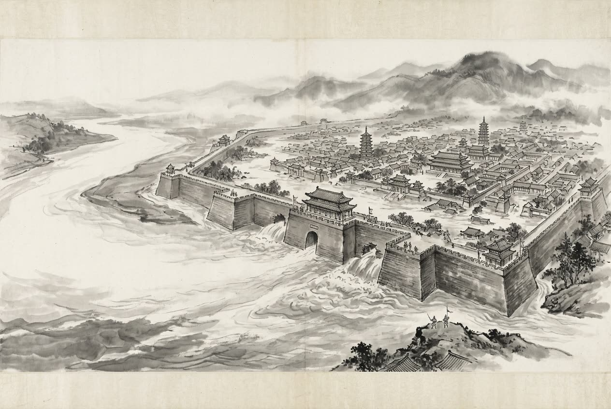

# 卷007 秦紀二 — 始皇帝下二十二年

> 巻 7 / 294 ・ 秦紀二 ・ 年号: 始皇帝下二十二年 ・ 西暦: 225 BCE

[← 巻インデックス](README.md)

---

二十二年〔注:丙子(ひのえね)の年、紀元前二二五年〕。

王賁(おうほん)が魏を攻め、黄河の水路を引いて大梁(たいりょう)に注ぎ込んだ

〔注:大梁は陳留郡浚儀(しゅんぎ)県にあたり、王賁が旧来の水路を断ち切って水を東南へ導き大梁に灌いだので、これを梁溝と呼ぶ〕。三月、城壁が崩れた。魏王の假(か)が降伏したが、(秦は)これを殺し、こうして魏を滅ぼした。

王(秦王)は使者を遣わして安陵君(あんりょうくん)に告げた。「私は五百里の土地と安陵とを交換したい。」安陵君は答えた。「大王が恩恵を垂れ、大きな土地で小さな土地を取り替えてくださるとは、まことに幸いです。とは申せ、私は魏の先王から土地を授かったのですから、終生これを守りたく、交換は致しかねます。」王は彼を義のある者と認め、それを許した。

李信(りしん)が平輿(へいよ)を攻め、蒙恬(もうてん)が寢(しん)を攻め、楚の軍を大いに破った。李信はさらに鄢郢(えんえい)を攻めてこれを破った〔注:この鄢郢は楚の旧都の鄢郢ではない。郢は陳を指し、鄢は潁川の鄢陵を指す。あるいは「鄢郢」は「鄢陵」の誤りとも考えられる〕。そこで李信は兵を率いて西へ向かい、蒙恬と城父(じょうほ)で合流した。すると楚軍がこれを追ってきて、三日三晩、一度も止まり休まずに追撃し、李信を大いに打ち破った。楚軍は秦の二つの陣営に攻め入り、七人の都尉(とい)を殺した。李信は逃げ帰った。

王はこれを聞いて激怒し、自ら頻陽(ひんよう)へ出向いて王翦(おうせん)に詫びた。「私は将軍の策を用いなかったために、李信は案の定、秦軍に恥をかかせてしまった。将軍は病だとはいえ、どうして私を見捨てたままにできようか!」王翦は辞退して言った。「病で軍を率いることはできません。」王は言った。「もうよい、二度と言うな!」王翦は言った。「どうしてもこの私を用いられるのなら、六十万でなければなりません!」王は言った。「将軍の策に従うまでだ。」こうして王翦は六十万の兵を率いて楚を討つことになった。王は霸上(はじょう)まで見送った〔注:霸上は霸水のほとりの地名で、長安の東三十里にある〕。王翦はそこで多くの良い田畑や屋敷を願い出た。王は言った。「将軍は出陣されるのだ、貧しさを心配することなどあろうか!」王翦は言った。「大王の将軍となって手柄を立てても、結局は諸侯に封ぜられることはありませぬ。それゆえ大王が私を頼みとされている今のうちに、田畑や屋敷を願い出て子孫の財産にしておこうというだけのことです。」王は大笑いした。王翦は出発したのち、関(かん)に着くと、使者を送り返してさらに良い田を願い出ることを五度も繰り返した〔注:これは武関を出るところであろう〕。ある者が言った。「将軍が物をねだるのも、いささか度が過ぎますな!」王翦は言った。「そうではない。王は気が粗く、人を信じない質(たち)だ。今、国じゅうの兵士を空にしてまるごと私に委ねておられる。私が田畑や屋敷をたくさん願い出て子孫の財産として身の証を立てておかなければ、かえって王はそのまま座して私を疑うことになるのだ。」

---

原文を表示

二十二年
王賁伐魏，引河溝以灌大梁。三月，城壞。魏王假降，殺之，遂滅魏。
王使人謂安陵君曰：「寡人欲以五百里地易安陵。」安陵君曰：「大王加惠，以大易小，甚幸。雖然，臣受地於魏之先王，願終守之，弗敢易！」王義而許之。
李信攻平輿，蒙恬攻寢，大破楚軍。信又攻鄢郢，破之。於是引兵而西，與蒙恬會城父。楚人因隨之，三日三夜不頓舍，大敗李信，入兩壁，殺七都尉；李信奔還。
王聞之，大怒，自至頻陽謝王翦曰：「寡人不用將軍謀，李信果辱秦軍。將軍雖病，獨忍棄寡人乎！」王翦謝：「病不能將。」王曰：「已矣，勿復言！」王翦曰：「必不得已用臣，非六十萬人不可！」王曰：「爲聽將軍計耳。」於是王翦將六十萬人伐楚。王送至霸上，王翦請美田宅甚衆。王曰：「將軍行矣，何憂貧乎！」王翦曰：「爲大王將，有功，終不得封侯，故及大王之嚮臣，以請田宅爲子孫業耳。」王大笑。王翦旣行，至關，使使還請善田者五輩。或曰：「將軍之乞貸亦已甚矣！」王翦曰：「不然。王怚中而不信人。今空國中之甲士而專委於我，我不多請田宅爲子孫業以自堅，顧令王坐而疑我矣。」

---

出典: 維基文庫「資治通鑒 (胡三省音注)/卷007」(revid 2033689, CC BY-SA 4.0) / 原字: Kanripo KR2b0007 @80174f6 . 成果物=CC BY-NC-SA 系。

[← 前年: 始皇帝下二十一年](j007_y02.md) ・ [巻インデックス](README.md) ・ [次年: 始皇帝下二十三年 →](j007_y04.md)
