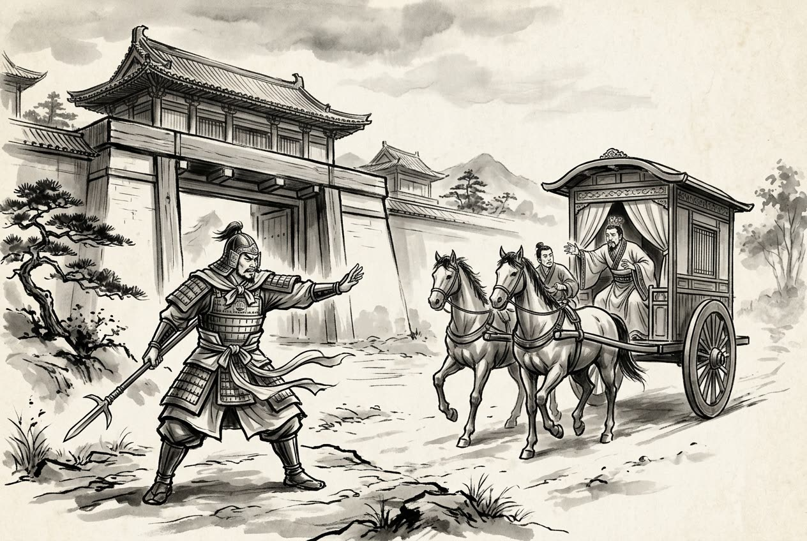

# 卷007 秦紀二 — 始皇帝下二十五年

> 巻 7 / 294 ・ 秦紀二 ・ 年号: 始皇帝下二十五年 ・ 西暦: 222 BCE

[← 巻インデックス](README.md)

---

二十五年〔注:己卯(つちのとう)の年、紀元前二二二年〕。

秦は大規模に兵を起こし、王賁(おうほん)に遼東(りょうとう)を攻めさせ、燕王の喜(き)を捕らえた〔注:燕はこうして滅んだ〕。

臣光曰く――燕の太子丹は、ほんの一時の怒りを抑えきれずに、虎や狼のように凶暴な秦に手を出した。考えは浅く謀(はかりごと)も浅薄で、恨みをかきたてて禍(わざわい)を招き寄せ、召公(しょうこう)以来の(燕の)宗廟をあっという間に絶やしてしまった。これほど大きな罪があろうか。それなのに、論ずる者の中には彼を賢者と評する者さえいる。なんと見当違いなことか。

そもそも国家を治める者は、才能に応じて官を任じ、礼に基づいて政(まつりごと)を立て、仁によって民をなつけ、信義によって隣国と交わる。そうしてこそ、官には適任者が得られ、政はほどよく行われ、人民はその徳を慕い、四方の隣国はその道義を親しむ。このようであれば、国家は磐石(ばんじゃく)のように安らかで、燃えさかる炎のように勢いがあり、これに触れる者は砕け、これを侵す者は焼け焦げる。たとえ強暴な国があろうとも、何を恐れることがあろうか。だが丹はこれをなそうとせず、よりにもよって万乗(ばんじょう)の大国を擁しながら、一介の匹夫(ひっぷ)のような怒りにまかせて事を決し、盗賊まがいの謀(はかりごと)をほしいままにした。その結果、功業は崩れ、身は殺され、社稷(しゃしょく)は廃墟と化した。なんと悲しいことではないか。

そもそも膝で這(は)い、腹ばいになるのは、(真の)恭(うやうや)しさではない〔注:蒲伏とは手で這い、地に身を伏せることである〕。約束を必ず守り、承諾を重んじるのは、(真の)信ではない〔注:復言は言を必ず果たすこと、重諾は承諾を重んじることである〕。金を惜しみなく費やし、玉を散じるのは、(真の)恵みではない。首をはね、腹を切るのは、(真の)勇ではない。要するに、謀(はかりごと)は遠謀に欠け、振る舞いは義に外れていた。あの楚の白公勝(はくこうしょう)の類(たぐい)であろう〔注:白公勝は父の仇を報いようとし、怒りを抑えきれず叔父にまで害を及ぼした。事は《左傳》に見える〕。

荊軻(けいか)は(太子丹に)養い育てられた私情に報いようとして、(連坐して滅びる)七族の身も顧みず、わずか一尺八寸の匕首(あいくち)で燕を強くし秦を弱めようとした。なんと愚かなことか〔注:荊軻が秦王を刺したために、その一族は連坐して滅ぼされた〕。だから揚子(揚雄)はこれを論じて、要離(ようり)を「蜘蛛(くも)のように(力及ばず)斃(たお)れた者」、聶政(じょうせい)を「壮士として斃れた者」、荊軻を「刺客として斃れた者」とし、いずれも義とは呼べないとした〔注:要離は呉の人で、呉王闔閭のために慶忌を刺した。聶政の事は第一巻、安王五年に見える〕。また「荊軻は、君子の道に照らせば盗賊(の類)である」とも言った。まことにその通りだ。

王賁が代(だい)を攻め、代王の嘉(か)を捕らえた〔注:嘉は(趙滅亡後に)代へ逃れていた。前巻十九年、趙がもはや祀られなくなったところに見える〕。

王翦(おうせん)は荊(けい)の江南の地をことごとく平定し、百越(ひゃくえつ)の君主を降伏させ、會稽郡(かいけいぐん)を置いた〔注:秦の會稽郡は吳県を治所とし、今の閩越(びんえつ)・両浙(りょうせつ)の地を兼ねた〕。

五月、天下に大酺(たいほ)を許した(国を挙げて大いに酒宴を催すことを許した)。

はじめ、齊(せい)の君王后(くんおうこう)は賢明で、秦に慎重に仕え、諸侯とは信義をもって交わった〔注:君王后は太史敫(たいしきょう)の娘で、襄王の后である〕。齊もまた東は海に面していた。秦は日夜、三晋(韓・魏・趙)・燕・楚を攻めたてたが、この五国はそれぞれ自国を守るのに精いっぱいだった。そのため齊王の建(けん)は即位して四十余年、戦火を受けずにすんだ。君王后が死のうとするとき、王建を戒めて言った。「群臣のうち用いるに足る者は、某と某です。」王は言った。「書き留めておきましょう。」君王后は「よろしい」と言った。王が筆と木簡を取って言葉を受けようとすると、君王后は言った。「この老婦は、もう忘れてしまいました。」君王后が死ぬと、后勝(こうしょう)が齊の宰相となり、秦の間者(かんじゃ)からの賄賂(わいろ)を多く受け取った。(后勝の)賓客が秦に入ると、秦はまた彼らに多くの金を与えた。賓客たちは皆、秦のための反間(裏切りの工作員)となって、王に秦へ入朝するよう勧め、攻め戦いの備えを整えさせず、五国が秦を攻めるのを助けさせなかった。秦はそのおかげで五国を滅ぼすことができたのである。

齊王が(秦へ)入朝しようとしたとき、雍門(ようもん)の司馬(しば)が進み出て言った。「王を立てるのは、社稷(しゃしょく)のためですか、それとも王ご自身のためですか。」

王は言った。「社稷のためだ。」司馬は言った。「社稷のために王を立てるのなら、王はなぜ社稷を捨てて秦へ入ろうとなさるのですか。」齊王は車を引き返して戻った。

卽墨(そくぼく)の大夫がこれを聞き、齊王に謁見して言った。「齊の地は四方数千里、武装した兵は数百万を数えます。そもそも三晋の大夫たちは皆、秦に従うのを快く思わず、阿(あ)・甄(けん)のあたりにいる者は数百人にのぼります〔注:甄は鄄(けん)に作るべきである〕。王が彼らを集めて百万の兵を与え、三晋の旧領を取り戻させれば、臨晉(りんしん)の関(せき)からただちに(秦へ)攻め入れます。鄢郢(えんえい)の大夫たちは秦に仕えるのを望まず、城南の下にいる者は数百人にのぼります。王が彼らを集めて百万の軍を与え、楚の旧領を取り戻させれば、武関(ぶかん)からただちに攻め入れます。このようにすれば、齊の威光を打ち立て、秦を滅ぼすこともできましょう。どうして自国を保つだけにとどまりましょうか。」だが齊王は聞き入れなかった。

---

原文を表示

二十五年
大興兵，使王賁攻遼東，虜燕王喜。
臣光曰：燕丹不勝一朝之忿以犯虎狼之秦，輕慮淺謀，挑怨速禍，使召公之廟不祀忽諸，罪孰大焉！而論者或謂之賢，豈不過哉！
夫爲國家者，任官以才，立政以禮，懷民以仁，交鄰以信；是以官得其人，政得其節，百姓懷其德，四鄰親其義。夫如是，則國家安如磐石，熾如焱火，觸之者碎，犯之者焦，雖有強暴之國，尚何足畏哉！丹釋此不爲，顧以萬乘之國，決匹夫之怒，逞盜賊之謀，功隳身戮，社稷爲墟，不亦悲哉！
夫其膝行、蒲伏，非恭也；復言、重諾、非信也；糜金、散玉，非惠也；刎首、決腹，非勇也。要之，謀不遠而動不義，其楚白公勝之流乎！
荊軻懷其豢養之私，不顧七族，欲以尺八匕首強燕而弱秦，不亦愚乎！故揚子論之，以要離爲蛛蝥之靡，聶政爲壯士之靡，荊軻爲刺客之靡，皆不可謂之義。又曰：「荊軻，君子盜諸。」善哉！
王賁攻代，虜代王嘉。
王翦悉定荊江南地，降百越之君，置會稽郡。
五月，天下大酺。
初，齊君王后賢，事秦謹，與諸侯信；齊亦東邊海上。秦日夜攻三晉、燕、楚，五國各自救，以故齊王建立四十餘年不受兵。及君王后且死，戒王建曰：「羣臣之可用者某。」王曰：「請書之。」君王后曰：「善！」王取筆牘受言，君王后曰：「老婦已忘矣。」君王后死，后勝相齊，多受秦間金。賓客入秦，秦又多與金。客皆爲反間，勸王朝秦，不脩攻戰之備，不助五國攻秦，秦以故得滅五國。
齊王將入朝，雍門司馬前曰：「所爲立王者，爲社稷耶，爲王耶？」王曰：「爲社稷。」司馬曰：「爲社稷立王，王何以去社稷而入秦？」齊王還車而反。
卽墨大夫聞之，見齊王曰：「齊地方數千里，帶甲數百萬。夫三晉大夫皆不便秦，而在阿、甄之間者百數；王收而與之百萬人之衆，使收三晉之故地，卽臨晉之關可以入矣。鄢郢大夫不欲爲秦，而在城南下者百數，王收而與之百萬之師，使收楚故地，卽武關可以入矣。如此，則齊威可立，秦國可亡，豈特保其國家而已哉！」齊王不聽。

---

出典: 維基文庫「資治通鑒 (胡三省音注)/卷007」(revid 2033689, CC BY-SA 4.0) / 原字: Kanripo KR2b0007 @80174f6 . 成果物=CC BY-NC-SA 系。

[← 前年: 始皇帝下二十四年](j007_y05.md) ・ [巻インデックス](README.md) ・ [次年: 始皇帝下二十六年 →](j007_y07.md)
