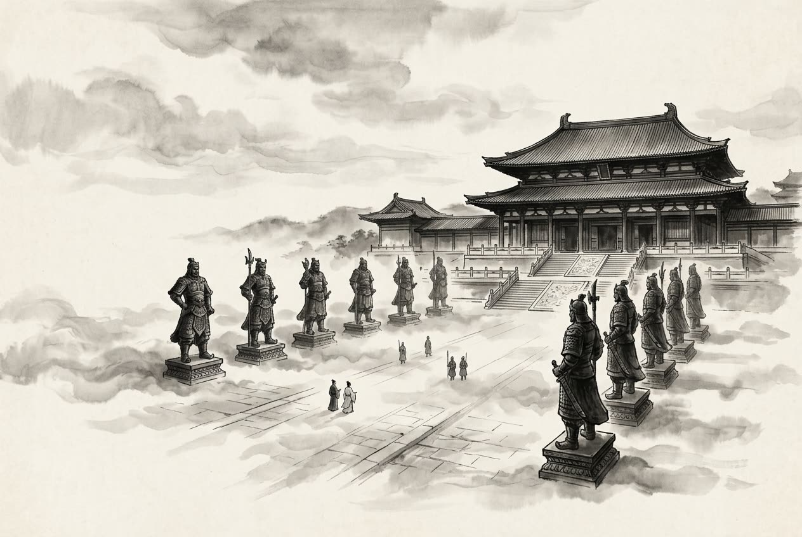

# 卷007 秦紀二 — 始皇帝下二十六年

> 巻 7 / 294 ・ 秦紀二 ・ 年号: 始皇帝下二十六年 ・ 西暦: 221 BCE

[← 巻インデックス](README.md)

---

二十六年〔注:庚辰(かのえたつ)の年、紀元前二二一年〕。

王賁(おうほん)が燕から南下して齊(せい)を攻め、不意に臨淄(りんし)へ攻め入った。民で敢えて防ぎ戦おうとする者はいなかった。秦は人を遣わして齊王(建)を誘い、五百里の土地に封じてやると約束した。齊王はそこで降伏した。秦は彼を共(きょう)へ移し、松や柏(かしわ)の木立の中に住まわせたが、(食を与えず)飢えて死なせた〔注:共は河內郡の県名〕。齊の人々は、王建が早くに諸侯と合従(がっしょう)せず、よこしまな食客の言を聞き入れて国を滅ぼしたことを恨み、歌に詠んだ。「松か、柏か! 建を共に住まわせ(死に追いやっ)たのは、あの食客どもか!」――建が食客を用いるのに、その善し悪しをよく見きわめなかったことを憎んだのである〔注:齊の田氏はこうして滅んだ〕。

臣光曰く――合従・連衡(れんこう)の説は、さんざん入れ替わって幾通りもあるが、その大筋からいえば、合従こそ六国(りっこく)の利であった。昔、いにしえの先王が無数の国を建て、諸侯を親しませ、たがいに朝聘(ちょうへい)して交わらせ、饗宴を催してともに楽しませ、会盟して結束させたのは、ほかでもない、皆が心を一つにし力を合わせて国家を保つことを望んだからである。もし六国がたがいに信義をもって親しみ合えていたなら、秦がいかに強暴であっても、どうしてこれを滅ぼせただろうか。そもそも三晉(韓・魏・趙)は齊・楚の防壁であり、齊・楚は三晉の根であって、その情勢はたがいに支え合い、表裏のように依り合っていた。だから三晉が齊・楚を攻めるのは、みずから自分の根を断つことであり、齊・楚が三晉を攻めるのは、みずから自分の防壁を取り払うことだった。どうして自分の防壁を取り払って盗賊に媚び、「盗賊は私をかわいがって攻めてこないだろう」などと言えようか。なんと道理に背いたことか。

王(秦王政)は、はじめて天下を統一すると、自分の徳は三皇(さんこう)を兼ね、功は五帝(ごてい)を上回ると考えた〔注:伏羲・神農・黃帝を三皇、少昊・顓頊・高辛・唐堯・虞舜を五帝とする〕。そこで称号を改めて「皇帝」とし、(天子の)命令を「制」、(天子の)指示を「詔」と呼び、自らを「朕(ちん)」と称することにした〔注:古くは君臣の別なく「朕」と自称したが、秦が制度を定めてからは天子のみが用いた〕。亡父の莊襄王(そうじょうおう)を太上皇(たいじょうこう)と追尊した。そして制(みことのり)を下して言った。「死後にその行いによって諡(おくりな)をつけるのは、子が父を、臣が君を品定めすることであって、まったく筋が通らぬ。今より以後、諡法を廃止する〔注:周公の作った諡法は行いの善悪で諡を立てるもの。秦が廃したのは、後人に悪諡をつけられるのを畏れたためという〕。朕を始皇帝とし、後世は数で数えて、二世・三世から万世に至るまで、無窮(むきゅう)に伝えていくのだ。」

はじめ、齊の威王(いおう)・宣王(せんおう)のころ、鄒衍(すうえん)が五行(ごぎょう)の徳が循環するという終始五德の運の説を論じ著した。始皇が天下を併合すると、齊の人がこれを奏上した。始皇はその説を採用し、周は火徳を得ていたので、周に取って代わった秦は、(火に)勝つものに従って水徳とした。そこではじめて暦の年を改め、朝賀(ちょうが)はすべて十月の朔日(ついたち)から始めることとし、衣服・旗指物・割符の旗はみな黒を尊び、数は六を基準とした〔注:始皇は建亥の月=十月を歳首とした。これが改年である。水徳ゆえ黒を尚び、水の成数が六ゆえ六を基準とした〕。

丞相の綰(わん)が言った〔注:丞相綰は姓を王という〕。「燕・齊・荊(けい=楚)の地は遠く、王を置かなければこれを鎮めるすべがありません。どうか諸公子を(王に)立ててくださいませ。」始皇はこの議を群臣に下した。廷尉(ていい)の斯(し)が言った〔注:廷尉は秦の官で、裁判を司る〕。「周の文王・武王が封じた子弟や同姓の者はたいへん多かったのですが、後には血縁が疎遠になり、たがいを仇敵のように攻撃し合い、周の天子も止めることができませんでした。今、天下は陛下の御威光のおかげで一つに統一されており、すべてを郡・県とし、諸公子や功臣には公の租税で手厚く褒美を与えれば、たやすく統御でき、天下に二心を抱く者もなくなります。これこそ安寧のための方策です。諸侯を置くのは得策ではありません。」始皇は言った。「天下があまねく戦いに苦しんで止むときがなかったのは、諸侯や王がいたからだ。宗廟の加護でようやく天下が定まったばかりだというのに、また国を立てるのは、戦いの種を蒔くようなものだ。それでいて安らかな静けさを求めても、難しいに決まっておろう。廷尉の議が正しい。」

こうして天下を三十六の郡に分け、郡ごとに守(しゅ)・尉(い)・監(かん)を置いた〔注:守は郡の政治を、尉は守を補佐して軍事と兵卒を、監御史は郡の監察を司る〕。

天下の武器を集めて咸陽(かんよう)へ運び、これを溶かして鐘の懸け台や、十二体の金属の人像を鋳造した。

一体の重さはそれぞれ千石(せんせき)で、これを宮殿の中に据えた〔注:臨洮に巨人十二人が現れたという話にちなんで鋳たともいう〕。度量衡や、長さ・重さ・容積の基準を統一した。天下の有力者十二万戸を咸陽へ移住させた。

諸々の宗廟や章臺(しょうだい)・上林(じょうりん)はみな渭水(いすい)の南にあった。秦は諸侯を破るたびに、その宮殿のさまを写し取り、それを咸陽の北の坂の上に造らせた。南は渭水に臨み、雍門(ようもん)から東は涇水(けいすい)・渭水のあたりまで、御殿・複道(高架の通路)・めぐらした楼閣が連なり、攻め取った諸侯の美女や鐘・太鼓をその中に満たし入れた。

---

原文を表示

二十六年
王賁自燕南攻齊，猝入臨淄，民莫敢格者。秦使人誘齊王，約封以五百里之地，齊王遂降，秦遷之共，處之松柏之間，餓而死。齊人怨王建不早與諸侯合從，聽姦人賓客以亡其國，歌之曰：「松耶，柏耶！住建共者客耶！」疾建用客之不詳也。
臣光曰：從衡之說雖反覆百端，然大要合從者，六國之利也。昔先王建萬國，親諸侯，使之朝聘以相交，饗宴以相樂，會盟以相結者，無他，欲其同心勠力以保家國也。曏使六國能以信義相親，則秦雖強暴，安得而亡之哉！夫三晉者，齊、楚之藩蔽；齊、楚者，三晉之根柢；形勢相資，表裏相依。故以三晉而攻齊、楚，自絕其根柢也，以齊、楚而攻三晉，自撤其藩蔽也。安有撤其藩蔽以媚盜，曰「盜將愛我而不攻」，豈不悖哉！
王初幷天下，自以爲德兼三皇，功過五帝，乃更號曰「皇帝」，命爲「制」，令爲「詔」，自稱曰「朕」。追尊莊襄王爲太上皇。制曰：「死而以行爲諡，則是子議父，臣議君也，甚無謂。自今以來，除諡法。朕爲始皇帝，後世以計數，二世、三世至于萬世，傳之無窮。」
初，齊威、宣之時，鄒衍論著終始五德之運；及始皇幷天下，齊人奏之。始皇采用其說，以爲周得火德，秦代周，從所不勝，爲水德。始改年，朝賀皆自十月朔；衣服、旌旄、節旗皆尚黑；數以六爲紀。
丞相綰言：「燕、齊、荊地遠，不爲置王，無以鎭之。請立諸子。」始皇下其議。廷尉斯曰：「周文武所封子弟同姓甚衆，然後屬疏遠，相攻擊如仇讎，周天子弗能禁止。今海內賴陛下神靈一統，皆爲郡、縣，諸子功臣以公賦稅重賞賜之，甚足易制，天下無異意，則安寧之術也。置諸侯不便。」始皇曰：「天下共苦戰鬬不休，以有侯王。賴宗廟，天下初定，又復立國，是樹兵也；而求其寧息，豈不難哉！廷尉議是。」
分天下爲三十六郡，郡置守、尉、監。
收天下兵聚咸陽，銷以爲鍾鐻、金人十二，重各千石，置宮庭中。一法度、衡、石、丈尺。徙天下豪桀於咸陽十二萬戶。
諸廟及章臺、上林皆在渭南。每破諸侯，寫放其宮室，作之咸陽北阪上，南臨渭，自雍門以東至涇、渭，殿屋、復道、周閣相屬，所得諸侯美人、鍾鼓以充入之。

---

出典: 維基文庫「資治通鑒 (胡三省音注)/卷007」(revid 2033689, CC BY-SA 4.0) / 原字: Kanripo KR2b0007 @80174f6 . 成果物=CC BY-NC-SA 系。

[← 前年: 始皇帝下二十五年](j007_y06.md) ・ [巻インデックス](README.md) ・ [次年: 始皇帝下二十七年 →](j007_y08.md)
