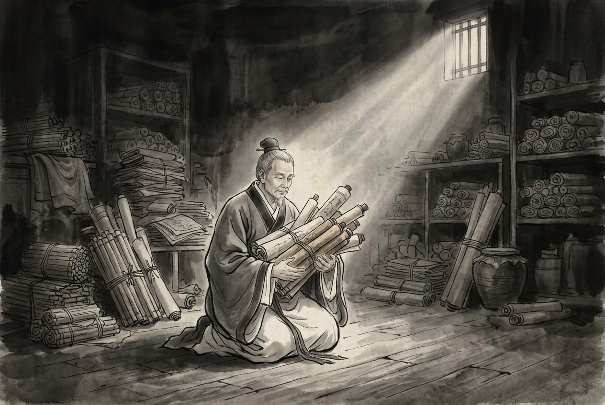

# 卷009 漢紀一 — 太祖高皇帝上之上元年

> 巻 9 / 294 ・ 漢紀一 ・ 年号: 太祖高皇帝上之上元年 ・ 西暦: 206 BCE

[← 巻インデックス](README.md)

---

太祖高皇帝(上の上)〔注:姓は劉(りゅう)氏、諱(いみな)は邦(ほう)、字(あざな)は季(き)。沛(はい)の豊邑(ほうゆう)中陽里(ちゅうようり)の人〕。
元年〔注:乙未(きのとひつじ)の年、紀元前二〇六年〕。

冬、十月〔注:秦は水徳(すいとく)をとなえ、建亥(けんがい)の月(十月)に水が位を得るとして、十月を年の初めとした。高祖もこのとき十月に霸上(はじょう)に至り、そのままこの暦を改めなかった〕、沛公(はいこう)は霸上に着いた。秦王の子嬰(しえい)は、白木の車に白馬を立て、組(くみひも)を首に掛けて〔注:白い車・白馬は喪(も)に服す者の服。組を首に掛けるのは自殺の意を示すしぐさ。応劭(おうしょう)は「子嬰はあえて皇帝の号を継がず、ただ王と称しただけだ」と言う〕、皇帝の璽(じ)・符(ふ)・節(せつ)を封じて、軹道(しどう)のかたわらで降伏した〔注:軹道は霸陵(はりょう)にあった亭(てい)の名で、長安の東十三里にあった〕。諸将のなかには秦王を誅すべきだと言う者もいた。だが沛公は言った。「もともと懐王(かいおう)がわたしを遣わしたのは、まさにわたしが寛容にふるまえると見込んでのことだ。それに人がすでに降伏したのを殺すのは縁起が悪い」。そして子嬰を役人に預けて監視させた。

賈誼(かぎ)はこう論じている。「秦はわずかな土地から万乗(ばんじょう)の権勢を打ち立て、八州を従えて、かつて肩を並べた六国の王たちを臣下として朝(ちょう)させた〔注:秦はもと雍州(ようしゅう)一州の地にすぎなかったが、六国を破ると、豫(よ)・兗(えん)・青・揚・荊・幽・冀・幷の八州を併せて手にした。六国はもと秦と同じく王を称しており、秦と肩を並べる存在だった〕。それから百年あまりののち、ようやく天下を我が家とし〔注:六合(りくごう)とは天・地・東・西・南・北〕、殽(こう)・函(かん)の険を宮殿の守りとした。ところが、一人の男が乱を起こしただけで七廟(しちびょう)は崩れ、その身は人の手にかかって死に、天下の笑い者となった。なぜか。仁義を行わず、攻める時と守る時とで形勢が変わったのを見そこなったからである」。

沛公は西へ進んで咸陽(かんよう)に入った。諸将は皆、争って金銀・絹・財宝をおさめた倉に走り、それを分け取った。だが蕭何(しょうか)だけはまっ先に入って、秦の丞相府にあった地図・戸籍などの文書を取りおさめて保管した。

このおかげで沛公は、天下の要害や、戸口(人口)の多少、どこが強くどこが弱いかを、ことごとく把握することができた。沛公は秦の宮殿、とばり、犬や馬、貴重な財宝、そして千を数えるほどの女たちを見て、ここに居すわりたいと思った。樊噲(はんかい)が諫めた。「沛公は天下を取りたいのですか、それとも金持ちのご隠居になりたいのですか。こうした贅沢で華やかな物は、みな秦が滅んだもとです。沛公にいったい何の用がありましょう。どうか急ぎ霸上へ引き返し、宮中にとどまりませんように」。沛公は聞き入れなかった。すると張良(ちょうりょう)が言った。「秦が無道だったからこそ、沛公はここまで来られたのです。そもそも天下のために残虐な賊を除く者は、喪服を着るような慎みを身上とすべきです〔注:縞素(こうそ)は喪(も)に服す者の服。ここでは民を弔(とむら)う心構えのこと〕。今、秦に入ったばかりで、もうその安楽に身を浸すのは、いわゆる『桀(けつ)の暴虐を助ける』というものです。それに忠言は耳に逆らうが行いには利があり、毒の薬は口に苦いが病には利がある。どうか沛公、樊噲の言葉を聞き入れてください」。沛公はそこで軍を霸上へ引き返した。

十一月、沛公は諸県の父老(ふろう)や有力者たちをことごとく召し集めて言った。「父老たちは秦のむごく細かい法に長らく苦しんでこられた。わたしは諸侯と『先に関に入った者がそこの王となる』と約束した。だから、わたしが関中(かんちゅう)の王になるはずだ。父老たちと約束しよう、法は三か条だけだ。人を殺した者は死罪、人を傷つけた者と盗みをはたらいた者は、それぞれ相応の罪に当てる〔注:傷害には曲直があり、盗みには贓物(ぞうぶつ)の多少があって、罪名はあらかじめ定められない。だから「罪に当てる」とだけ言い、何の罪に当てるかは決めていない〕。残りの秦の法はすべて取り除く。役人も民も、皆これまでどおり安んじて暮らしてよい。そもそもわたしが来たのは、父老たちのために害を除くためであって、侵し荒らすためではない。恐れることはない。それに、わたしが軍を霸上へ引き返したのは、諸侯の到着を待って取り決めを定めるためにすぎぬ」。そして人を遣わし、秦の役人とともに県・郷・邑を回って、これを触れ告げさせた。秦の民は大いに喜び、争って牛・羊・酒・食べ物を持って兵士たちに献上しようとした。だが沛公はまた辞退して受け取らず、「倉の粟は多く、足りぬわけではない。民に出費をかけたくない」と言った。民はますます喜び、ただ沛公が秦王にならぬのではないかと、そればかりを案じた。

項羽(こうう)は河北を平定すると、諸侯の兵を率いて西へ関に入ろうとした。これより前、諸侯の役人や兵卒、徭役(ようえき)に駆り出された者や守備兵で、秦中(しんちゅう)を通った者たちは、秦中の役人や兵卒から、よく無礼な扱いを受けていた。ところが章邯(しょうかん)が秦軍を率いて諸侯に降ると、諸侯の役人や兵卒は勝ちに乗じて、多くの秦兵を奴隷のようにこき使い、秦の役人や兵卒を軽んじて辱めた。秦の役人や兵卒の多くは恨みを抱き、ひそかに言い合った。「章将軍たちは、おれたちをだまして諸侯に降らせた。今もし関に入って秦を破れれば大いに結構だが、もしできなければ、諸侯はおれたちを捕虜にして東へ連れ去り、秦はおれたちの父母妻子をことごとく誅殺するだろう。どうすればいい」。諸将はその不穏な相談をかすかに聞きつけ、項羽に告げた。項羽は黥布(げいふ)と蒲(ほ)将軍を呼んで相談した。「秦の役人・兵卒はまだ大勢いて、心服していない。関に至って言うことを聞かなければ、ことは必ず危うくなる。いっそ撃ち殺してしまい、章邯・長史(ちょうし)の欣(きん)・都尉(とい)の翳(えい)だけを連れて秦に入るほうがよい」。こうして楚軍は夜襲をかけ、新安(しんあん)城の南で、秦兵二十万人あまりを生き埋めにした。

ある者が沛公に説いた。「秦は天下の十倍も富み、地形も堅固です。聞けば項羽は章邯を雍王(ようおう)と呼んで関中の王にするとか。今すぐにもやって来れば、沛公はこの地を保てなくなりましょう。急ぎ兵に函谷関(かんこくかん)を守らせ、諸侯の軍を中に入れず、関中の兵を少しずつ徴発して自軍を増し、これを防がれるのがよい」。沛公はその計をもっともと思い、これに従った。

まもなく項羽が関に至ると、関門は閉じられていた。沛公がすでに関中を平定したと聞いて、項羽は激怒し、黥布らに函谷関を攻め破らせた。十二月、項羽は進んで戯(ぎ)に至った。沛公の左司馬(さしば)の曹無傷(そうむしょう)が、人を遣わして項羽に告げさせた。「沛公は関中の王になろうとし、子嬰を相(しょう)にして、珍宝をことごとく自分のものにしようとしています」。封爵をもらおうとしてのことである。項羽は大いに怒り、兵士をねぎらって、翌朝沛公の軍を攻めると期した。このとき項羽の兵は四十万、百万と号して、新豊(しんぽう)の鴻門(こうもん)にあった。沛公の兵は十万、二十万と号して、霸上にあった。

范増(はんぞう)が項羽に説いた。「沛公は山東(さんとう)にいたころは財を貪り、女好きでした。それが今、関に入っても、財物には手をつけず、女もはべらせていない。これはその志が小さくない証拠です。わたしが人にその気(き)を望見させたところ、いずれも竜虎の形をなし、五色のいろどりを成しておりました。これは天子の気です〔注:天子の気とは、内は赤く外は黄色く、四方に発する所には王者がいるという。竜馬のごとく、あるいは雑色がもうもうと天を衝(つ)くものは、みな帝王の気とされる〕。急ぎ撃って、機を逃しませぬよう」。

楚の左尹(さいん)の項伯(こうはく)は〔注:楚の官には左尹・右尹がある〕、項羽の叔父にあたり、もとから張良と親しかった。そこで夜、馬を駆って沛公の軍へ行き、ひそかに張良に会って、ことの次第をすっかり告げ、いっしょに逃げようと呼んで言った。「ともに死ぬことはない」。張良は言った。「わたしは韓王(かんおう)のために沛公をお送りしている身。沛公が今、急場に立たされているのに、それを見捨てて逃げ去るのは義に反する。告げぬわけにはいかぬ」。そこで張良は奥へ入り、ことのすべてを沛公に告げた。沛公は大いに驚いた。張良が言った。「殿の兵卒で、項羽に立ち向かえると思われますか」。沛公はしばらく黙ってから言った。「もとよりかなわぬ。さてどうすればよい」。張良は言った。「わたしが行って項伯に、沛公はそむく気などないと言いましょう」。沛公は言った。「君はどうして項伯と旧知の仲なのだ」。張良は言った。「秦のころ、わたしと付き合いがあって、彼が人を殺したとき、わたしが助けて生き延びさせたのです。今、急場とあって、わざわざ知らせに来てくれたのです」。沛公は言った。「君と項伯と、どちらが年上か」。張良は言った。「わたしより年上です」。沛公は言った。「君、わたしのために彼を呼び入れてくれ。わたしは兄として遇しよう」。張良は出て、たって項伯を招き入れた。項伯はすぐ入って沛公に会った。沛公は杯を捧げて長寿を祝い、婚姻を結ぶことを約して言った。「わたしは関に入ってからというもの、ごくわずかな物にも手をつけず〔注:秋毫(しゅうごう)とは、極めて細かいものをいう〕、役人や民を名簿に登録し、倉や蔵を封じて将軍(項羽)を待っておりました。将を遣わして関を守らせたのは、ほかの盗賊の出入りや不測の事態に備えるためです。日夜将軍の到着を待ち望んでいたのに、どうして謀反などいたしましょう。どうか伯どのには、わたしが恩義に背く気などないことを、すっかりお伝えください」。項伯は承知し、沛公に言った。「明朝、早く自分から出向いてお詫びなさるがよい」。沛公は「承知した」と答えた。こうして項伯はまた夜のうちに去り、自軍に帰ると、沛公の言葉をことごとく項羽に伝え、ついでにこう言った。「沛公が先に関中を破ってくれなければ、あなたがどうして関に入れたでしょう。今、人が大きな功を立てたのに、これを撃つのは義に反します。むしろこのまま手厚く遇するのがよろしい」。項羽は承知した。

沛公は翌朝、騎兵百人あまりを従えて鴻門に項羽を訪ね、詫びて言った。「わたしは将軍と力を合わせて秦を攻め、将軍は河北で、わたしは河南で戦いました。自分でも先に関に入って秦を破れるとは思いもよらず、こうしてまた将軍にここでお目にかかれました。今、つまらぬ者の讒言(ざんげん)があって、将軍とわたしの間に隙(すき)を生じさせております」。項羽は言った。「それは沛公の左司馬の曹無傷が言ったのだ。そうでなければ、この籍(せき=項羽)がどうしてこんなことになろうか」。項羽はそのまま沛公を引きとめてともに酒を飲んだ。范増はたびたび項羽に目くばせし、腰に佩(お)びた玉玦(ぎょっけつ)を三度も掲げて示した〔注:玦は環(わ)のかたちで一部が欠けたもの。范増がこれを掲げて項羽に示したのは、決意して沛公を殺せとうながしたのである〕。だが項羽は黙ったまま応じなかった。范増は立って外に出て、項莊(こうそう)を呼んで言った。「君王は人柄が情にもろく、思い切れぬ。おまえが入って前へ出て長寿を祝い、祝いが終わったら、剣の舞をさせてほしいと願い出よ。そして座のうちで沛公を撃ち、これを殺せ。そうしなければ、おまえたちはみな彼の捕虜にされてしまうぞ」。項莊はそこで入って長寿を祝い、祝いが終わると言った。「軍中には楽しみとてございません。どうか剣の舞をさせてください」。項羽は「よかろう」と言った。項莊は剣を抜いて立ち、舞い始めた。すると項伯もまた剣を抜いて立って舞い、つねにわが身で沛公を翼(かば)うようにさえぎったので、項莊は撃つことができなかった。

そこで張良は軍門に出て樊噲に会った。樊噲が言った。「今日のなりゆきはどうなっています」。張良は言った。「今、項莊が剣を抜いて舞っているが、その狙いはつねに沛公にある」。樊噲は言った。「これは差し迫った事態だ。わたしが入って、沛公と生死をともにしよう」。樊噲はすぐ剣を帯び、盾を抱えて入った。軍門の衛士が止めて中に入れまいとしたが、樊噲は盾を横ざまにして突き当たり、衛士は地に倒れた。そのまま中に入り、とばりを押し開いて立ち、目をかっと見開いて項羽をにらみつけた。髪は逆立って上を指し、まなじりは裂けんばかりだった。項羽は剣に手をかけて膝を立て〔注:跽(き)とは膝を立てて身を起こすこと〕、言った。「客は何者だ」。張良が言った。「沛公の参乗(さんじょう=お供)の樊噲です」。項羽は言った。「壮士よ。これに杯の酒をやれ」。そこで一斗(いっと)の大杯の酒を与えた。樊噲は拝して礼を述べ、立ち上がって、立ったまま飲み干した。項羽は言った。「これに豚の肩肉をやれ」。そこで生の豚の肩肉を一つ与えた。樊噲は盾を地に伏せ、その上に豚の肩肉をのせ、剣を抜いて切り、これを食らった。項羽は言った。「壮士よ、もっと飲めるか」。樊噲は言った。「わたしは死ぬことさえ避けはせぬ。杯の酒など、なんで辞退いたしましょう。そもそも秦は虎狼(ことう)のような心を持ち、人を殺すこと数えきれぬほど、人を刑に処すること足りぬのを恐れるほどでした。だからこそ天下がこぞって背いたのです。懐王は諸将と『先に秦を破って咸陽に入った者をそこの王とする』と約束しました。今、沛公が先に秦を破って咸陽に入り、ごくわずかな物にも手をつけず、軍を霸上へ引き返して将軍を待っておりました。これほどの苦労と高い功がありながら、封爵の賞もないのに、つまらぬ者の言を聞き入れて、功ある人を誅そうとなさる。これでは滅びた秦の二の舞でございます。ひそかに、将軍のためにとるべき道ではないと存じます」。項羽はこれに答える言葉もなく、ただ「座れ」と言った。樊噲は張良に従って座についた。

しばらく座っていたが、沛公は立って厠(かわや)へ行き、その折に樊噲(はんかい)を呼んで外へ出た。沛公は言った。「いま暇(いとま)を告げずに出てきてしまった。どうしたものか」。樊噲は言った。「今や人(項羽)はまさに包丁とまな板、こちらはまさにその上の魚や肉です。何の暇乞いなどいりましょう」。そこでそのまま立ち去ることにした。鴻門(こうもん)は霸上(はじょう)から四十里。沛公は車と騎馬を(鴻門に)置いたまま〔注:車騎を鴻門に残し、自分には従えなかった〕、身一つで馬に乗り、樊噲・夏侯嬰(かこうえい)・靳彊(きんきょう)・紀信(きしん)ら四人は剣と盾を持って徒歩で付き従い、驪山(りざん)のふもとから芷陽(しよう)へ抜ける道を取り、わき道伝いに霸上へ急いだ。張良(ちょうりょう)はあとに残して項羽に詫びさせることにし、白璧(はくへき)を項羽に、玉斗(ぎょくと)を亞父(あふ=范増)に献上させた。沛公は張良に言った。「この道から我が軍まではせいぜい二十里だ。わたしが軍に着いたころ合いを見計らって、お前は座敷に入れ」。沛公が立ち去り、わき道伝いに軍に着いたころ、張良は座敷に入って詫びて言った。「沛公は酒に弱く〔注:杯に勝てない、の意〕、みずから暇乞いができませぬ。つつしんで臣のわたくし良に、白璧一対を持たせ、再拝して将軍の足下に献上いたさせ、玉斗一対を再拝して亞父の足下にたてまつらせました」。項羽は言った。「沛公はどこにいる」。張良は言った。「将軍が責め咎(とが)めるおつもりだと聞き〔注:見て責める、の意〕、身一つで一人立ち去り、もう軍に着いておりましょう」。項羽は璧を受け取り、席の上に置いた。亞父は玉斗を受け取ると、地に置き、剣を抜いてこれを突いて打ち砕き、言った。「ああ、あの若造とはともに事を謀るに足りぬ。将軍(項羽)から天下を奪う者は、必ず沛公だ。我らはやがてその捕虜にされるだろう」。沛公は軍に着くと、ただちに曹無傷(そうむしょう)を誅殺した。

数日後、項羽は兵を率いて西へ進み、咸陽(かんよう)を皆殺しにし、降伏した秦王の子嬰(しえい)を殺し、秦の宮殿に火をかけた。火は三か月燃え続けて消えなかった。そしてその財宝や女たちを収めて、東へ引き揚げた。秦の民は大いに失望した〔注:秦の民は、はじめ沛公が侵し荒らさぬのを見て喜んだが、項羽に皆殺しにされて、はじめに抱いた望みを失ったのである〕。

韓生(かんせい)が項羽に説いた。「関中(かんちゅう)は山にさえぎられ河を帯び、四方を要害に囲まれた地で、土地も肥えています。ここに都すれば覇を唱えられましょう」。だが項羽は、秦の宮殿がみな焼け崩れているのを見、また心は東(故郷)へ帰りたいと思っていたので、こう言った。「富貴になっても故郷に帰らぬのは、刺繍の着物を着て夜歩くようなものだ。誰がそれを見て分かろう」。韓生は退出して言った。「世間で『楚の人は猿が冠(かんむり)をかぶったようなものだ』と言うが、まさにそのとおりだった」〔注:沐猴(もくこう)とは猿のこと。人の衣冠を着けても、その心は人らしくない、という意〕。項羽はこれを聞いて、韓生を釜(かま)茹(ゆ)でにした。

項羽は人を遣わして懐王(かいおう)に命を仰いだ。懐王は「約束のとおりに(=先に関に入った沛公を関中の王に)」と言った。項羽は怒って言った。「懐王は我が一族が立てた者にすぎず、功績があってのことではない。どうして一人で取り決めを差配できようか。天下が初めて乱を起こしたとき、諸侯の末裔を仮(かり)に立てて秦を討たせた。だが、みずから甲冑を着け鋭い武器を執って真っ先に事を起こし、三年も野にさらされて秦を滅ぼし天下を定めたのは、みな将相や諸君と、この籍(項羽)の力によるものだ。懐王に功がなくとも、その地を割いて王とするのは当然のことだ」。諸将は皆「もっともだ」と言った。春、正月、項羽はうわべだけ懐王を尊んで義帝(ぎてい)とし、言った。「古の帝(みかど)は、領地が方千里(ほうせんり)で、必ず川の上流に居(い)を構えたものだ」〔注:上游(じょうゆう)とは川の上流のこと〕。そして義帝を江南へ移し、郴(ちん)に都させた。

二月、項羽は天下を分けて諸将を王に立てた。項羽は自ら西楚(せいそ)の霸王(はおう)となり、梁(りょう)・楚の地九郡の王となって、彭城(ほうじょう)に都した。項羽と范増は沛公を疑っていたが、すでに和解を結んでしまっており、また約束を破ったとの非難を受けるのも嫌だった〔注:約束(=先に関に入った者を関中の王とする)を破ったとされるのを嫌った〕。そこでひそかに謀(はか)って言った。「巴(は)・蜀(しょく)は道が険しく、秦に流された者がみなそこに住んでいる」。そして「巴・蜀もまた関中の地だ」と(言い繕って)、沛公を漢王(かんおう)に立て、巴・蜀・漢中(かんちゅう)の王とし、南鄭(なんてい)に都させた。さらに関中を三つに分け、秦の降将を王に立てて、漢へ通じる道をふさがせた。章邯(しょうかん)を雍王(ようおう)として咸陽以西の王とし、廃丘(はいきゅう)に都させた。長史の欣(きん)は、もと櫟陽(やくよう)の獄の役人で、かつて項梁(こうりょう)に恩を施したことがあり〔注:項梁が櫟陽で訴えに引っかかったとき、欣が獄掾(ごくえん)の曹咎(そうきゅう)に手紙を書いてもらって事を収めた。これが「項梁に恩がある」ということ〕、都尉の董翳(とうえい)は、もともと章邯に楚へ降るよう勧めた者だった。それゆえ欣を塞王(さいおう)として咸陽以東から黄河までの王とし、櫟陽に都させ、董翳を翟王(てきおう)として上郡(じょうぐん)の王とし、高奴(こうど)に都させた。項羽は梁の地を自分のものにしたかったので、魏王の豹(ひょう)を西魏王に移して河東(かとう)の王とし、平陽(へいよう)に都させた。瑕丘(かきゅう)の申陽(しんよう)は張耳(ちょうじ)の寵臣で、先に河南郡を落とし、黄河のほとりで楚軍を迎えた者だったので、申陽を河南王に立て、洛陽(らくよう)に都させた。韓王の成(せい)はもとの都をそのままとし、陽翟(ようてき)に都させた。趙の将の司馬卬(しばこう)は河内(かだい)を平定し、たびたび功を立てたので、卬を殷王(いんおう)に立てて河内の王とし、朝歌(ちょうか)に都させた。趙王の歇(けつ)を代王(だいおう)に移した。趙の相の張耳はもとから賢者と評され、また(項羽に)従って関に入ったので、張耳を常山王(じょうざんおう)に立てて趙の地の王とし、襄国(じょうこく)を治所とした。当陽君(とうようくん)の黥布(げいふ)は楚の将として、つねに全軍の先頭に立つ功があったので、黥布を九江王(きゅうこうおう)に立て、六(りく)に都させた。番君(はんくん)の呉芮(ごぜい)は百越(ひゃくえつ)を率いて諸侯を助け、また従って関に入ったので、呉芮を衡山王(こうざんおう)に立て、邾(ちゅ)に都させた。義帝の柱国(ちゅうこく)の共敖(きょうごう)は、兵を率いて南郡(なんぐん)を攻めて功が多かったので、共敖を臨江王(りんこうおう)に立て、江陵(こうりょう)に都させた。燕王の韓広(かんこう)を遼東王(りょうとうおう)に移し、無終(ぶしゅう)に都させた。燕の将の臧荼(ぞうと)は楚に従って趙を救い、そのまま従って関に入ったので、臧荼を燕王に立て、薊(けい)に都させた。斉王の田巿(でんし)を膠東王(こうとうおう)に移し、即墨(そくぼく)に都させた。斉の将の田都(でんと)は楚に従って趙を救い、そのまま従って関に入ったので、田都を斉王に立て、臨菑(りんし)に都させた。項羽がちょうど黄河を渡って趙を救おうとしていたとき、田安(でんあん)は済北(せいほく)の数城を落とし、その兵を率いて項羽に降ったので、田安を済北王に立て、博陽(はくよう)に都させた。田栄(でんえい)は、たびたび項梁の意に背き、また兵を率いて楚に従い秦を撃つことを肯んじなかったので、封じられなかった。成安君(せいあんくん)の陳余(ちんよ)は、将軍の印を捨てて去り、従って関に入らなかったので、これも封じられなかった。だが多くの食客が項羽に説いた。「張耳と陳余は、一体となって趙に功を立てた者です。今、張耳が王となったのに、陳余を封じぬわけにはいきますまい」。項羽はやむを得ず、陳余が南皮(なんぴ)にいると聞いて、その周辺の三県を陳余に封じた。番君配下の将の梅鋗(ばいけん)は功が多かったので、十万戸侯に封じた。

漢王(沛公)は怒り、項羽を攻めようとした。周勃(しゅうぼつ)・灌嬰(かんえい)・樊噲も皆これを勧めた。だが蕭何(しょうか)が諫めた。「漢中の王になるのは、いやな話ではありましょうが、それでも死ぬよりはましではありませんか」。漢王は言った。「どうして死ぬことになるのだ」。蕭何は言った。「今、兵力では(項羽に)及ばず、百たび戦えば百たび負けます。死なずにどうなりましょう。そもそも一人(項羽)の下に身を屈しながら、やがて天子の位(万乗の上)に身を伸ばすことができた者、それが湯王(とうおう)・武王(ぶおう)です。どうか大王は漢中の王となり、その民を養って賢人を招き、巴・蜀を取りおさめて用い、引き返して三秦(さんしん)〔注:雍・翟・塞の三つを三秦という〕を平定なされませ。さすれば天下を図ることができましょう」。漢王は「もっともだ」と言った。そしてついに自分の封地(漢中)へ赴いた。蕭何を丞相(じょうしょう)とした。

漢王は張良に黄金百鎰(ひゃくいつ)と真珠二斗(にと)を賜った。張良はそれをそっくり項伯(こうはく)に献じた。漢王はまた張良に命じて項伯に手厚く贈り物をさせ、漢中の地をすべて(漢に)もらえるよう願わせた。項王(項羽)はこれを許した。

夏、四月、諸侯は項羽の軍門の兵を引き払い〔注:戯下(きか)は軍の旌麾(せいき=旗)のもとの意。先に項羽に従って関に入った諸侯は、それぞれ兵を率いて項羽の命に従っていたが、今や封爵を受けて各自その封地へ赴くことになったので、まとめて「戯下を罷(や)めた」と言ったのである〕、それぞれ自分の封地へ赴いた。項王は兵三万人を漢王につけて封地へ向かわせた。楚や諸侯のもとから、慕ってついて行く者が数万人あり、杜(と)の南から蝕中(しょくちゅう)に入った。張良は襃中(ほうちゅう)まで送り、漢王は張良を韓へ帰らせた。張良はそこで漢王に勧めて、通り過ぎた桟道(さんどう)を焼き切らせ〔注:桟(さん)とは閣道(かくどう)のことで、木を架けて造った道〕、諸侯の盗み兵に備えさせ、あわせて項羽に東へ出る気がないことを示させた。

田栄は、項羽が斉王の巿(し)を膠東に移し、田都を斉王に立てたと聞き、大いに怒った。五月、田栄は兵を起こして田都を迎え撃ち、田都は楚へ逃げ去った。田栄は斉王の巿を引きとめて、膠東へ行かせなかった。だが巿は項羽を恐れて、こっそり逃げて(膠東の)国へ赴いた。田栄は怒り、六月、これを追って即墨で巿を殺し、自ら斉王となった。このころ、彭越(ほうえつ)は鉅野(きょや)にいて、一万人あまりの手勢を持っていたが、どこにも属していなかった。田栄は彭越に将軍の印を与え、済北を撃たせた。秋、七月、彭越は済北王の田安を撃ち殺した。田栄はそのまま三斉(さんせい)〔注:三斉とは斉・済北・膠東をいう〕の地を併せてその王となり、さらに彭越に楚を撃たせた。項王は蕭公角(しょうこうかく)に命じて兵を率いて彭越を撃たせたが、彭越は楚軍を大いに破った。

張耳が自分の封地(常山)へ赴くと、陳余はますます怒って言った。「張耳とわたしは、功は同等だ。それなのに今、張耳は王となり、わたしだけが侯にとどまる。これは項羽の不公平だ」。そこでひそかに張同(ちょうどう)と夏説(かえつ)を遣わして斉王の田栄に説かせた。「項羽は天下を治める者でありながら不公平で、配下の諸将を残らず良い土地の王にし、もとからの王を醜(みにく)い土地へ移しました。今、趙王(歇)は北のかた代に追いやられました。わたし(陳余)はこれを承服できませぬ。聞けば大王(田栄)は兵を起こされ、不義には従わぬとのこと。どうか大王、わたしに兵をお貸しくださって常山を撃ち、趙王を(もとの位に)復させてくだされ。そうすれば趙を(斉の)防壁といたしましょう」。斉王はこれを許し、兵を遣わして陳余に従わせた。

項王は、張良が漢王に従ったこと、また韓王の成にも功がなかったことから、成を封地へ赴かせず、ともに彭城まで連れ帰り、その位を廃して穣侯(じょうこう)とした。やがてさらに、これを殺した。

はじめ、淮陰(わいいん)の人の韓信(かんしん)は、家が貧しく、これといった行いもなく〔注:無行(むこう)とは、推挙されるに足る善行がないこと〕、推挙されて役人になることもできず、また商売で身を立てることもできず、いつも人のもとに身を寄せて飲み食いしていたので、人々の多くは彼を疎んじた。韓信が城下で釣りをしていると、綿を水にさらしていた老女(漂母)が、信が飢えているのを見て、飯を食べさせてやった。信は喜び、漂母に言った。「わたしは必ずあなたに手厚く報いよう」。老女は怒って言った。「一人前の男が自分で身を養えぬとはね。わたしはこの若殿(韓信)が哀れで食べさせてやっただけ。報いなど望むものか」。淮陰の肉屋の若者で、信を侮る者がいて言った。「お前は図体は大きく、刀剣を帯びるのが好きだが、心の中は臆病者にすぎぬ」。そして人前で信を辱めて言った。「信よ、死ぬ覚悟があるなら、おれを刺せ。死ねぬのなら、おれの股(また)の下をくぐれ」。そこで信は相手をじっと見つめてから、身をかがめて股の下をくぐり、腹ばいになった。市場の人々はみな信を笑い、臆病者だと思った。

項梁が淮(わい)を渡ったとき、信は剣を杖(つえ)について項梁に従った。その配下にいたが、世に名を知られることはなかった。項梁が敗れると、今度は項羽に属し、項羽は信を郎中(ろうちゅう)とした。信はたびたび策を項羽に進言したが、項羽は用いなかった。漢王が蜀へ入ると、信は楚を逃げ出して漢へ帰したが、まだ名を知られていなかった。連敖(れんごう)という役についたが、罪に問われて斬られることになった。その仲間十三人はみなすでに斬られ、順番が信に回ってきた。信はそこで顔を上げて見、ちょうど滕公(とうこう=夏侯嬰)が目にとまったので、言った。「上(漢王)は天下を取ろうとは思われぬのですか。どうして壮士を斬るのです」。滕公はその言葉を奇とし、その風貌を見事だと思い、信を釈放して斬らなかった。語り合ってみて、たいそう気に入り、これを漢王に進言した。漢王は信を治粟都尉(ちぞくとい)に任じたが、それでもまだ信を奇(すぐ)れた者とは思わなかった。

韓信(かんしん)はたびたび蕭何(しょうか)と語り合い、蕭何は信を奇(すぐ)れた人物だと見抜いた。漢王が南鄭(なんてい)に着くと、諸将や兵卒はみな歌をうたって東(故郷)へ帰りたがり、道中で逃げ去る者が多かった。信は、蕭何らがすでに自分のことを何度も漢王に進言したのに、漢王が用いてくれぬと見て、そのまま逃げ去った。蕭何は信が逃げたと聞き、漢王に知らせる間も惜しんで、自ら追いかけた。ある者が漢王に「丞相の蕭何が逃げました」と告げた。漢王は大いに怒り、左右の手を失ったような心地になった。一、二日して、蕭何が漢王に拝謁に来た。漢王は怒りつつ喜びつつ、蕭何を罵(ののし)って言った。「お前が逃げたのは、なぜだ」。蕭何は言った。「わたしが逃げたのではありません。逃げた者を追いかけていたのです」。漢王は言った。「お前が追ったのは誰だ」。蕭何は言った。「韓信です」。漢王はまた罵って言った。「逃げた将は十人を数えるほどいるのに、お前は一人も追わなかった。韓信を追ったなどと、嘘だろう」。蕭何は言った。「並みの将なら、いくらでも手に入りましょう。だが韓信ほどの者となれば、国に並ぶ者なき国士(こくし)です〔注:国家の奇(すぐ)れた人物、漢国の士で信に比べられる者はほかにいない、の意〕。大王が末永く漢中の王にとどまるおつもりなら、信を用いる必要はありません。だが必ず天下を争うおつもりなら、信のほかに、ともに事を計れる者はおりません。ただ大王のお考えが、どちらに決まるか次第です」。漢王は言った。「わしとて東へ出たいのだ。どうしてふさぎ込んだまま、いつまでもこんな所にいられようか」。蕭何は言った。「もし必ず東へ出るとのお考えなら、信を用いることができれば、信はとどまりましょう。用いることができなければ、結局は逃げてしまうだけです」。漢王は言った。「お前に免じて、信を将にしよう」。蕭何は言った。「将にしたところで、信はとどまりますまい」。漢王は言った。「では大将にしよう」。蕭何は言った。「まことに結構なことです」。そこで漢王は信を呼んで大将に任じようとした。蕭何は言った。「大王はもとより無作法で礼を欠いておられます。今、大将に任じるのに、小僧を呼びつけるようになさっては、これこそ信が立ち去った理由です。大王がぜひとも信を任じるおつもりなら、吉日を選び、身を清め、壇場(だんじょう)を設け、礼式を整えてこそ、初めてよろしいのです」。漢王はこれを許した。諸将は皆喜び、めいめい自分が大将になれるものと思った。いざ大将に任じる段になると、それが韓信であったので、全軍が驚いた。

任命の礼が終わって席につくと、漢王は言った。「丞相がたびたび将軍のことを言う。将軍は、わしにどんな計策を授けてくれるのか」。信は辞退して礼を述べ、そのうえで漢王に問うた。「今、東に向かって天下の権を争う相手は、項王(こうおう)にほかなりませんね」。漢王は「そうだ」と言った。信は言った。「大王ご自身、勇ましさ・たくましさ・情け深さ・強さの点で、項王と比べてどちらが上だとお考えですか」。漢王は長いこと黙ってから、「及ばぬ」と言った。信は再拝して言祝(ことほ)いで言った。「このわたしも、大王は(その点では)及ばぬと存じます。ですが、わたしはかつて項王に仕えました。項王の人柄を申し上げましょう。項王が怒気を含んで叱(しか)りつければ、千人もの者がみな縮み上がります。しかし賢い将に任せてその指揮を委ねることができません。これはただの匹夫(ひっぷ)の勇にすぎません。項王が人に会えば、うやうやしく慈(いつく)しみ深く、もの言いもやさしく、人が病めば涙を流して飲み食いを分け与えます。ところが、いざ人を使う段になると、功があって封爵を授けるべき者には、その印(いん)の角が手でいじられてすり減るほど(手元で握りしめて)〔注:印の角をもてあそんで角がすり減り、惜しんで授けようとしない、の意〕、惜しんで与えることができません。これこそいわゆる『婦人の仁』というものです。項王は天下に覇を唱えて諸侯を臣従させながら、関中に居(い)を構えず、彭城(ほうじょう)に都しました。義帝(ぎてい)との約束に背き、(功ではなく)親しい者・かわいい者を王に立てたので、不公平です。もとからの主君を追い払ってその将相を王とし、さらに義帝を江南へ移して追いやり、通り過ぎる先々で残らず滅ぼし尽くしました。百姓は親しみ従わず、ただその威光と強さに脅(おびや)かされているだけです。名目は覇者であっても、実は天下の心を失っております。だからその強さは、たやすく弱さに転じましょう。今、大王がまことにその逆の道を取り、天下の武勇の者を用いれば、誅(ちゅう)せられぬ者がありましょうか。天下の城邑をもって功臣を封じれば、服さぬ者がありましょうか。義の兵をもって、東へ帰りたがる兵士たちを率いれば、討ち散らせぬ敵がありましょうか。それに、三秦(さんしん)の王は秦の将でした〔注:章邯・司馬欣・董翳の三人をいう〕。秦の子弟を率いること数年、殺し死なせた者は数えきれぬほど。そのうえ、その兵をだまして諸侯に降らせ、新安(しんあん)に至って、項王はだまし討ちに秦の降兵二十万人あまりを生き埋めにし、ただ章邯・欣・翳の三人だけが助かりました。秦の父兄はこの三人を恨み、その痛みは骨の髄(ずい)にまで達しております。今、楚は無理やり威光でこの三人を(秦の)王に立てましたが、秦の民は誰一人として彼らを慕いません。大王が武関(ぶかん)に入られたとき、ごくわずかな物にも害を加えず、秦のむごい法を取り除き、秦の民と法三章を約束されました。秦の民で、大王に秦の王になってほしくない者はおりません。諸侯の取り決めでも、大王が関中の王となるはずで、関中の民はみなそれを知っております。大王が(本来の)職分を失って漢中に入られたことを、秦の民は恨まぬ者がありません。今、大王が兵を挙げて東へ向かわれれば、三秦は檄(げき)を回すだけで平定できましょう」。そこで漢王は大いに喜び、信を得るのが遅かったとさえ思い、ついに信の計に従って、諸将に攻めるべき所を割り当てた。そして蕭何を残して巴・蜀の租税を取りおさめさせ、軍の食糧を供給させた。

八月、漢王は兵を率いて故道(こどう)から出て、雍(よう)を襲った。雍王の章邯(しょうかん)は漢軍を陳倉(ちんそう)で迎え撃った。雍の兵は敗れて逃げ戻り、踏みとどまって好畤(こうじ)で戦ったが、また敗れて、廃丘(はいきゅう)へ逃げ込んだ。漢王はそのまま雍の地を平定し、東は咸陽(かんよう)に至った。兵を率いて雍王を廃丘に包囲し、諸将を遣わして各地を攻略させた。塞王(さいおう)の欣(きん)と翟王(てきおう)の翳(えい)はともに降り、その地を渭南(いなん)・河上(かじょう)・上郡(じょうぐん)とした。将軍の薛欧(せつおう)・王吸(おうきゅう)に命じて武関から出て、王陵(おうりょう)の兵を頼みとして、太公(たいこう=漢王の父)と呂后(りょこう=漢王の妻)を迎えさせた。項王はこれを聞いて、兵を出して陽夏(ようか)でこれを防いだので、(漢軍は)前へ進めなかった。

王陵は沛(はい)の人で、先に数千人の仲間を集めて南陽(なんよう)に拠っていたが、このとき初めて兵を率いて漢に属した。項王は王陵の母を捕らえて軍中に置き、王陵の使者が来ると、王陵の母を東向き(の上座)に座らせて〔注:古くは東向きの席を尊い座とした。沛公が鴻門で項羽に会ったとき、項羽は東向きに座っていた。韓信が李左車を東向きに座らせて師として仕えたのも同じである〕、これで王陵を招き寄せようとした。だが王陵の母は、こっそり使者を見送り、泣いて言った。「どうか年寄りのわたしのために陵に伝えておくれ。漢王によく仕えよ、と。漢王は長者(りっぱな人)で、ついには天下を取るお方だ。この年寄りのために、二心を抱いてはならぬ。わたしは死をもって使者をお見送りします」。そして剣に伏して死んだ。項王は怒り、王陵の母を釜茹でにした。

項王は、もと呉(ご)の令(れい)であった鄭昌(ていしょう)を韓王に立て、漢を防がせた。

張良(ちょうりょう)は項王に手紙を送って言った。「漢王は(本来の)職分を失い、関中を手に入れたいと望んでおります。約束どおりになれば、それでとどまり、あえて東へ出はいたしませぬ」。さらに斉(せい)・梁(りょう)が反乱を起こしたとの書を項王に送って言った。「斉は趙(ちょう)と組んで楚を滅ぼそうとしております」。項王はこのために西(漢)へ向かう気をなくし、北のかた斉を撃った。

燕王の韓広(かんこう)は遼東(りょうとう)へ赴くのを肯んじなかった。臧荼(ぞうと)は韓広を撃ち殺し、その地を併せた。

この年、内史(ないし)で沛の人の周苛(しゅうか)を御史大夫(ぎょしたいふ)とした。

項王が義帝に急ぎ立ち去るようせき立てると、その群臣や側近は、しだいに義帝のもとから離れて背いていった。

---

原文を表示

太祖高皇帝上之上
元年
冬，十月，沛公至霸上；秦王子嬰素車、白馬，係頸以組，封皇帝璽、符、節，降軹道旁。諸將或言誅秦王。沛公曰︰「始懷王遣我，固以能寬容。且人已降，殺之不祥。」乃以屬吏。
賈誼論曰︰秦以區區之地致萬乘之權，招八州而朝同列，百有餘年，然後以六合爲家，殽、函爲宮；一夫作難而七廟墮，身死人手，爲天下笑者，何也？仁誼不施而攻守之勢異也。
沛公西入咸陽，諸將皆爭走金帛財物之府分之，蕭何獨先入收秦丞相府圖籍藏之，以此沛公得具知天下阨塞、戶口多少、強弱之處。沛公見秦宮室、帷帳、狗馬、重寶、婦女以千數，意欲留居之。樊噲諫曰︰「沛公欲有天下耶，將爲富家翁耶？凡此奢麗之物，皆秦所以亡也，沛公何用焉！願急還霸上，無留宮中！」沛公不聽。張良曰︰「秦爲無道，故沛公得至此。夫爲天下除殘賊，宜縞素爲資。今始入秦，卽安其樂，此所謂『助桀所虐』。且忠言逆耳利於行，毒藥苦口利於病，願沛公聽樊噲言！」沛公乃還軍霸上。
十一月，沛公悉召諸縣父老、豪傑，謂曰︰「父老苦秦苛法久矣！吾與諸侯約，先入關者王之；吾當王關中。與父老約，法三章耳︰殺人者死，傷人及盜抵罪。餘悉除去秦法，諸吏民皆案堵如故。凡吾所以來，爲父老除害，非有所侵暴；無恐！且吾所以還軍霸上，待諸侯至而定約束耳。」乃使人與秦吏行縣、鄕、邑，告諭之。秦民大喜，爭持牛、羊、酒食獻饗軍士。沛公又讓不受，曰︰「倉粟多，非乏，不欲費民。」民又益喜，唯恐沛公不爲秦王。
項羽旣定河北，率諸侯兵欲西入關。先是，諸侯吏卒、繇使、屯戍過秦中者，秦中吏卒遇之多無狀。及章邯以秦軍降諸侯，諸侯吏卒乘勝多奴虜使之，輕折辱秦吏卒。秦吏卒多怨，竊言曰︰「章將軍等詐吾屬降諸侯。今能入關破秦，大善；卽不能，諸侯虜吾屬而東，秦又盡誅吾父母妻子，柰何？」諸將微聞其計，以告項羽。項羽召黥布、蒲將軍計曰︰「秦吏卒尚衆，其心不服；至關不聽，事必危。不如擊殺之，而獨與章邯、長史欣、都尉翳入秦。」於是楚軍夜擊阬秦卒二十餘萬人新安城南。
或說沛公曰︰「秦富十倍天下，地形強。聞項羽號章邯爲雍王，王關中，今則來，沛公恐不得有此。可急使兵守函谷關，無內諸侯軍；稍徵關中兵以自益，距之。」沛公然其計，從之。
已而項羽至關，關門閉；聞沛公已定關中，大怒，使黥布等攻破函谷關。十二月，項羽進至戲。沛公左司馬曹無傷使人言項羽曰︰「沛公欲王關中，令子嬰爲相，珍寶盡有之。」欲以求封。項羽大怒，饗士卒，期旦日擊沛公軍。當是時，項羽兵四十萬，號百萬，在新豐鴻門；沛公兵十萬，號二十萬，在霸上。
范增說項羽曰︰「沛公居山東時，貪財，好色；今入關，財物無所取，婦女無所幸，此其志不在小。吾令人望其氣，皆爲龍虎，成五采，此天子氣也。急擊勿失！」
楚左尹項伯者，項羽季父也，素善張良，乃夜馳之沛公軍，私見張良，具告以事，欲呼與俱去，曰︰「毋俱死也！」張良曰︰「臣爲韓王送沛公；沛公今有急，亡去，不義，不可不語。」良乃入，具告沛公。沛公大驚。良曰︰「料公士卒足以當項羽乎？」沛公默然曰︰「固不如也。且爲之柰何？」張良曰︰「請往謂項伯，言沛公之不敢叛也。」沛公曰︰「君安與項伯有故？」張良曰︰「秦時與臣游，嘗殺人，臣活之。今事有急，故幸來告良。」沛公曰︰「孰與君少長？」良曰︰「長於臣。」沛公曰︰「君爲我呼入，吾得兄事之。」張良出，固要項伯；項伯卽入見沛公。沛公奉巵酒爲壽，約爲婚姻，曰︰「吾入關，秋毫不敢有所近，籍吏民，封府庫而待將軍。所以遣將守關者，備他盜之出入與非常也。日夜望將軍至，豈敢反乎！願伯具言臣之不敢倍德也。」項伯許諾，謂沛公曰︰「旦日不可不蚤自來謝。」沛公曰︰「諾。」於是項伯復夜去，至軍中，具以沛公言報項羽；因言曰︰「沛公不先破關中，公豈敢入乎！今人有大功而擊之，不義也；不如因善遇之。」項羽許諾。
沛公旦日從百餘騎來見項羽鴻門，謝曰︰「臣與將軍戮力而攻秦，將軍戰河北，臣戰河南；不自意能先入關破秦，得復見將軍於此。今者有小人之言，令將軍與臣有隙。」項羽曰︰「此沛公左司馬曹無傷言之；不然，籍何以至此！」項羽因留沛公與飲。范增數目項羽，舉所佩玉玦以示之者三；項羽默然不應。范增起，出，召項莊，謂曰︰「君王爲人不忍。若入前爲壽，壽畢，請以劍舞，因擊沛公於坐，殺之。不者，若屬皆且爲所虜！」莊則入爲壽，壽畢，曰︰「軍中無以爲樂，請以劍舞。」項羽曰︰「諾。」項莊拔劍起舞。項伯亦拔劍起舞，常以身翼蔽沛公，莊不得擊。
於是張良至軍門見樊噲。噲曰︰「今日之事何如？」良曰︰「今項莊拔劍舞，其意常在沛公也。」噲曰︰「此迫矣，臣請入，與之同命！」噲卽帶劍擁盾入。軍門衞士欲止不內，樊噲側其盾以撞，衞士仆地。遂入，披帷立，瞋目視項羽，頭髮上指，目眦盡裂。項羽按劍而跽曰︰「客何爲者？」張良曰︰「沛公之參乘樊噲也。」項羽曰︰「壯士！賜之巵酒。」則與斗巵酒。噲拜謝，起，立而飲之。項羽曰︰「賜之彘肩！」則與一生彘肩。樊噲覆其盾於地，加彘肩其上，拔劍切而啗之。項羽曰︰「壯士復能飲乎？」樊噲曰︰「臣死且不避，巵酒安足辭！夫秦有虎狼之心，殺人如不能舉，刑人如恐不勝；天下皆叛之。懷王與諸將約曰︰『先破秦入咸陽者，王之。』今沛公先破秦，入咸陽，毫毛不敢有所近，還軍霸上以待將軍。勞苦而功高如此，未有封爵之賞，而聽細人之說，欲誅有功之人，此亡秦之續耳，竊爲將軍不取也！」項羽未有以應，曰︰「坐！」樊噲從良坐。

坐須臾，沛公起如廁，因招樊噲出。沛公曰︰「今者出，未辭也，爲之柰何？」樊噲曰︰「如今人方爲刀俎，我方爲魚肉，何辭爲！」於是遂去。鴻門去霸上四十里，沛公則置車騎，脫身獨騎；樊噲、夏侯嬰、靳彊、紀信等四人持劍、盾步走，從驪山下道芷陽，間行趣霸上。留張良使謝項羽，以白璧獻羽，玉斗與亞父。沛公謂良曰︰「從此道至吾軍，不過二十里耳。度我至軍中，公乃入。」沛公已去，間至軍中，張良入謝曰︰「沛公不勝桮杓，不能辭，謹使臣良奉白璧一雙，再拜獻將軍足下；玉斗一雙，再拜奉亞父足下。」項羽曰︰「沛公安在？」良曰︰「聞將軍有意督過之，脫身獨去，已至軍矣。」項羽則受璧，置之坐上。亞父受玉斗，置之地，拔劍撞而破之，曰︰「唉，豎子不足與謀！奪將軍天下者，必沛公也；吾屬今爲之虜矣！」沛公至軍，立誅殺曹無傷。
居數日，項羽引兵西，屠咸陽，殺秦降王子嬰，燒秦宮室，火三月不滅；收其貨寶、婦女而東。秦民大失望。
韓生說項羽曰︰「關中阻山帶河，四塞之地，地肥饒，可都以霸。」項羽見秦宮室皆已燒殘破，又心思東歸，曰︰「富貴不歸故鄕，如衣繡夜行，誰知之者！」韓生退曰︰「人言楚人沐猴而冠耳，果然！」項羽聞之，烹韓生。
項羽使人致命懷王；懷王曰︰「如約。」項羽怒曰︰「懷王者，吾家所立耳，非有功伐，何以得專主約！天下初發難時，假立諸侯後以伐秦。然身被堅執銳首事，暴露於野三年，滅秦定天下者，皆將相諸君與籍之力也。懷王雖無功，固當分其地而王之。」諸將皆曰︰「善！」春，正月，羽陽尊懷王爲義帝，曰︰「古之帝者，地方千里，必居上游。」乃徙義帝於江南，都郴。
二月，羽分天下王諸將。羽自立爲西楚霸王，王梁、楚地九郡，都彭城。羽與范增疑沛公，而業已講解，又惡負約，乃陰謀曰︰「巴、蜀道險，秦之遷人皆居之。」乃曰︰「巴、蜀亦關中地也。」故立沛公爲漢王，王巴、蜀、漢中，都南鄭。而三分關中，王秦降將，以距塞漢路︰章邯爲雍王，王咸陽以西，都廢丘；長史欣者，故爲櫟陽獄掾，嘗有德於項梁；都尉董翳者，本勸章邯降楚；故立欣爲塞王，王咸陽以東，至河，都櫟陽；立翳爲翟王，王上郡，都高奴。項羽欲自取梁地，乃徙魏王豹爲西魏王，王河東，都平陽。瑕丘申陽者，張耳嬖臣也，先下河南郡，迎楚河上，故立申陽爲河南王，都洛陽。韓王成因故都，都陽翟。趙將司馬卬定河內，數有功，故立卬爲殷王，王河內，都朝歌。徙趙王歇爲代王。趙相張耳素賢，又從入關，故立耳爲常山王，王趙地，治襄國。當陽君黥布爲楚將，常冠軍，故立布爲九江王，都六。番君吳芮率百越佐諸侯，又從入關，故立芮爲衡山王，都邾。義帝柱國共敖將兵擊南郡，功多，因立敖爲臨江王，都江陵。徙燕王韓廣爲遼東王，都無終。燕將臧荼從楚救趙，因從入關，故立荼爲燕王，都薊。徙齊王田巿爲膠東王，都卽墨。齊將田都從楚救趙，因從入關，故立都爲齊王，都臨菑。項羽方渡河救趙，田安下濟北數城，引其兵降項羽，故立安爲濟北王，都博陽。田榮數負項梁，又不肯將兵從楚擊秦，以故不封。成安君陳餘棄將印去，不從入關，亦不封。客多說項羽曰︰「張耳、陳餘，一體有功於趙，今耳爲王，餘不可以不封。」羽不得已，聞其在南皮，因環封之三縣。番君將梅鋗功多，封十萬戶侯。
漢王怒，欲攻項羽；周勃、灌嬰、樊噲皆勸之。蕭何諫曰︰「雖王漢中之惡，不猶愈於死乎？」漢王曰︰「何爲乃死也？」何曰︰「今衆弗如，百戰百敗，不死何爲！夫能詘於一人之下而信於萬乘之上者，湯、武是也。臣願大王王漢中，養其民以致賢人，收用巴、蜀，還定三秦，天下可圖也。」漢王曰︰「善！」乃遂就國；以何爲丞相。
漢王賜張良金百鎰，珠二斗；良具以獻項伯。漢王亦因令良厚遺項伯，使盡請漢中地，項王許之。
夏，四月，諸侯罷戲下兵，各就國。項王使卒三萬人從漢王之國。楚與諸侯之慕從者數萬人，從杜南入蝕中。張良送至襃中，漢王遣良歸韓；良因說漢王燒絕所過棧道，以備諸侯盜兵，且示項羽無東意。
田榮聞項羽徙齊王巿於膠東，而以田都爲齊王，大怒。五月，榮發兵距擊田都，都亡走楚。榮留齊王巿，不令之膠東。巿畏項羽，竊亡之國。榮怒，六月，追擊殺巿於卽墨，自立爲齊王。是時，彭越在鉅野，有衆萬餘人，無所屬。榮與越將軍印，使擊濟北。秋，七月，越擊殺濟北王安。榮遂幷王三齊之地，又使越擊楚。項王命蕭公角將兵擊越，越大破楚軍。
張耳之國，陳餘益怒曰︰「張耳與餘，功等也；今張耳王，餘獨侯，此項羽不平！」乃陰使張同、夏說說齊王榮曰︰「項羽爲天下宰不平，盡王諸將善地，徙故王於醜地。今趙王乃北居代，餘以爲不可。聞大王起兵，不聽不義；願大王資餘兵擊常山，復趙王，請以趙爲扞蔽！」齊王許之，遣兵從陳餘。
項王以張良從漢王，韓王成又無功，故不遣之國，與俱至彭城，廢以爲穰侯；已，又殺之。
初，淮陰人韓信，家貧，無行，不得推擇爲吏，又不能治生商賈，常從人寄食飲，人多厭之。信釣於城下，有漂母見信飢，飯信。信喜，謂漂母曰︰「吾必有以重報母。」母怒曰︰「大丈夫不能自食；吾哀王孫而進食，豈望報乎！」淮陰屠中少年有侮信者曰︰「若雖長大，好帶刀劍，中情怯耳。」因衆辱之曰︰「信能死，刺我；不能死，出我袴下！」於是信孰視之，俛出袴下，蒲伏。一市人皆笑信，以爲怯。
及項梁渡淮，信杖劍從之；居麾下，無所知名。項梁敗，又屬項羽，羽以爲郎中；數以策干羽，羽不用。漢王之入蜀，信亡楚歸漢，未知名。爲連敖，坐當斬；其輩十三人皆已斬，次至信，信乃仰視，適見滕公，曰︰「上不欲就天下乎，何爲斬壯士？」滕公奇其言，壯其貌，釋而不斬；與語，大說之，言於王。王拜以爲治粟都尉，亦未之奇也。

信數與蕭何語，何奇之。漢王至南鄭，諸將及士卒皆歌謳思東歸，多道亡者。信度何等已數言王，王不我用，卽亡去。何聞信亡，不及以聞，自追之。人有言王曰︰「丞相何亡。」王大怒，如失左右手。居一二日，何來謁王。王且怒且喜，罵何曰︰「若亡，何也？」何曰︰「臣不敢亡也，臣追亡者耳。」王曰︰「若所追者誰？」何曰︰「韓信也。」王復罵曰︰「諸將亡者以十數，公無所追；追信，詐也！」何曰︰「諸將易得耳；至如信者，國士無雙。王必欲長王漢中，無所事信；必欲爭天下，非信無可與計事者。顧王策安所決耳！」王曰︰「吾亦欲東耳，安能鬱鬱久居此乎！」何曰︰「計必欲東，能用信，信卽留；不能用信，終亡耳。」王曰︰「吾爲公以爲將。」何曰︰「雖爲將，信不留。」王曰︰「以爲大將。」何曰︰「幸甚！」於是王欲召信拜之。何曰︰「王素慢無禮；今拜大將，如呼小兒，此乃信所以去也。王必欲拜之，擇良日，齋戒，設壇場，具禮，乃可耳。」王許之。諸將皆喜，人人各自以爲得大將。至拜大將，乃韓信也，一軍皆驚。
信拜禮畢，上坐。王曰︰「丞相數言將軍；將軍何以敎寡人計策？」信辭謝，因問王曰︰「今東鄕爭權天下，豈非項王耶？」漢王曰︰「然。」曰︰「大王自料，勇悍仁強孰與項王？」漢王默然良久，曰︰「不如也。」信再拜賀曰︰「惟信亦以爲大王不如也。然臣嘗事之，請言項王之爲人也︰項王喑惡叱咤，千人皆廢，然不能任屬賢將；此特匹夫之勇耳。項王見人，恭敬慈愛，言語嘔嘔，人有疾病，涕泣分食飲；至使人，有功當封爵者，印刓敝，忍不能予；此所謂婦人之仁也。項王雖霸天下而臣諸侯，不居關中而都彭城；背義帝之約，而以親愛王諸侯，不平；逐其故主而王其將相，又遷逐義帝置江南，所過無不殘滅；百姓不親附，特劫於威強耳。名雖爲霸，實失天下心，故其強易弱。今大王誠能反其道，任天下武勇，何所不誅；以天下城邑封功臣，何所不服；以義兵從思東歸之士，何所不散！且三秦王爲秦將，將秦子弟數歲矣，所殺亡不可勝計；又欺其衆，降諸侯，至新安，項王詐阬秦降卒二十餘萬，唯獨邯、欣、翳得脫。秦父兄怨此三人，痛入骨髓。今楚強以威王此三人，秦民莫愛也。大王之入武關，秋毫無所害；除秦苛法，與秦民約法三章；秦民無不欲得大王王秦者。於諸侯之約，大王當王關中，關中民咸知之；大王失職入漢中，秦民無不恨者。今大王舉而東，三秦可傳檄而定也。」於是漢王大喜，自以爲得信晚，遂聽信計，部署諸將所擊；留蕭何收巴、蜀租，給軍糧食。
八月，漢王引兵從故道出，襲雍；雍王章邯迎擊漢陳倉。雍兵敗，還走；止，戰好畤，又敗，走廢丘。漢王遂定雍地，東至咸陽；引兵圍雍王於廢丘，而遣諸將略地。塞王欣、翟王翳皆降，以其地爲渭南、河上、上郡。令將軍薛歐、王吸出武關，因王陵兵以迎太公、呂后。項王聞之，發兵距之陽夏，不得前。
王陵者，沛人也，先聚黨數千人，居南陽，至是始以兵屬漢。項王取陵母置軍中，陵使至，則東鄕坐陵母，欲以招陵。陵母私送使者。泣曰︰「願爲老妾語陵︰善事漢王，漢王長者，終得天下；毋以老妾故持二心。妾以死送使者！」遂伏劍而死。項王怒，亨陵母。
項王以故吳令鄭昌爲韓王，以距漢。
張良遺項王書曰︰「漢王失職，欲得關中；如約卽止，不敢東。」又以齊、梁反書遺項王曰︰「齊欲與趙幷滅楚。」項王以此故無西意，而北擊齊。
燕王廣不肯之遼東；臧荼擊殺之，幷其地。
是歲，以內史沛周苛爲御史大夫。
項王使趣義帝行，其羣臣、左右稍稍叛之。

---

出典: 維基文庫「資治通鑒 (胡三省音注)/卷009」(revid 2033687, CC BY-SA 4.0) / 原字: Kanripo KR2b0007 @80174f6 . 成果物=CC BY-NC-SA 系。

[巻インデックス](README.md)
