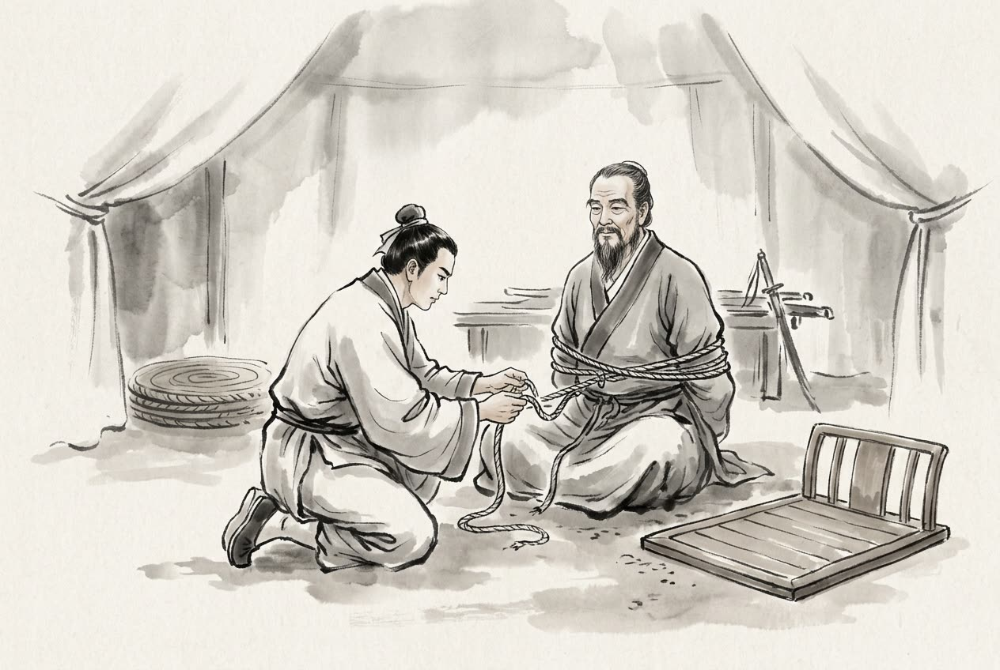

# 卷010 漢紀二 — 太祖高皇帝上之下三年

> 巻 10 / 294 ・ 漢紀二 ・ 年号: 太祖高皇帝上之下三年 ・ 西暦: 204 BCE

[← 巻インデックス](README.md)

---

太祖高皇帝(上の下)。
三年〔注:丁酉(ひのととり)の年、紀元前二〇四年〕。

冬、十月。韓信(かんしん)と張耳(ちょうじ)は数万の兵を率いて東へ趙(ちょう)を攻めた。趙王と成安君(せいあんくん)陳余(ちんよ)はこれを聞き、井陘(せいけい)の入口に兵を集め〔注:井陘の地は四方が高く中央が低く、井戸のような地形なので井陘と呼ぶ。鎮州にあたる険しい要害である〕、二十万と号した。

広武君(こうぶくん)の李左車(りさしゃ)が成安君に説いて言った。「韓信と張耳は勝ちに乗じ、国を遠く離れて戦っております。その鋭い勢いは正面から受け止められませぬ。聞くところでは『千里も先まで食糧を運べば兵は飢え、薪を切り草を刈ってから煮炊きするようでは、軍は満腹で眠れぬ』と申します〔注:樵は薪取り、蘇は草刈りのこと〕。いま井陘の道は、車が二台並んで通れず〔注:方軌とは車を並べて進めること〕、騎馬も列を組めませぬ。数百里も行軍すれば、その勢い、糧食は必ず後方に取り残されます。どうか私に奇襲の兵三万を貸してくだされ。間道(かんどう)から敵の輜重(しちょう)〔注:輜重とは衣類や荷を載せた荷車、すなわち軍の物資のこと〕を断ち切りましょう。あなたは堀を深く塁を高くして守りを固め、決して戦ってはなりませぬ。敵は前へ進んで戦うこともできず、退いて帰ることもできず、野で略奪する物もなく、十日とたたぬうちに、二人の将の首をあなたの麾下(きか)に届けてみせます。さもなければ、必ずこの二人に捕らえられましょう」。だが成安君は、つねづね自分は正義の軍だと称し、偽りの謀(はかりごと)や奇策は用いぬとして、こう言った。「韓信の兵は少なく疲れている。これしきの相手を避けて撃たねば、諸侯は私を臆病だと思い、軽んじて攻めて来るであろう」。

韓信は人をひそかに偵察に出し、成安君が広武君の策を用いぬと知って大いに喜び、思い切って兵を進めて下って行った。井陘口の手前三十里のところで進軍を止めて宿営した。夜半、軍中に令を伝えて出発させ、身軽な騎兵二千を選び、一人ひとりに赤い旗を一本ずつ持たせて〔注:漢の旗はすべて赤い〕、間道から山に身を隠して〔注:山かげに隠れて敵に見られぬようにすること〕趙軍を見張らせた。そして言いつけた。「趙軍は我が軍が逃げるのを見れば、必ず塁(とりで)をからにして追ってくる。お前たちはすばやく趙の塁に入り、趙の旗を抜き取って、漢の赤い旗を立てよ」。さらに副将に軽い食事を配らせて〔注:餐は軽い食事〕、こう言った。「今日、趙を破ってから皆で食事をするぞ」。諸将は誰も信じず、うわべだけ「はい」と答えた。韓信は言った。「趙はすでに有利な地形を先取りして塁を構えている。それに敵は、我が大将の旗と太鼓をまだ見ていないので、我が先鋒を撃とうとはしまい。我が軍が険しい地形にぶつかって引き返すのを恐れているからだ」〔注:趙は韓信が険路を出てから撃とうと待ち構えており、先鋒だけ見て兵を出せば、韓信は険を頼みに兵を引き返してしまうと、韓信は考えたのである〕。そこで一万の兵を先に進ませ、井陘を出ると、川を背にして陣を敷いた。趙軍はこれを遠くから見て大笑いした。

夜明け、韓信は大将の旗と太鼓を立て、太鼓を打ち鳴らしながら井陘口を出た。趙軍は塁を開いてこれを撃ち、長いあいだ激しく戦った。そこで韓信と張耳はわざと太鼓と旗を捨て、川辺の軍へ逃げ込んだ。川辺の軍は門を開いて二人を入れ、ふたたび激しく戦った。趙軍は思ったとおり塁をからにして漢の旗と太鼓を奪い合い、韓信・張耳を追った。韓信・張耳はすでに川辺の軍に入っており、兵は皆死にものぐるいで戦って〔注:殊死とは、決死の覚悟ということ〕、打ち破ることができなかった。韓信が先に出しておいた奇襲の騎兵二千は、趙が塁をからにして利を追うのを待ち構え、趙の塁へ駆け込んで、趙の旗をことごとく抜き取り、漢の赤い旗を二千本立てた。趙軍は韓信たちを討ち取れず、塁へ帰ろうとしたが、塁はみな漢の赤い旗だらけ。これを見て大いに驚き、漢はもう趙王と将を皆捕らえてしまったのだと思い込んだ。兵はそのまま乱れて逃げ出し、趙の将がこれを斬っても、止めることができなかった。そこで漢兵は挟み撃ちにして趙軍を大破し、成安君を泜水(ていすい)のほとりで斬り、趙王の歇(けつ)を捕らえた。

諸将は討ち取った首と捕虜を差し出し、祝賀を終えると、韓信に尋ねた。「兵法では『右と背後に山陵を、前方と左に水沢を置け』とあります。それなのに今日、将軍は我らに逆に川を背にして陣を敷かせ、『趙を破ってから食事をするぞ』とおっしゃいました。我らは納得できませんでしたが、結局これで勝ちました。これはどういう兵法なのですか」。韓信は言った。「これも兵法にあるのだ。お前たちが気づかなかっただけだ。兵法には『これを死地に陥れてこそ生き、亡地に置いてこそ存(なが)らえる』とあるではないか〔注:孫子に、戦えば生き残り戦わねば滅びる地を死地とある。前に高山、後ろに大水があり、進めず退くにも障りがある地のこと〕。それに私は、ふだんから手なずけ訓練してきた兵を率いているわけではない。これはいわば『市の人々を駆り立てて戦わせる』ようなものだ〔注:市場にいる人々を駆り集めて戦わせるようなもので、日ごろ鍛えた兵ではない、ということ〕。その勢いでは、死地に置いて一人ひとりに自分のために戦わせるほかなかった。もし生きられる地を与えていれば、皆逃げ出していただろう。どうしてこれを使いこなせようか」。諸将は皆感服して言った。「お見事。我らの及ぶところではありません」。

韓信は、広武君を生け捕りにした者に千金を与えると触れを出した。広武君を縛って麾下に連れて来た者があると、韓信はその縄を解き、広武君を東向きに座らせ、師として礼を尽くして問うた。

「私は北のかた燕(えん)を伐ち、東のかた斉(せい)を伐ちたいと思うが、どうすれば成功できるだろうか」。広武君は辞退して言った。「私は敗れて捕らわれた身、どうして大事を量るに足りましょう」〔注:私のような敗亡の余り者には、その軽重を見極める資格はない、の意〕。韓信は言った。「私はこう聞いている。百里奚(ひゃくりけい)は虞(ぐ)にいて虞は滅び、秦(しん)に移って秦は覇者となった〔注:百里奚は虞の大夫。虞公が用いなかったので虞は滅び、秦の穆公が信任して用いたので、秦は西戎に覇を唱えた〕。これは虞では愚かで秦では賢かったからではない。用いられたか否か、聞き入れられたか否かの違いだ。もし成安君があなたの計を聞き入れていたら、私のような者もとうに捕らわれていただろう。あなたを用いなかったおかげで、私はこうしてあなたに仕えることができるのだ。今、私は心を委ねてあなたの計に従いたい。どうか辞退なさらないでくれ」。広武君は言った。「いま将軍は西河を渡って魏王を捕らえ、夏説(かえつ)を生け捕り、東のかた井陘を下って、一朝もたたぬうちに趙の二十万の大軍を破り、成安君を誅されました。その名は国中に知れ渡り、威勢は天下を震わせ、農夫は誰もが鋤(すき)を投げ出し、よい衣を着てうまい物を食らい〔注:当時の人々は韓信の威勢を恐れて生業を保てず、皆耕作をやめ、よい衣を着てうまい物を食べ、その日その日を生きるばかりで先のことを考えなくなった、の意〕、耳を傾けて将軍の命を待っております。これは将軍の長所です。しかし兵は疲れ果てており、実際には使いものになりにくい。いま将軍が、疲れ切った兵をもって燕の堅城のもとに攻めかかれば、戦おうとしても戦えず、攻めても落とせず、こちらの内情はさらけ出され、勢いも尽きてしまいます〔注:内情がさらけ出されれば敵に備えられ、勢いが尽きれば敵に乗じられる〕。日を費やして長引けば、糧食は底をつきます。燕が降らぬうちは、斉も必ず国境を固めて自らを強くするでしょう。燕と斉がにらみ合って決着がつかねば、劉(りゅう・劉邦)と項(こう・項羽)の勝敗の行方も定まりませぬ。これが将軍の短所です。よく兵を用いる者は、短所をもって相手の長所を撃たず、長所をもって相手の短所を撃つものです」。韓信は言った。「では、どうすればよいのか」。広武君は答えて言った。「いま将軍のために計りますに、武具を伏せて兵を休め、趙の民を鎮め慰めるに越したことはありませぬ。そうすれば百里四方から牛や酒が日ごとに届き、それで将士をねぎらえます。そのうえで燕の方へ軍を向け〔注:首とは頭の向く方角、すなわち軍を燕へ向けること〕、そののち弁の立つ士に短い手紙を持たせ〔注:咫尺の書とは、ごく短い簡単な手紙のこと〕、将軍の長所(威勢)を燕に見せつければ〔注:暴とは見せつけ、さらけ出すこと〕、燕は必ず従わずにはおられますまい。燕が従って東のかた斉に臨めば、たとえ知恵者がいても、もはや斉のための計を立てられなくなりましょう。そうなれば、天下のことはすべて図ることができます。兵法にもともと『まず評判を響かせ、あとから実力を用いる』というのは、まさにこのことです」。韓信は言った。「もっともだ」。その策に従い、使者を立てて燕に遣わすと、燕は風になびくように従った。漢へ使者を遣わして報告し、あわせて張耳を趙王に立てることを願い出ると、漢王はこれを許した。楚はたびたび奇襲の兵を黄河に渡らせて趙を撃ったが、張耳と韓信は行き来して趙を救い、そのついでに趙の城邑を平定し、兵を集めて漢のもとへ送った。

甲戌(きのえいぬ)の晦(つごもり)〔注:月末を晦という〕、日食があった。

十一月、癸卯(みずのとう)の晦、日食があった。

随何(ずいか)が九江(きゅうこう)に着くと、九江王の太宰(たいさい)が応接にあたったが〔注:この太宰は周礼の太宰ではなく、漢の奉常に属する、食事を司る役。随何が九江に入ったので、王が太宰に応接させたのである〕、三日たっても王に会えなかった。随何は太宰に説いて言った。「王が私に会われぬのは、必ず楚を強いと見、漢を弱いと見ておられるからでしょう。それこそ私が使者として参ったわけです。私に王とお会いさせてください。私の言うことが正しければ、それは王の聞きたいことでありましょうし、私の言うことが間違っていれば、私ども二十人を九江の市で斧と台に伏せて処刑なされば、それで王が漢に背いて楚に味方する意を、十分に明らかにできましょう」。太宰はそこでこれを王に取り次いだ。

王は随何に会った。随何は言った。「漢王は私を遣わし、謹んで大王の御者(おそば)に書をたてまつらせました。ひそかに不思議に思いますが、大王は楚とどれほど親しい間柄なのでしょうか」。九江王は言った。「わしは北に向かって臣下として楚に仕えている」。随何は言った。「大王は項王とともに諸侯に列せられた身。それなのに北に向かって臣下として仕えておられるのは、必ず楚を強いと見、国を託せると思っておられるからでしょう。ところが項王が斉を伐ったときには、みずから版築(はんちく)を背負い〔注:版は土塀を突き固める板、築は突き固める杵〕、兵士の先頭に立たれました。大王も当然、九江の全軍をくり出し、みずからこれを率いて楚の先鋒となるべきでした。それなのに、わずか四千の兵を出して楚を助けたにすぎぬ。北面して臣下として人に仕える者が、はたしてこんなことでよいのでしょうか。漢王が彭城(ほうじょう)に攻め入ったときも、項王はまだ斉から出ていませんでした。大王は当然、九江の全兵を率いて淮(わい)を渡り、日夜彭城のもとで戦うべきでした。ところが大王は万人の軍を抱えながら、一人として淮を渡らせず、手をこまねいて〔注:垂拱とは、衣の袖を垂れ手を組む、すなわち何もせず傍観すること〕どちらが勝つかを眺めておられた。人に国を託す者が、はたしてこんなことでよいのでしょうか。大王はうわべの臣従の名をかかげて楚になびきながら、手厚く身を託そうとしておられる。私は大王のために、それは取るべき道でないと思います。それでも大王が楚に背かれぬのは、漢を弱いと見ておられるからでしょう。しかし楚の兵がいかに強くとも、天下は楚に不義の名を負わせております。盟約に背いて義帝(ぎてい)を殺したからです。漢王は諸侯を従え、引き返して成皋(せいこう)・滎陽(けいよう)を守り、蜀(しょく)・漢(かん)の穀物を運び下し、堀を深く塁を固め、兵を分けて辺境を見回らせ、塞(とりで)に登って守らせております。楚の人は敵国を八、九百里も深く攻め入り〔注:楚は彭城から滎陽・成皋までの間に梁(りょう)の地を挟んでおり、当時その梁の地で彭越が背いて敵国となっていたので、敵国を八、九百里も深く攻め入った、という〕、老人や弱者が千里の外まで糧を運んでおります。漢が堅く守って動かねば、楚は進んでも攻められず、退いても囲みを解けませぬ。だから楚の兵は頼みにならぬと申すのです。かりに楚が漢に勝てば、諸侯はおのれの危うさを恐れて互いに救い合いましょう。楚の強さは、ちょうど天下の兵を呼び寄せるだけのことになります。ですから楚が漢に及ばぬことは、その勢いから見て明らかです。いま大王は万全の漢につかず、滅びかけた楚に身を託しておられる。私はひそかに大王のために、これを解せぬのです。私は九江の兵だけで楚を滅ぼせると申すのではありませぬ。大王が兵を出して楚に背かれれば、項王は必ず(その地に)足止めされましょう。数か月も足止めできれば、漢が天下を取るのは万全となります。私は大王とともに剣を提げて漢に帰参したく存じます。漢王は必ず土地を割いて大王を封じましょう。まして九江は当然、大王のものになります」。九江王は言った。「仰せに従おう」。ひそかに楚に背いて漢に味方することを承知したが、まだあえて漏らさなかった。

楚の使者が九江に来ていて、伝舎(でんしゃ)に宿り〔注:伝舎とは旅人の宿。前の客が泊まって去り、次の客がまた泊まる、と順に受け継ぐので伝舎という〕、布(九江王)に兵を出すよう、しきりに急(せ)き立てていた。随何はまっすぐに乗り込み、楚の使者の上座に座って言った。「九江王はすでに漢に帰参された。楚がどうして兵を出させられようか」。布は呆然とした。楚の使者は立ち上がった。随何はそこで布に説いて言った。「事はもう成りました〔注:構とは結ぶこと、すなわち楚に背く話がもう固まったということ〕。このまま楚の使者を殺し、帰らせずに、急ぎ漢のもとへ走って力を合わせるのがよろしい」。布は言った。「使者の言うとおりにしよう」。そして楚の使者を殺し、兵を起こして楚を攻めた。

楚は項声(こうせい)と龍且(りょうしょ)を遣わして九江を攻めさせ〔注:龍は姓、且は名〕、数か月して、龍且は九江の軍を破った。布は兵を率いて漢へ逃げ込もうとしたが、楚兵に殺されるのを恐れ、間道を通って随何とともに漢へ帰った。十二月、九江王が漢に着いた。漢王はちょうど寝台に腰かけて足を洗っているところで、布を呼び入れて引見した。布は大いに怒り、来たことを悔やんで自殺しようとした。だが退出して宿舎に入ってみると、帳(とばり)や調度、飲食、従者がみな漢王の住まいと同じ待遇だったので〔注:高帝は、布が以前から長く王であったため、自分を尊大に思い上がらせまいと、わざと礼を厳しくして布を屈服させ、そのあとで帳を立派にし、飲食を厚くし、従者を多くして、その心を喜ばせた。これは権道(臨機の手立て)である〕、布はまた望外の喜びにわいた。そこで人を九江へ送り込んだが、楚はすでに項伯(こうはく)に九江の兵を収めさせ、布の妻子をことごとく殺していた。布の使者は、布の旧知や寵臣をかなり集め、数千人を率いて漢に帰った。漢は九江王に兵を増やし、ともに成皋に駐屯した。

楚はたびたび漢の甬道(ようどう・防壁つきの輸送路)を侵して奪い、漢軍は食糧に乏しくなった。漢王は酈食其(れきいき)と、楚の勢力をくじく策を相談した。酈食其は言った。「昔、湯(とう)は桀(けつ)を伐ち、その子孫を杞(き)に封じました。武王は紂(ちゅう)を伐ち、その子孫を宋(そう)に封じました。いま秦は徳を失い義を捨て、諸侯を侵し伐ち、その社稷(しゃしょく)を滅ぼして、錐(きり)を立てるほどの土地さえ残しませんでした。陛下がもし六国の子孫を改めて立てられれば、その君臣や百姓は必ずみな陛下の徳をいただき、こぞって徳義を慕い、臣下となることを願いましょう。徳義が行き渡れば、陛下は南面して覇を唱え、楚も必ず襟を正して朝廷に伺候しましょう」。漢王は言った。「よし。急いで印を刻ませよ。先生はそれを携えて出向いてくれ」。

酈食其(れきいき)がまだ出発しないうちに、張良(ちょうりょう)が外から戻って漢王に拝謁した。漢王はちょうど食事中で、こう言った。「子房(しぼう)〔注:子房は張良の字(あざな)〕、前へ。客の中に、私のために楚の勢力をくじく策を立てた者がいてな」。そして酈食其の言葉をすっかり張良に告げ、「どう思う」と尋ねた。張良は言った。「いったい誰が陛下のためにこの計を立てたのですか。陛下の大業はだいなしです」。漢王は言った。「なぜだ」。張良は答えて言った。「どうか目の前のお箸を借りて〔注:漢王が食事中だったので、張良は食前の箸を借り、それで指し示して説明しようと言ったのである〕、大王のために筋道を立てさせてください。昔、湯(とう)・武王(ぶおう)が桀(けつ)・紂(ちゅう)の子孫を封じたのは、その生死を意のままにできると見極めていたからです。いま陛下は項籍(こうせき・項羽)の生死を意のままにできましょうか。これが第一の不可です。武王は殷(いん)に入ると、商容(しょうよう)の里の門を顕彰し、囚われていた箕子(きし)を解き放ち、比干(ひかん)の墓を手厚く祀りました〔注:商容は殷の賢人。里の入口の門を閭(りょ)という。紂は箕子を囚え比干を殺したが、武王は殷に勝つと箕子を釈放し、比干の墓を封じた〕。いま陛下にそれができましょうか。これが第二の不可です。武王は巨橋(きょきょう)の倉の穀物を放出し、鹿台(ろくだい)の銭をばらまいて〔注:巨橋は倉の名、鹿台は紂の宝庫〕、貧しい者に与えました。いま陛下にそれができましょうか。これが第三の不可です。殷を平定するや、戦車をやめて乗用の車に造り変え〔注:革は兵車、軒は乗用の車。兵車を廃して乗用車を用いたこと〕、武器を逆さに積んで、もう兵を用いぬことを天下に示しました。いま陛下にそれができましょうか。これが第四の不可です。馬を華山(かざん)の南で休ませ、無為(何もしないこと)を示しました。いま陛下にそれができましょうか。これが第五の不可です。牛を桃林(とうりん)の北に放ち〔注:桃林は弘農のあたりの山谷〕、もう物資を運ばぬことを示しました。いま陛下にそれができましょうか。これが第六の不可です。天下の遊説の士たちが、親戚と別れ、先祖の墓を捨て、旧友のもとを去って、陛下に付き従っているのは、ただ朝な夕なに、ほんのわずかな土地(の恩賞)を望んでいるからです。いま六国の子孫を立て直せば、天下の遊説の士はそれぞれ自分の主君のもとへ帰って仕え、親戚に従い、旧友や先祖の墓のもとへ戻ってしまいます。陛下は誰とともに天下を取られるのですか。これが第七の不可です。それに楚がただ強くさえなければよいのですが、六国が立てば、かえって楚になびき従うことになり〔注:いまは楚が強大で並ぶ者がない。もし六国を立てれば、六国は皆たわんで楚に従い、陛下はどうしてこれを臣下にできようか、の意〕、陛下はどうしてこれを臣下にできましょうか。これが第八の不可です。本当にあの客の謀(はかりごと)を用いれば、陛下の大業はだいなしです」。漢王は食事を中断して口の中の物を吐き出し、ののしって言った〔注:高祖は人をののしるとき、たいてい『而公(なんじのきみ)』『乃公(だいのきみ)』と、自分を尊んで言った〕。「あの青二才の儒者め、危うくわしの大事をしくじらせるところだったわ」。そして急いで印を鋳つぶさせた。

荀悦(じゅんえつ)の論にいう。およそ策を立てて勝ちを決める術には、その要点が三つある。一つは形、二つは勢、三つは情である。形とは、その大局の得失の見通しを言い、勢とは、その時々の適否や進退の機を言い、情とは、その心の可否の実情を言う。だから同じ策、同じ事柄でも功(成果)が異なるのは、この三つの術が違うからである。

はじめ、張耳(ちょうじ)・陳余(ちんよ)は陳渉(ちんしょう)に六国を復興させるよう説いて、自分の党を打ち立てようとした〔注:この件は巻七、秦の二世元年に見える〕。酈食其もまた漢王に説いた。説いた内容は同じなのに得失が異なったわけは、こうである。陳渉が起こったときは、天下がみな秦を滅ぼそうとしていた。だが楚・漢の勝負はまだ決まっておらず、いまは天下が必ずしも項羽を滅ぼそうとしているわけではない。だから六国を立てることは、陳渉にとっては、いわば自分の味方を増やして秦の敵を増やすことであった。しかも陳渉はまだ天下の地を自分のものにしてはいなかったから、いわば自分の持ち物でないものを取って人に与え、うわべの恵みを施して実(じつ)の福を得ることであった。ところが六国を立てることは、漢王にとっては、いわば自分の持ち物を割いて敵に貸し与え、うわべの名を設けて実(じつ)の禍(わざわい)を受けることである。これが同じ事でありながら形(大局)が異なる例である。

また宋義(そうぎ)が秦と趙が共倒れになるのを待ったのは〔注:この件は巻八、秦の二世三年に見える〕、昔の卞荘子(べんそうし)が虎を刺した話と同じ趣旨である〔注:卞荘子が虎を刺そうとすると、管(かん)という子どもがこれを止めて言った。『二頭の虎がいま牛を食らっている。牛がうまければ必ず争い、大きいほうは傷つき、小さいほうは死ぬ。傷ついたところを刺せば、一挙に二頭とも仕留められる』。卞荘子はそのとおりにして、はたして二頭の虎を得た〕。これを戦国の時代に施せば、隣国が互いに攻め合って、さしせまった危急がない場合には、それでよい。戦国の諸国は立国して久しく、一戦の勝敗が必ずしも存亡には直結しなかった。その勢いは、急いで敵国を滅ぼせるものではなく、進めば利に乗じ、退けば自らを保つ、だから力を蓄えて時を待ち、敵の共倒れに乗じる――その勢いが自然そうさせたのである。ところがいま楚・趙が起こった情勢は、秦とは勢いのうえで両立できず、安危の機は呼吸のあいだに変わってしまう。進めば功を定め、退けば禍を受ける。これが同じ事でありながら勢(機)が異なる例である。

趙を伐った戦いでは、韓信(かんしん)は泜水(ていすい)のほとりに陣取ったのに趙はこれを破れなかった〔注:この件は前巻(本年の前半)に見える〕。彭城(ほうじょう)の難では、漢王は睢水(すいすい)のほとりで戦い、兵士はみな睢水に飛び込んで、楚兵が大勝した〔注:この件は前巻、二年に見える〕。なぜか。趙の兵は国を出て迎え撃ち、勝てると見れば進み、難しいと見れば退き、内(自国)を顧みる心を抱いて、決死の覚悟がなかった。韓信の軍は孤立して川のほとりにあり、兵士は必死で、二心がなかった。これが韓信の勝った理由である。漢王は敵国深く攻め入って、酒宴を開き盛大に集い、兵士は気が緩んで、戦う心が固まっていなかった。楚は強大な威勢を誇りながら国都を失い、兵士はみな憤激の気にあふれ、敗北を救い滅亡を防ごうとあせって、一瞬に命を懸けた。これが漢の敗れた理由である。しかも韓信は精兵を選んで守らせ、趙は内を顧みる兵でこれを攻めた。項羽は精兵を選んで攻め、漢は気の緩んだ兵でこれに応じた。これが同じ事でありながら情(実情)が異なる例である。

ゆえにいう、権謀はあらかじめ定めておくことはできず、変化は先回りして図ることはできない。時とともに移り、物事に応じて変化する、これが策を立てる要諦である。

漢王が陳平(ちんぺい)に言った。「天下は乱れに乱れている。いつ平定できるのか」。陳平は言った。「項王の硬骨の臣は、亜父(あふ・范増)、鍾離昩(しょうりばつ)、龍且(りょうしょ)、周殷(しゅういん)の類で〔注:鍾離は古の鍾離子の後で、国名を姓とした。龍は龍伯氏の出〕、数人にすぎませぬ。大王がもし数万斤の金を惜しまず投じて反間(離間)の計をめぐらし、君臣の仲を裂いて、その心を疑わせれば、項王の人柄は、疑い深く讒言(ざんげん)を信じますから、必ず内輪で殺し合うでしょう。漢はそこに乗じて軍を進めて攻めれば、楚を破るのは間違いありませぬ」。漢王は言った。「よし」。そこで黄金四万斤を出して陳平に与え、思うままに使わせ、その出し入れを問わなかった。陳平は多くの金をばらまいて楚軍に反間をしかけ、こう言いふらした。「鍾離昩ら諸将は項王の将として功が多いのに、ついに土地を割いて王に封じてもらえぬ。それで漢と一つになり、項氏を滅ぼしてその土地を分けて王になろうとしている」。項羽ははたして鍾離昩らを疑い、信じなくなった。

夏、四月、楚は漢王を滎陽(けいよう)で包囲して攻め立て、その勢いは急(さしせまったもの)だった。漢王は和を請い、滎陽から西を漢の領分とすることにしようとした。亜父は項羽に滎陽を急ぎ攻めるよう勧め、漢王はこれを心配した。項羽が使者を漢に遣わすと、陳平は太牢(たいろう)のごちそうを用意させた〔注:太牢とは、三牲(牛・羊・豕)をそろえた盛大なもてなし〕。それを運び入れ、楚の使者を見るや、わざと驚いたふりをして言った。「亜父の使者かと思ったら、項王の使者だったのか」。そして料理を持ち去らせ、改めて粗末な料理を楚の使者に出した〔注:ごちそうの肴(さかな)や肉を下げ、粗末で雑な料理に取り替えたのである〕。楚の使者は帰って、ありのままを項王に報告し、項王ははたして大いに亜父を疑った。亜父は滎陽城を急ぎ攻め落とそうとしたが、項王は信じず、聞き入れようとしなかった。亜父は項王が自分を疑っていると聞いて、怒って言った。「天下の大勢はほぼ定まりました。君王みずからおやりください。どうかこの老骨に暇(いとま)をお与えください」。帰る途中、まだ彭城に着かぬうちに、背中に疽(そ・できもの)を発して死んだ。

五月、将軍の紀信(きしん)が漢王に言った。「事はさしせまっております。私が楚をあざむきますから、王はそのすきに抜け出されますよう」。そこで陳平は夜、女子二千人あまりを東門から出し、楚は四方からこれを攻めた。紀信は王の車に乗り、黄色い絹の蓋(きぬがさ)を立て、左に纛(とう・旄牛の尾の飾り)を立てて〔注:天子の車は黄色い絹を蓋の裏とし、纛は旄牛の尾で作った飾りで、車の左に立てる〕、「食糧が尽きた、漢王が降伏する」と告げた。楚はみな万歳を叫び、城の東へ見物に行った。そのすきに漢王は数十騎とともに西門から抜け出して逃げ、韓王信(かんおうしん)と周苛(しゅうか)・魏豹(ぎひょう)・樅公(しょうこう)に滎陽を守らせた。項羽は紀信を見て、「漢王はどこだ」と問うと、「もう抜け出されました」と答えた。項羽は紀信を焼き殺した。周苛と樅公は相談して言った。「国に背いた王(魏豹)とは、ともに城を守りにくい」。そこで魏豹を殺した。

漢王は滎陽を出て成皋(せいこう)に至り、関に入って兵を集め、ふたたび東へ向かおうとした。轅生(えんせい)が漢王に説いて言った。「漢は楚と滎陽で数年もにらみ合い、漢はいつも苦しんでおります。どうか君王は武関(ぶかん)から出てください。項王は必ず兵を率いて南へ向かいましょう。王は塁を深くして戦わず、滎陽・成皋のあたりをひとまず休ませ、韓信らに河北の趙の地を安んじ落ち着かせ、燕(えん)・斉(せい)とつながらせます〔注:輯は集と同じで、和らげ合わせること〕。そのうえで君王はまた滎陽へ向かわれるのです。こうすれば、楚は守るべき所が多くなって力が分散し、漢は休息を得て、改めて楚と戦えば、これを破るのは間違いありませぬ」。漢王はその計に従い、軍を宛(えん)・葉(しょう)のあたりへ出した。黥布(げいふ)とともに進みながら兵を集めた。項羽は漢王が宛にいると聞き、はたして兵を率いて南へ向かった。漢王は塁を固く守って戦わなかった。

漢王が彭城で敗れ、囲みを解いて西へ逃れたとき、彭越(ほうえつ)は落とした城をみな失ったが、ひとり兵を率いて北の黄河のほとりに居すわり、たびたび行き来して漢のための遊撃兵となって楚を攻め、その後方の糧道を断っていた。この月、彭越は睢水を渡り、項声(こうせい)・薛公(せつこう)と下邳(かひ)で戦って破り、薛公を殺した。項羽はそこで終公(しょうこう)に成皋を守らせ〔注:終は姓〕、自分は東へ彭越を攻めた。漢王は兵を率いて北へ向かい、終公を撃ち破って、ふたたび成皋に陣取った。

六月、項羽はすでに彭越を破って追い払い、漢がふたたび成皋に陣取ったと聞くと、兵を率いて西へ滎陽城を抜き、周苛を生け捕りにした。項羽は周苛に言った。「わしのために働けば、お前を上将軍とし、三万戸に封じよう」。周苛はののしって言った。「お前こそ早く漢に降れ。さもなくば今に捕虜になるぞ。お前は漢王の敵ではない」。項羽は周苛を煮殺し、あわせて樅公も殺して韓王信を捕らえ、そのまま成皋を包囲した。漢王は逃れ、ただ滕公(とうこう)とだけ車をともにして成皋の玉門(ぎょくもん)〔注:玉門は成皋の北門〕から出て、北へ黄河を渡り、小脩武(しょうしゅうぶ)の伝舎(宿)に泊まった。明け方、漢使と称して、馬を駆って趙の塁に駆け込んだ。張耳・韓信はまだ起きておらず、その寝所に入って、その印と割符を奪い取り、それを振って諸将を呼び集め、配置をすっかり入れ替えた。韓信・張耳は起きて、漢王が来たと知って大いに驚いた。漢王は二人の軍を奪うと、すぐに張耳に趙の地を見回らせて守りを固めさせ、韓信を相国(しょうこく)に任じ、まだ出陣していない趙の兵を集めて斉を撃たせた。諸将は少しずつ成皋を抜け出して漢王に従った。楚はついに成皋を抜き、西へ進もうとしたが、漢は兵を出して鞏(きょう)でこれを防ぎ〔注:鞏は四面に山があり堅固な土地〕、西へ進ませなかった。

秋、七月、大角(たいかく)星のあたりに孛星(はいせい・凶兆の妖星)が現れた〔注:孛は彗星の類で、芒(ひかり)が四方に出るものを孛という。凶兆の悪気が生むもので、内に大乱がなければ必ず大いくさがあるとされる。大角は天王(天子)の帝座にあたる〕。

臨江王(りんこうおう)の敖(ごう)が薨(こう)じ、子の尉(い)が後を継いだ。

漢王は韓信の軍を手に入れて、ふたたび大いに勢いを盛り返した。八月、兵を率いて黄河に臨み、南を向いて小脩武に陣取り、ふたたび楚と戦おうとした。郎中(ろうちゅう)の鄭忠(ていちゅう)が漢王を説いて止め〔注:漢の制度では、郎中は郎中令に属する官〕、塁を高くし堀を深くして戦わぬようにさせた。漢王はその計を聞き入れ、将軍の劉賈(りゅうか)・盧綰(ろわん)に兵二万人、騎兵数百を率いさせ、白馬津(はくばしん)を渡って楚の地に入らせ、彭越を助けて楚の蓄えを焼き〔注:積聚とは蓄えた軍糧や飼い葉の類〕、その補給の手立てを崩させて、項王の軍に食糧を供給できなくさせた。楚兵が劉賈を攻めると、劉賈はそのつど塁を固く守って戦わず、彭越と互いに支え合った。

彭越は梁(りょう)の地を攻め従え、睢陽(すいよう)・外黄(がいこう)など十七城を落とした。九月、項王は大司馬(だいしば)の曹咎(そうきゅう)に言った。「しっかり成皋を守れ。もし漢王が戦いを挑んできても、くれぐれも戦うな。ただ東へ進ませぬようにすればよい。わしは十五日で必ず梁の地を平定し、また将軍のもとへ戻る」。項羽は兵を率いて東へ進み、陳留(ちんりゅう)・外黄・睢陽などの城を攻め、みなこれを落とした。

漢王は成皋から東を捨て、鞏(きょう)・洛(らく)に立てこもって楚を防ごうとした。酈食其(れきいき)が言った。「私はこう聞いております、『天にとっての天(もっとも大切なもの)を知る者こそ、王者の業を成せる』と。王者は民を天とし、民は食を天とします。あの敖倉(ごうそう)は、天下の物資が長らく集め運ばれてきた所で、私が聞くところでは、その地下には蓄えた穀物がたいそう多くあるとのこと。楚人は滎陽(けいよう)を抜きながら、敖倉を堅く守らず、東へ引き上げて、罪人あがりの兵に成皋を分け守らせております〔注:適卒とは、罪を得て罰として戍(まも)りにつかされた兵のこと〕。これこそ天が漢を助けようとしているのです。いままさに楚は取りやすいのに、漢がかえって後ろへ退いては、みすから好機を捨てることになります。私はひそかに、それは誤りだと思います。それに二人の英雄は並び立てぬもの。楚と漢が長くにらみ合って決着がつかねば、天下は揺れ動き、農夫は鋤(すき)を放り出し、機織りの女は機(はた)を下り、天下の人心はまだどこにも定まっておりません。どうか急ぎふたたび兵を進め、滎陽を取り返し、敖倉の穀物を押さえ、成皋の険を固め、太行(たいこう)の道をふさぎ、蜚狐(ひこ)の口を防ぎ〔注:蜚狐口は代郡の南にある要害の関〕、白馬(はくば)の津を守って、諸侯に地形を押さえて敵を制する勢いを見せつけてください。そうすれば天下は、どこに帰すべきかを悟りましょう」。王はこれに従い、そこで改めて敖倉を取る策を練った。

酈食其はまた王に説いて言った。「いままさに燕(えん)・趙(ちょう)はすでに定まり、ただ斉(せい)だけが落ちておりません。斉の田氏一族は勢力が強く、東は海に至り、南は岱(たい・泰山)を背負い、西は済(せい・済水)、北は河(黄河)の険をめぐらせ〔注:斉の地は東は海、南は泰山に至るので海・岱を背負うといい、西は清済、北は濁河を険とするので河・済に阻まれるという〕、南は楚に近く、人々は変わり身が早くずる賢い。あなたが数万の兵を遣わしても、わずかな年月で破ることはできますまい。どうか私が、王の明らかな詔(みことのり)をいただいて斉王を説き、漢に味方して東方の藩屛(はんぺい・守りの臣)と称させましょう」。上(漢王)は言った。「よし」。

そこで酈食其を遣わして斉王に説かせた。「王は天下がどこに帰すかをご存じか」。王は言った。「知らぬ。天下はどこに帰すのだ」。酈食其は言った。「漢に帰します」。王は言った。「先生はなぜそう言うのか」。酈食其は言った。「漢王は先に咸陽(かんよう)に入りました。ところが項王は約束に背いて、漢王を漢中(かんちゅう)の王にしてしまった。項王は義帝(ぎてい)を移して殺し、漢王はそれを聞くと、蜀(しょく)・漢の兵を起こして三秦(さんしん)を撃ち、関を出て、義帝のありかを問いただしました。天下の兵を集め、諸侯の子孫を立て、城を降せばその将をすぐ侯(こう)に封じ、財貨を得ればすぐ将士に分け与え、天下と利を分かち合いましたから、英傑や賢才はみな喜んで漢王のために働きます。一方、項王には約束に背いたという名があり、義帝を殺した負い目があります。人の功は何一つ覚えず、人の罪は何一つ忘れず、戦に勝っても恩賞は与えられず、城を抜いてもその地に封じられず、項氏一門でなければ要職につけぬ。だから天下はこれに背き、賢才はこれを恨み、誰も働こうとしません。ですから天下のことが漢王に帰すのは、座したまま見通せるのです。そもそも漢王は蜀・漢から出て三秦を平定し、西河を渡って北魏(ほくぎ・魏王豹)を破り、井陘(せいけい)を出て成安君(せいあんくん)を誅しました。これは人の力ではなく、天の福です。いますでに敖倉の穀物を押さえ、成皋の険を固め、白馬の津を守り、太行の坂をふさぎ、蜚狐の口を防いでおります。天下は、遅れて服する者が先に滅びるのです。王が急いで真っ先に漢王に下られれば、斉の国は保てましょう。さもなくば、危うい滅びはたちどころに待ち受けております」。これより先、斉は韓信(かんしん)が東へ兵を進めようとしていると聞き、華無傷(かむしょう)・田解(でんかい)に大軍を率いさせて歷下(れきか)に駐屯させ〔注:歷下は済南郡の歷城県のあたり〕、漢を防がせていた。だが酈食其の言を容れると、使者を遣わして漢と和睦し、歷下の守備の備えを解いて、酈食其と日々酒を酌み交わして楽しんだ。

韓信は兵を率いて東へ進み、まだ平原(へいげん)を渡らぬうちに、酈食其がすでに斉を説き降したと聞き、進軍をやめようとした。弁の立つ士の蒯徹(かいてつ)が韓信に説いて言った。「将軍は斉を撃てとの詔(みことのり)を受けておられる。それなのに漢が、別に密使を出して斉を降したまでのこと〔注:間使とは、ひそかに遣わした使者のこと〕。将軍に止まれという詔がございましたか。どうして進軍をやめてよいのですか。それに酈生はただの一介の士で、車の前の横木にもたれて〔注:軾は車の前の横木で、人がよりかかる所〕、三寸の舌をふるっただけで斉の七十あまりの城を降しました。将軍は数万の兵をもって、一年あまりかかってやっと趙の五十あまりの城を下したにすぎぬ。将軍として数年も働きながら、かえって一人の青二才の儒者の功に及ばぬとは」。そこで韓信はもっともと思い、ついに黄河を渡った。

---

原文を表示

太祖高皇帝上之下
三年
冬，十月，韓信、張耳以兵數萬東擊趙。趙王及成安君陳餘聞之，聚兵井陘口，號二十萬。
廣武君李左車說成安君曰：「韓信、張耳乘勝而去國遠鬬，其鋒不可當。臣聞『千里餽糧，士有飢色；樵蘇後爨，師不宿飽。』今井陘之道，車不得方軌，騎不得成列；行數百里，其勢糧食必在其後。願足下假臣奇兵三萬人，從間路絕其輜重；足下深溝高壘勿與戰。彼前不得鬬，退不得還，野無所掠，不至十日，而兩將之頭可致於麾下；否則必爲二子所禽矣。」成安君嘗自稱義兵，不用詐謀奇計，曰：「韓信兵少而疲，如此避而不擊，則諸侯謂吾怯而輕來伐我矣。」
韓信使人間視，知其不用廣武君策，則大喜，乃敢引兵遂下。未至井陘口三十里，止舍。夜半，傳發，選輕騎二千人，人持一赤幟，從間道萆山而望趙軍。誡曰：「趙見我走，必空壁逐我；若疾入趙壁，拔趙幟，立漢赤幟。」令其裨將傳餐，曰：「今日破趙會食！」諸將皆莫信，佯應曰「諾。」信曰：「趙已先據便地爲壁；且彼未見吾大將旗鼓，未肯擊前行，恐吾至阻險而還也。」乃使萬人先行，出，背水陳；趙軍望見而大笑。
平旦，信建大將旗鼓，鼓行出井陘口；趙開壁擊之，大戰良久。於是信與張耳佯棄鼓旗，走水上軍；水上軍開入之，復疾戰。趙果空壁爭漢旗鼓，逐信、耳。信、耳已入水上軍，軍皆殊死戰，不可敗。信所出奇兵二千騎共候趙空壁逐利，則馳入趙壁，皆拔趙旗，立漢赤幟二千。趙軍已不能得信等，欲還歸壁；壁皆漢赤幟，見而大驚，以爲漢皆已得趙王將矣，兵遂亂，遁走，趙將雖斬之，不能禁也。於是漢兵夾擊，大破趙軍，斬成安君泜水上，禽趙王歇。
諸將効首虜，畢賀，因問信曰：「兵法：『右倍山陵，前左水澤。』今者將軍令臣等反背水陳，曰『破趙會食』，臣等不服，然竟以勝。此何術也？」信曰：「此在兵法，顧諸君不察耳！兵法不曰：『陷之死地而後生，置之亡地而後存』？且信非得素拊循士大夫也，此所謂『驅市人而戰之』，其勢非置之死地，使人人自爲戰；今予之生地，皆走，寧尚可得而用之乎！」諸將皆服，曰：「善！非臣所及也。」
信募生得廣武君者予千金。有縛致麾下者，信解其縛，東鄕坐，師事之。問曰：「僕欲北伐燕，東伐齊，何若而有功？」廣武君辭謝曰：「臣，敗亡之虜，何足以權大事乎！」信曰：「僕聞之：百里奚居虞而虞亡，在秦而秦霸；非愚於虞而智於秦也，用與不用，聽與不聽也。誠令成安君聽足下計，若信者亦已爲禽矣；以不用足下，故信得侍耳。今僕委心歸計，願足下勿辭！」廣武君曰：「今將軍涉西河，虜魏王，禽夏說；東下井陘，不終朝而破趙二十萬衆，誅成安君；名聞海內，威震天下，農夫莫不輟耕釋耒，褕衣甘食，傾耳以待命者，此將軍之所長也。然而衆勞卒罷，其實難用。今將軍欲舉倦敝之兵頓之燕堅城之下，欲戰不得，攻之不拔，情見勢屈；曠日持久，糧食單竭。燕旣不服，齊必距境以自強。燕、齊相持而不下，則劉、項之權未有所分也，此將軍所短也。善用兵者，不以短擊長而以長擊短。」韓信曰：「然則何由？」廣武君對曰：「方今爲將軍計，莫如按甲休兵，鎭撫趙民，百里之內，牛酒日至，以饗士大夫；北首燕路，而後遣辨士奉咫尺之書，暴其所長於燕，燕必不敢不聽從。燕已從而東臨齊，雖有智者，亦不知爲齊計矣。如是，則天下事皆可圖也。兵固有先聲而後實者，此之謂也。」韓信曰：「善！」從其策，發使使燕，燕從風而靡；遣使報漢，且請以張耳王趙，漢王許之。楚數使奇兵渡河擊趙，張耳、韓信往來救趙，因行定趙城邑，發兵詣漢。
甲戌晦，日有食之。
十一月，癸卯晦，日有食之。
隨何至九江，九江太宰主之，三日不得見。隨何說太宰曰：「王之不見何，必以楚爲強，漢爲弱也。此臣之所以爲使。使何得見，言之而是，大王所欲聞也；言之而非，使何等二十人伏斧質九江市，足以明王倍漢而與楚也。」太宰乃言之王。
王見之。隨何曰：「漢王使臣敬進書大王御者，竊怪大王與楚何親也？」九江王曰：「寡人北鄕而臣事之。」隨何曰：「大王與項王俱列爲諸侯，北鄕而臣事之者，必以楚爲強，可以託國也。項王伐齊，身負版築，爲士卒先。大王宜悉九江之衆，身自將之，爲楚前鋒；今乃發四千人以助楚。夫北面而臣事人者，固若是乎？漢王入彭城，項王未出齊也。大王宜悉九江之兵渡淮，日夜會戰彭城下；大王乃撫萬人之衆，無一人渡淮者，垂拱而觀其孰勝。夫託國於人者，固若是乎？大王提空名以鄕楚而欲厚自託，臣竊爲大王不取也！然而大王不背楚者，以漢爲弱也。夫楚兵雖強，天下負之以不義之名，以其背盟約而殺義帝也。漢王收諸侯，還守成皋、滎陽，下蜀、漢之粟，深溝壁壘，分卒守徼乘塞。楚人深入敵國八九百里，老弱轉糧千里之外。漢堅守而不動，楚進則不得攻，退則不能解，故曰楚兵不足恃也。使楚勝漢，則諸侯自危懼而相救；夫楚之強，適足以致天下之兵耳。故楚不如漢，其勢易見也。今大王不與萬全之漢而自託於危亡之楚，臣竊爲大王惑之！臣非以九江之兵足以亡楚也；大王發兵而倍楚，項王必留；留數月，漢之取天下可以萬全。臣請與大王提劍而歸漢，漢王必裂地而封大王；又況九江必大王有也。」九江王曰：「請奉命。」陰許畔楚與漢，未敢泄也。
楚使者在九江，舍傳舍，方急責布發兵。隨何直入，坐楚使者上，曰：「九江王已歸漢，楚何以得發兵？」布愕然。楚使者起。何因說布曰：「事已構，可遂殺楚使者，無使歸，而疾走漢幷力。」布曰：「如使者敎。」於是殺楚使者，因起兵而攻楚。
楚使項聲、龍且攻九江，數月，龍且破九江軍。布欲引兵走漢，恐楚兵殺之，乃間行與何俱歸漢。十二月，九江王至漢。漢王方踞床洗足，召布入見。布大怒，悔來，欲自殺；及出就舍，帳御、飲食、從官皆如漢王居，布又大喜過望。於是乃使人入九江；楚已使項伯收九江兵，盡殺布妻子。布使者頗得故人、幸臣，將衆數千人歸漢。漢益九江王兵，與俱屯成皋。
楚數侵奪漢甬道，漢軍乏食。漢王與酈食其謀橈楚權。食其曰：「昔湯伐桀，封其後於杞；武王伐紂，封其後於宋。今秦失德棄義，侵伐諸侯，滅其社稷，使無立錐之地。陛下誠能復立六國之後，此其君臣、百姓必皆戴陛下之德，莫不嚮風慕義，願爲臣妾。德義已行，陛下南鄕稱霸，楚必斂袵而朝。」漢王曰：「善！趣刻印，先生因行佩之矣。」

食其未行，張良從外來謁。漢王方食，曰：「子房前！客有爲我計橈楚權者，」具以酈生語告良，曰：「何如？」良曰：「誰爲陛下畫此計者？陛下事去矣！」漢王曰：「何哉？」對曰：「臣請借前箸，爲大王籌之，昔湯、武封桀、紂之後者，度能制其死生之命也；今陛下能制項籍之死命乎？其不可一也。武王入殷，表商容之閭，釋箕子之囚，封比干之墓；今陛下能乎？其不可二也。發巨橋之粟，散鹿臺之錢，以賜貧窮；今陛下能乎？其不可三也。殷事已畢，偃革爲軒，倒載干戈，示天下不復用兵；今陛下能乎？其不可四也。休馬華山之陽，示以無爲；今陛下能乎？其不可五也。放牛桃林之陰，以示不復輸積；今陛下能乎？其不可六也。天下游士，離其親戚，棄墳墓，去故舊，從陛下游者，徒欲日夜望咫尺之地。今復立六國之後，天下游士各歸事其主，從其親戚，反其故舊、墳墓，陛下誰與取天下乎？其不可七也。且夫楚唯無強，六國立者復橈而從之，陛下焉得而臣之？其不可八也。誠用客之謀，陛下事去矣！」漢王輟食，吐哺，罵曰：「豎儒幾敗而公事！」令趣銷印。
荀悅論曰：夫立策決勝之術，其要有三：一曰形，二曰勢，三曰情。形者，言其大體得失之數也；勢者，言其臨時之宜、進退之機也；情者，言其心志可否之實也。故策同、事等而功殊者，三術不同也。
初，張耳、陳餘說陳涉以復六國，自爲樹黨；酈生亦說漢王。所以說者同而得失異者，陳涉之起，天下皆欲亡秦；而楚、漢之分未有所定，今天下未必欲亡項也。故立六國，於陳涉，所謂多己之黨而益秦之敵也；且陳涉未能專天下之地也，所謂取非其有以與於人，行虛惠而獲實福也。立六國，於漢王，所謂割己之有而以資敵，設虛名而受實禍也。此同事而異形者也。
及宋義待秦、趙之斃，與昔卞莊刺虎同說者也。施之戰國之時，鄰國相攻，無臨時之急，則可也。戰國之立，其日久矣，一戰勝敗，未必以存亡也；其勢非能急於亡敵國也，進乘利，退自保，故累力待時，乘敵之斃，其勢然也。今楚、趙所起，其與秦勢不並立，安危之機，呼吸成變，進則定功，退則受禍。此同事而異勢者也。
伐趙之役，韓信軍於泜水之上而趙不能敗。彭城之難，漢王戰于睢水之上，士卒皆赴入睢水而楚兵大勝，何則？趙兵出國迎戰，見可而進，知難而退，懷內顧之心，無出死之計；韓信軍孤在水上，士卒必死，無有二心，此信之所以勝也。漢王深入敵國，置酒高會，士卒逸豫，戰心不固；楚以強大之威而喪其國都，士卒皆有憤激之氣，救敗赴亡之急，以決一旦之命，此漢之所以敗也。且韓信選精兵以守，而趙以內顧之士攻之；項羽選精兵以攻，而漢以怠惰之卒應之。此同事而異情者也。
故曰：權不可豫設，變不可先圖；與時遷移，應物變化，設策之機也。
漢王謂陳平曰：「天下紛紛，何時定乎？」陳平曰：「項王骨鯁之臣，亞父、鍾離昩、龍且、周殷之屬，不過數人耳。大王誠能捐數萬斤金，行反間，間其君臣，以疑其心；項王爲人，意忌信讒，必內相誅，漢因舉兵而攻之，破楚必矣。」漢王曰：「善！」乃出黃金四萬斤與平，恣所爲，不問其出入。平多以金縱反間於楚軍，宣言：「諸將鍾離昩等爲項王將，功多矣，然而終不得裂地而王，欲與漢爲一，以滅項氏而分王其地。」項羽果意不信鍾離昩等。
夏，四月，楚圍漢王於滎陽，急；漢王請和，割滎陽以西者爲漢。亞父勸羽急攻滎陽；漢王患之。項羽使使至漢，陳平使爲大牢具。舉進，見楚使，卽佯驚曰：「吾以爲亞父使，乃項王使！」復持去，更以惡草具進楚使。楚使歸，具以報項王；項王果大疑亞父。亞父欲急攻下滎陽城，項王不信，不肯聽。亞父聞項王疑之，乃怒曰：「天下事大定矣，君王自爲之，願賜骸骨！」歸，未至彭城，疽發背而死。
五月，將軍紀信言於漢王曰：「事急矣！臣請誑楚，王可以間出。」於是陳平夜出女子東門二千餘人，楚因四面擊之。紀信乃乘王車，黃屋，左纛，曰：「食盡，漢王降。」楚皆呼萬歲，之城東觀。以故漢王得與數十騎出西門遁去，令韓王信與周苛、魏豹、樅公守滎陽。羽見紀信，問：「漢王安在？」曰：「已出去矣。」羽燒殺信。周苛、樅公相謂曰：「反國之王，難與守城！」因殺魏豹。
漢王出滎陽，至成皋，入關，收兵欲復東，轅生說漢王曰：「漢與楚相距滎陽數歲，漢常困。願君王出武關，項王必引兵南走。王深壁勿戰，令滎陽、成皋間且得休息，使韓信等得安輯河北趙地，連燕、齊，君王乃復走滎陽。如此，則楚所備者多，力分；漢得休息，復與之戰，破之必矣！」漢王從其計，出軍宛、葉間。與黥布行收兵。羽聞漢王在宛，果引兵南；漢王堅壁不與戰。
漢王之敗彭城，解而西也，彭越皆亡其所下城，獨將其兵北居河上，常往來爲漢游兵擊楚，絕其後糧。是月，彭越渡睢，與項聲、薛公戰下邳，破，殺薛公。羽乃使終公守成皋，而自東擊彭越。漢王引兵北，擊破終公，復軍成皋。
六月，羽已破走彭越，聞漢復軍成皋，乃引兵西拔滎陽城，生得周苛。羽謂苛：「爲我，將以公爲上將軍，封三萬戶。」周苛罵曰：「若不趨降漢，今爲虜矣；若非漢王敵也！」羽烹周苛，幷殺樅公而虜韓王信，遂圍成皋。漢王逃，獨與滕公共車出成皋玉門，北渡河，宿小脩武傳舍。晨，自稱漢使，馳入趙壁。張耳、韓信未起，卽其臥內，奪其印符以麾召諸將，易置之。信、耳起，乃知漢王來，大驚。漢王旣奪兩人軍，卽令張耳循行，備守趙地。拜韓信爲相國，收趙兵未發者擊齊。諸將稍稍得出成皋從漢王。楚遂拔成皋，欲西；漢使兵距之鞏，令其不得西。
秋，七月，有星孛于大角。
臨江王敖薨，子尉嗣。
漢王得韓信軍，復大振。八月，引兵臨河，南鄕，軍小脩武，欲復與楚戰。郎中鄭忠說止漢王，使高壘深塹勿與戰。漢王聽其計，使將軍劉賈、盧綰將卒二萬人，騎數百，渡白馬津，入楚地，佐彭越，燒楚積聚，以破其業，無以給項王軍食而已。楚兵擊劉賈，賈輒堅壁不肯與戰，而與彭越相保。
彭越攻徇梁地，下睢陽、外黃等十七城。九月，項王謂大司馬曹咎曰：「謹守成皋！卽漢王欲挑戰，愼勿與戰，勿令得東而已。我十五日必定梁地，復從將軍。」羽引兵東行，擊陳留、外黃、睢陽等城，皆下之。

漢王欲捐成皋以東，屯鞏、洛以距楚。酈生曰：「臣聞『知天之天者，王事可成』；王者以民爲天，而民以食爲天。夫敖倉，天下轉輸久矣，臣聞其下乃有藏粟甚多。楚人拔滎陽，不堅守敖倉，乃引而東，令適卒分守成皋，此乃天所以資漢也。方今楚易取而漢反卻，自奪其便，臣竊以爲過矣！且兩雄不俱立，楚、漢久相持不決，海內搖盪，農夫釋耒，工女下機，天下之心未有所定也。願足下急復進兵，收取滎陽，據敖倉之粟，塞成皋之險，杜太行之道，距蜚狐之口，守白馬之津，以示諸侯形制之勢，則天下知所歸矣。」王從之，乃復謀取敖倉。
食其又說王曰：「方今燕、趙已定，唯齊未下。諸田宗強，負海、岱，阻河、濟，南近於楚，人多變詐；足下雖遣數萬師，未可以歲月破也。臣請得奉明詔說齊王，使爲漢而稱東藩。」上曰：「善！」
乃使酈生說齊王曰：「王知天下之所歸乎？」王曰：「不知也。天下何所歸？」酈生曰：「歸漢！」曰：「先生何以言之？」曰：「漢王先入咸陽；項王負約，王之漢中。項王遷殺義帝；漢王聞之，起蜀、漢之兵擊三秦，出關而責義帝之處。收天下之兵，立諸侯之後；降城卽以侯其將，得賂卽以分其士；與天下同其利，豪英賢才皆樂爲之用。項王有倍約之名，殺義帝之負；於人之功無所記，於人之罪無所忘；戰勝而不得其賞，拔城而不得其封，非項氏莫得用事；天下畔之，賢才怨之，而莫爲之用。故天下之事歸於漢王，可坐而策也！夫漢王發蜀、漢，定三秦；涉西河，破北魏；出井陘，誅成安君；此非人之力也，天之福也！今已據敖倉之粟，塞成皋之險，守白馬之津，杜太行之阪，距蜚狐之口；天下後服者先亡矣。王疾先下漢王，齊國可得而保也；不然，危亡可立而待也！」先是，齊聞韓信且東兵，使華無傷、田解將重兵屯歷下，軍以距漢。及納酈生之言，遣使與漢平，乃罷歷下守戰備，與酈生日縱酒爲樂。
韓信引兵東，未度平原，聞酈食其已說下齊，欲止。辨士蒯徹說信曰：「將軍受詔擊齊，而漢獨發間使下齊，寧有詔止將軍乎，何以得毋行也？且酈生，一士，伏軾掉三寸之舌，下齊七十餘城；將軍以數萬衆，歲餘乃下趙五十餘城。爲將數歲，反不如一豎儒之功乎！」於是信然之，遂渡河。

---

出典: 維基文庫「資治通鑒 (胡三省音注)/卷010」(revid 2009980, CC BY-SA 4.0) / 原字: Kanripo KR2b0007 @80174f6 . 成果物=CC BY-NC-SA 系。

[巻インデックス](README.md) ・ [次年: 太祖高皇帝上之下四年 →](j010_y02.md)
