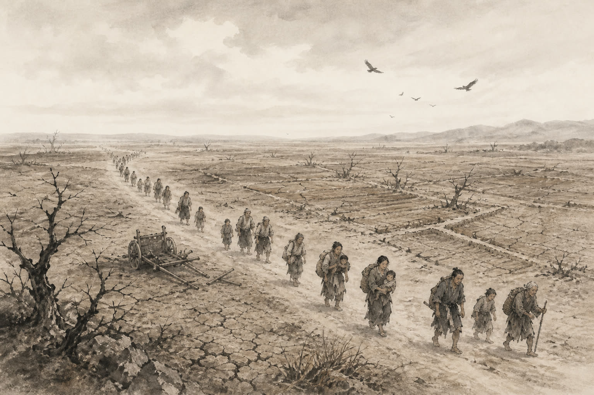

# 卷020 漢紀十二 — 世宗孝武皇帝中之下三年

> 巻 20 / 294 ・ 漢紀十二 ・ 年号: 世宗孝武皇帝中之下三年 ・ 西暦: 114 BCE

[← 巻インデックス](README.md)

---

三年〔注:丁卯(ひのとう)の年、紀元前一一四年〕。

冬。函谷関(かんこくかん)を新安(しんあん)へ移した〔注:班固『漢書』によれば、もとの関の地を弘農県(こうのうけん)とした。応劭(おうしょう)は「弘農は新安から三百里離れている」という。『述征記』には「新安県は今なお新関と呼ばれている」とある〕。

春、正月、戊子(つちのえね)の日。陽陵(ようりょう)の陵園で火事があった。

夏、四月。雹(ひょう)が降った。

関東(かんとう)の郡・国の十余りで飢饉となり、人が互いに食らい合うありさまであった。

常山憲王(じょうざんけんおう)の劉舜(りゅうしゅん)が薨(こう)じた〔注:劉舜は景帝の子で、中五年に封を受けた。諡法(しほう)では、博く聞いて多能なのを「憲」という〕。子の劉勃(りゅうぼつ)が跡を継いだが、憲王が病のときに看病をせず、また喪に服する際の無礼を咎められて廃され、房陵(ぼうりょう)へ移された〔注:『漢書』地理志では房陵県は漢中郡に属す。宋白(そうはく)は「闞駰(かんいん)によれば、ここは春秋時代の防渚(ぼうしょ)の地で、後漢の献帝が『防』を『房』に改め、あわせて房陵郡を立てた。今の房州である」という〕。一月余りののち、天子はあらためて憲王の子の劉平(りゅうへい)を真定王(しんていおう)に封じ〔注:真定県はもと常山に属していた。今、真定・綿曼(めんまん)・藁城(こうじょう)・肥纍(ひるい)の四県を分けて王国とした〕、常山(じょうざん)を郡とした。これによって五岳(ごがく)はすべて天子の領内に収まることになった〔注:華山(かざん)と嵩高(すうこう、嵩山)はもとから天子の郡にあった。南岳の霍山(かくざん)は廬江(ろこう)に属していたが、淮南王(わいなんおう)・衡山王(こうざんおう)が謀反して国が除かれ、漢に編入されて郡となった。元狩元年には済北王(さいほくおう)が太山(たいざん、泰山)とその周辺の邑を献上した。今また常山を郡としたことで、ようやく五岳はことごとく天子の領内に収まったのである〕。

代王(だいおう)の劉義(りゅうぎ)を清河王(せいがおう)に移した〔注:劉義は文帝の子である代王劉参(りゅうしん)の孫で、王登(おうとう)の子。清河王の劉乘(りゅうじょう)は孝景帝の子で、薨じたが跡継ぎの子がなく国が除かれていたため、代王をここに移したのである〕。

この年、匈奴(きょうど)の伊稚斜単于(いちやしゃぜんう)が死に、子の烏維単于(ういぜんう)が立った。

---

原文を表示

三年
冬，徙函谷關於新安。
春，正月，戊子，陽陵園火。
夏，四月，雨雹。
關東郡、國十餘饑，人相食。
常山憲王舜薨，子勃嗣，坐憲王病不侍疾及居喪無禮廢，徙房陵。後月餘，天子更封憲王子平爲眞定王，以常山爲郡，於是五嶽皆在天子之邦矣。
徙代王義爲清河王。
是歲，匈奴伊稚斜單于死，子烏維單于立。

---

出典: 維基文庫「資治通鑒 (胡三省音注)/卷020」(revid 388659, CC BY-SA 4.0) / 原字: Kanripo KR2b0007 @80174f6 . 成果物=CC BY-NC-SA 系。

[← 前年: 世宗孝武皇帝中之下二年](j020_y04.md) ・ [巻インデックス](README.md) ・ [次年: 世宗孝武皇帝中之下四年 →](j020_y06.md)
