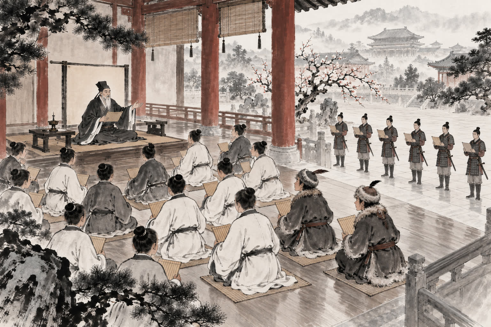
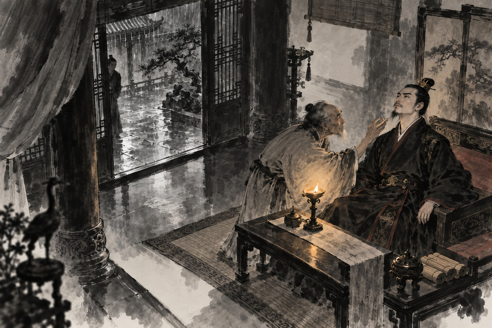

# 卷045 漢紀三十七 — 顯宗孝明皇帝下九年

> 巻 45 / 294 ・ 漢紀三十七 ・ 年号: 顯宗孝明皇帝下九年 ・ 西暦: 66 CE

[← 巻インデックス](README.md)

---

九年〔注:丙寅(ひのえとら)の年、紀元六六年〕。

夏、四月、甲辰(きのえたつ)の日。帝は詔(みことのり)を下し、司隸校尉(しれいこうい)と各州の部刺史(ぶしし)に対し、毎年、墨綬(ぼくじゅ)の長吏(ちょうり)のうち、任に就いて三年以上で、治績(ちせき)がとりわけ優れた者を各一名ずつ、その年の会計報告(上計)の使者とともに都へ上らせ、また、とりわけ治績の悪い者についても報告するよう命じた〔注:「墨綬の長吏」とは、俸禄千石・六百石クラスで黒い綬(=印のひも)を帯びる官をいい、ここでは大県の令(長官)以下の者をさす〕。

この年は大豊作であった〔注:五穀がすべて実った豊作の年を「大有年(たいゆうねん)」と記す〕。

皇子の恭(きょう)に靈壽王(れいじゅおう)の号を、皇子の黨(とう)に重熹王(じゅうきおう)の号を賜った〔注:いずれも縁起のよい美名を取ったものである〕。だが、まだ領地(国邑)は与えられていなかった。

帝は儒学(じゅがく)を重んじ尊んだので、皇太子をはじめ諸王・諸侯、それに大臣の子弟や功臣の子孫に至るまで、経書を学ばない者はいなかった。さらに外戚(がいせき)の樊(はん)氏・郭(かく)氏・陰(いん)氏・馬(ば)氏の子弟のために南宮(なんきゅう)に学校を建てた。これら四姓の子弟は「四姓小侯(ししょうしょうこう)」と呼ばれた〔注:正式な列侯(れっこう)ではないので「小侯」と呼んだのである〕。五経(ごけい)の師(=教官)を置き、才能のすぐれた者を探し選んでその学業を授けさせた。期門(きもん)・羽林(うりん)の兵士に至るまで、みな『孝経(こうきょう)』の章句に通じさせた。匈奴(きょうど)もまた子弟を遣わして入学させた。

廣陵王(こうりょうおう)の荊(けい)は、またしても人相見(にんそうみ)を呼び寄せて言った。「わしの顔だちは先帝に似ている。先帝は三十で天下を取られた。わしも今ちょうど三十だ。いま兵を挙げてよいだろうか」。人相見は役人のもとへ行ってこれを訴え出た。

荊はおびえおののき、みずから獄(ごく)に身を繋(つな)いだ。帝は情けをかけ、その件をとことん追及せず、詔して、荊が官吏や民を臣下・領民とすることは許さず、ただ従来どおり租税(そぜい)だけを取ることとし〔注:ふたたび謀反(むほん)をたくらむのを恐れたので、官吏や民を臣属とすることを許さず、ただ国の租税だけを得させたのである〕、相(しょう)と中尉(ちゅうい)に命じて、しっかりと荊を見張らせた。それでも荊は、巫(みこ)を使って祭祀(さいし)を行わせ、呪(のろ)いをかけさせた。帝は長水校尉(ちょうすいこうい)の樊鯈(はんちゅう)らに詔して、合同でその獄事(ごくじ)を取り調べさせた。取り調べが終わると、彼らは荊を誅殺(ちゅうさつ)するよう奏請(そうせい)した。帝は怒って言った。「卿(けい)らは、荊がわしの弟だからこそ、誅そうというのだろう。もしこれがわしの子であったなら、おまえたちは、あえてそんなことを言えるか」。樊鯈は答えて言った。「天下は高帝(こうてい)の天下であって、陛下の天下ではございませぬ。『春秋』の義(ぎ)によれば、君主や親に対しては害をなそうとする心をいだいてはならず、いだけば必ず誅すとあります〔注:『春秋公羊伝』の文である。「將(しょう)」とは、主君を弑(しい)し逆らおうとすることをさす〕。私どもは、荊が陛下の同母の弟(母弟)であり〔注:帝も荊も、ともに陰后(いんこう)の生んだ子であった〕、陛下が聖なる御心(みこころ)をとどめ、あわれみをおかけになることを思えばこそ、あえて(誅殺を)お願い申し上げたまでのこと。もしこれが陛下の御子(おんこ)であったなら、私どもは、おうかがいを立てるまでもなく独断で誅しておりましたでしょう」〔注:「専(せん)」とは、許しを請わないことをいう〕。帝は嘆息して、これを善し(もっとも)とした。樊鯈は、樊宏(はんこう)の子である。

---

原文を表示

九年
夏，四月，甲辰，詔司隸校尉、部刺史歲上墨綬長吏視事三歲已上、治狀尤異者各一人與計偕上，及尤不治者亦以聞。
是歲，大有年。
賜皇子恭號曰靈壽王，黨號曰重熹王，未有國邑。
帝崇尚儒學，自皇太子諸王侯及大臣子弟、功臣子孫，莫不受經。又爲外戚樊氏、郭氏、陰氏、馬氏諸子立學於南宮，號「四姓小侯」。置《五經》師，搜選高能以授其業。自期門、羽林之士，悉令通《孝經》章句。匈奴亦遣子入學。
廣陵王荊復呼相工謂曰：「我貌類先帝，先帝三十得天下，我今亦三十，可起兵未？」相者詣吏告之，荊惶恐，自繫獄，帝加恩，不考極其事，詔不得臣屬吏民，唯食租如故，使相、中尉謹宿衞之。荊又使巫祭祀、祝詛。詔長水校尉樊鯈等雜治其獄，事竟，奏請誅荊。帝怒曰：「諸卿以我弟故，欲誅之；卽我子，卿等敢爾邪？」鯈對曰：「天下者高帝天下，非陛下之天下也。《春秋》之義，君親無將，將而必誅。臣等以荊屬託母弟，陛下留聖心，加惻隱，故敢請耳；如令陛下子，臣等專誅而已。」帝歎息善之。鯈，宏之子也。

---

出典: 維基文庫「資治通鑒 (胡三省音注)/卷045」(revid 387834, CC BY-SA 4.0) / 原字: Kanripo KR2b0007 @80174f6 . 成果物=CC BY-NC-SA 系。

[← 前年: 顯宗孝明皇帝下八年](j045_y05.md) ・ [巻インデックス](README.md) ・ [次年: 顯宗孝明皇帝下十年 →](j045_y07.md)
