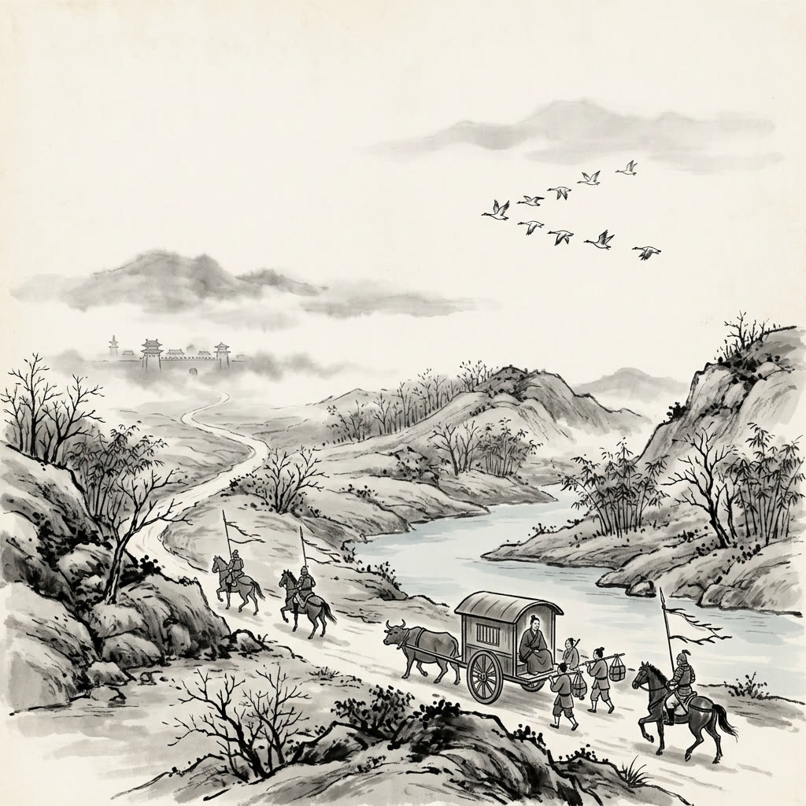

# 卷045 漢紀三十七 — 顯宗孝明皇帝下十三年

> 巻 45 / 294 ・ 漢紀三十七 ・ 年号: 顯宗孝明皇帝下十三年 ・ 西暦: 70 CE

[← 巻インデックス](README.md)

---

十三年〔注:庚午(かのえうま)の年、紀元七〇年〕。

夏、四月。汴渠(べんきょ)が完成した。これによって黄河(こうが)と汴とはそれぞれ別々に流れるようになり、昔の流路に戻った〔注:黄河と汴が決壊していたあいだは、汴の水が東へあふれて黄河と合流していた。いま堤が完成したことで、黄河は東北へ流れて海に入り、汴は東南へ流れて泗水(しすい)に入るようになった。これが「分かれて流れ、昔の流路に戻った」ということである〕。辛巳(かのとみ)の日、帝はみずから滎陽(けいよう)へ出向き、河川の工事をめぐり見て回った。そのまま黄河を渡り、太行山(たいこうざん)に登り、上党(じょうとう)へ足を運んだ。壬寅(みずのえとら)の日、宮(きゅう)へ還(かえ)った。

冬、十月。壬辰(みずのえたつ)の日、晦(みそか)に、日食があった。

楚王(そおう)の英(えい)は、方士(ほうし)とともに金の亀(かめ)や玉(ぎょく)の鶴(つる)を作り、それらに文字を刻んで吉兆(きっちょう)のしるし(符瑞)に仕立て上げていた。燕広(えんこう)という一介(いっかい)の男が、「英は、漁陽(ぎょよう)出身の王平(おうへい)という男や顔忠(がんちゅう)らと共謀し、予言の書物(図書)を偽作して、謀反(むほん)をたくらんでいる」と訴え出た。この件は取り調べのために下げ渡された。担当の役人(有司)は「英は大逆不道(たいぎゃくふどう=最も重い反逆の罪)にあたります。誅殺(ちゅうさつ)なさいますよう」と上奏した。だが帝は、近しい肉親への情から、これを殺すに忍びなかった。十一月、英を廃して王位を取り上げ、丹陽(たんよう)の涇県(けいけん)へ移し〔注:いまの宣州(せんしゅう)の県にあたる〕、湯沐邑(とうもくゆう)五百戸を与えた〔注:湯沐邑とは、その地の租税を取って、入浴・身じたくの費用にあてさせる領地のことである〕。英の子女で侯(こう)や公主(こうしゅ)の位にあった者は、その食邑(しょくゆう)を従来どおりとした。英の母である許太后(きょたいこう)には璽綬(じじゅ=后の印とその組みひも)を返上させず、楚(そ)の宮殿にそのまま住まわせることを許した〔注:許太后とは英の母の許氏(きょし)である〕。

これより先、ひそかに英の陰謀を司徒(しと)の虞延(ぐえん)に告げ知らせた者がいた。だが虞延は、英が皇室の近しい身内であることから、その告発を本当のこととは思わなかった。やがて英の一件が露見すると、詔(みことのり)が下って虞延を厳しく咎(とが)めた。

---

原文を表示

十三年
夏，四月，汴渠成；河、汴分流，復其舊迹。辛巳，帝行幸滎陽，巡行河渠，遂渡河，登太行，幸上黨；壬寅，還宮。
冬，十月，壬辰晦，日有食之。
楚王英與方士作金龜、玉鶴，刻文字爲符瑞。男子燕廣告英與漁陽王平、顏忠等造作圖書，有逆謀；事下案驗。有司奏「英大逆不道，請誅之。」帝以親親不忍。十一月，廢英，徙丹陽涇縣，賜湯沐邑五百戶；男女爲侯、主者，食邑如故；許太后勿上璽綬，留住楚宮。先是有私以英謀告司徒虞延者，延以英藩戚至親，不然其言。及英事覺，詔書切讓延。

---

出典: 維基文庫「資治通鑒 (胡三省音注)/卷045」(revid 387834, CC BY-SA 4.0) / 原字: Kanripo KR2b0007 @80174f6 . 成果物=CC BY-NC-SA 系。

[← 前年: 顯宗孝明皇帝下十二年](j045_y09.md) ・ [巻インデックス](README.md) ・ [次年: 顯宗孝明皇帝下十四年 →](j045_y11.md)
